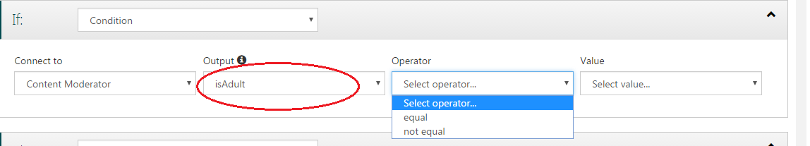
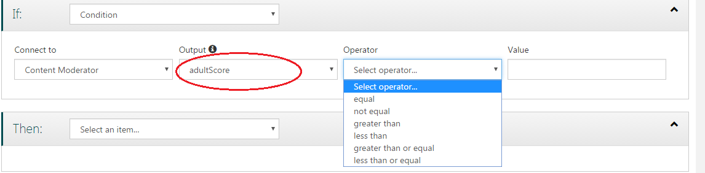
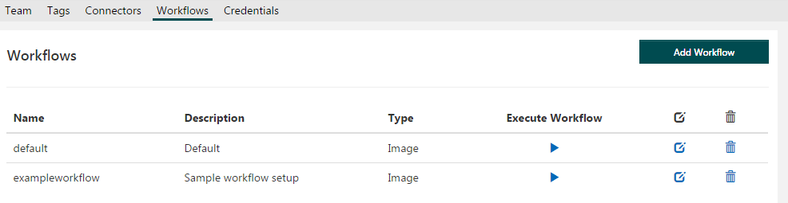
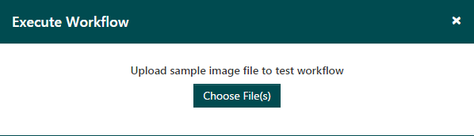
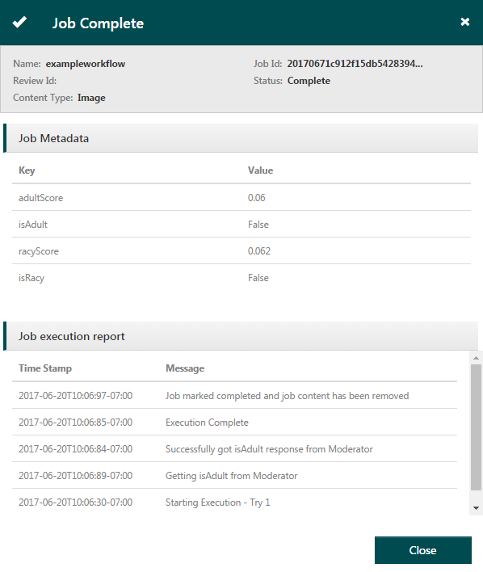

# Defining, testing, and using workflows  #

In addition to default workflow used for generating reviews, you can define custom workflows and thresholds based on content policies that are specific to your business.

Workflows “connect” to the Content Moderator API using connectors. In addition, you can use other APIs, as long as a connector for that API is available. The example here will use the Content Moderator connector, which is included by default.

## Creating a workflow ##

1. Select Workflows from the Settings tab.

2. Click the Add Workflows button.

3. Name your workflow, provide a description, and select whether you want to process images or text. 

4. Define the evaluation criteria (“Condition”). 

In the screenshot below, you can see the fields and the If-Then-Else selections that you will need to make to define your custom workflows. Choose a connector (in this example, Content Moderator). The available options for Output change, depending on the connector you choose. 

After you choose a connector and an output, a field displays for Operator, with available options dependent on your choices.

Select an Operator, then enter a value.

5. Define the action to be taken if the condition is met. The example below creates an image review, assigns it to a subteam, and creates a tag condition. It also specifies an additional criteria that must be fulfilled for the tag to be selected. In this way, you can combine multiple conditions to get the results you want.

6. Optionally, add an Else action in the same way that you defined the If section.
7. Click Save and make note of the workflow name. You will need the name when you use it with the Review API. 

## Test the Workflow ##

Now that you have a custom workflow defined, use the Review Tool Dashboard to test it. 

1. To test a particular workflow, click the respective arrow under Execute Workflow.

2. Upload a file (or several).

3. Wait for the job to process and display the results of the review.

## Use the Workflow with the Review API ##

Now that you have a custom workflow defined, use the Review API to start a moderation job with the workflow name as one of the parameters. This should be the workflow name that you noted in the previous step (in the example above, “ExampleWorkflow”). There are several required fields in the API. You can find much of the necessary information in your Settings.

- **teamName**: Select Settings > Team
- **WorkflowName**: Select Settings > Workflows
- **Ocp-Apim-Subscription-Key**: Select Settings > Credentials

