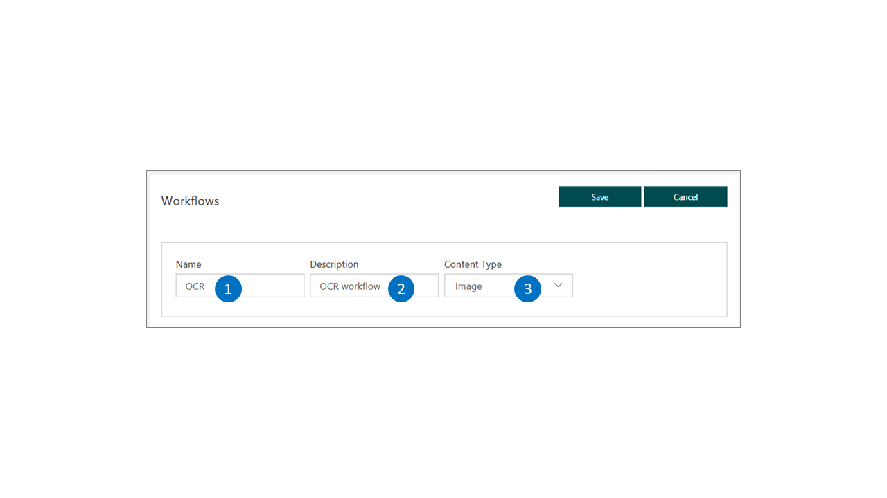
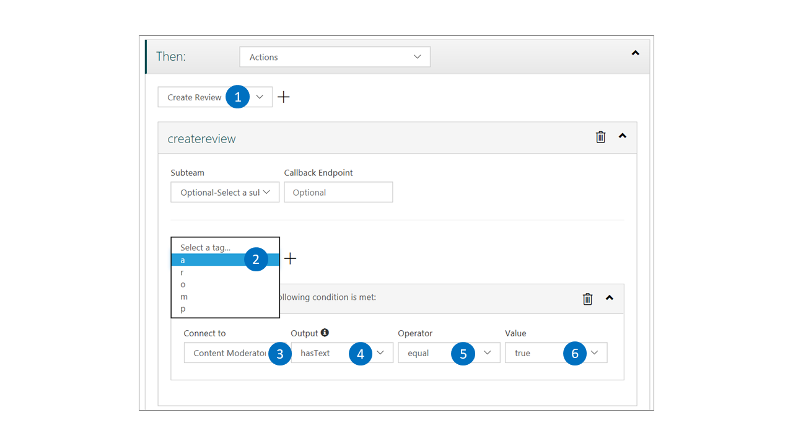
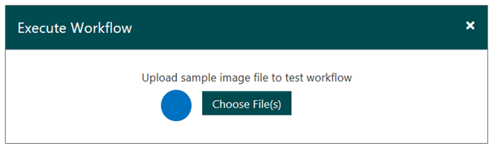
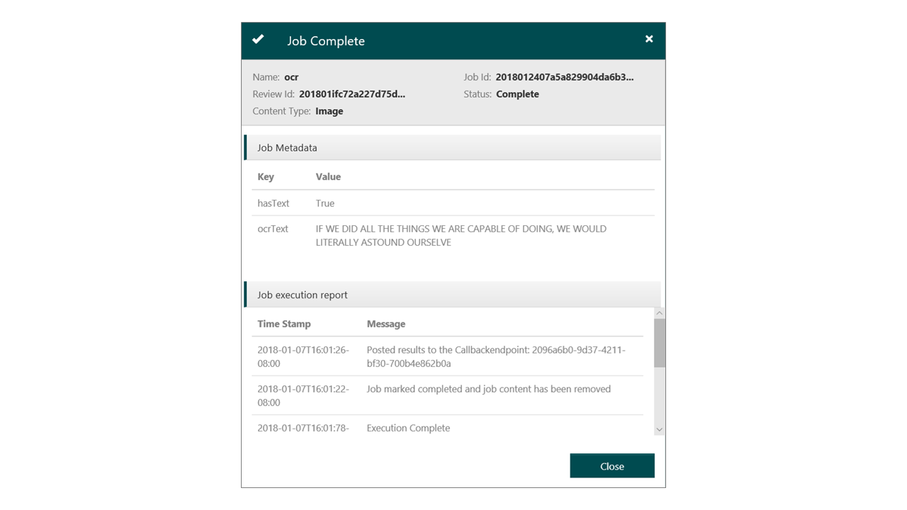

# Define, test, and use workflows

You can use the Azure Content Moderator workflow designer and APIs to define custom workflows and thresholds based on your content policies.

Workflows "connect" to the Content Moderator API by using connectors. You can use other APIs if a connector for that API is available. The example here uses the Content Moderator connector that is included by default.

## Browse to the Workflows section

On the **Settings** tab, select **Workflows**.

  

## Start a new workflow

Select **Add Workflow**.

  

## Assign a name and description

Name your workflow, enter a description, and choose whether the workflow handles images or text.

  

## Define the evaluation criteria ("condition")

In the following screenshot, you see the fields and the If-Then-Else selections that you need to define for your workflows. Choose a connector. This example uses **Content Moderator**. Depending on the connector you choose, the available options for output change.

  

After you choose the connector and its output that you want, select an operator and the value for the condition.

## Define the action to take

Select the action to take and the condition to meet. The following example creates an image review, assigns a tag `a`, and highlights it for the condition shown. You also can combine multiple conditions to get the results you want. Optionally, add an alternative (Else) path.

  

## Save your workflow

Finally, save the workflow, and note the workflow name. You need the name to start a moderation job by using the Review API.

## Test the workflow

Now that you defined a custom workflow, test it with sample content.

Select the corresponding **Execute Workflow** button.

  

### Upload a file

Save the [sample image](https://moderatorsampleimages.blob.core.windows.net/samples/sample5.png) to your local drive. To test the workflow, select **Choose File(s)** and upload the image.

  

### Track the workflow

Track the workflow as it executes.

  

### Review any images flagged for human moderation

To see the image review, go to the **Image** tab under **Review**.

  

## Next steps 

To invoke the workflow from code, use custom workflows with the [`Job` API console quickstart](../try-review-api-job.md) and the [.NET SDK quickstart](../moderation-jobs-quickstart-dotnet.md).
