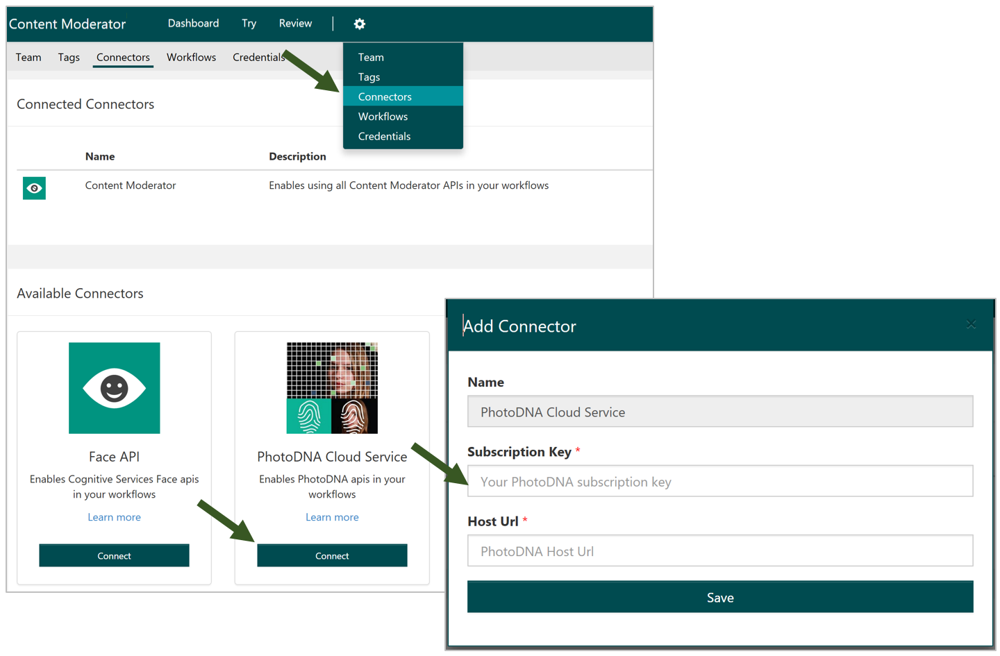
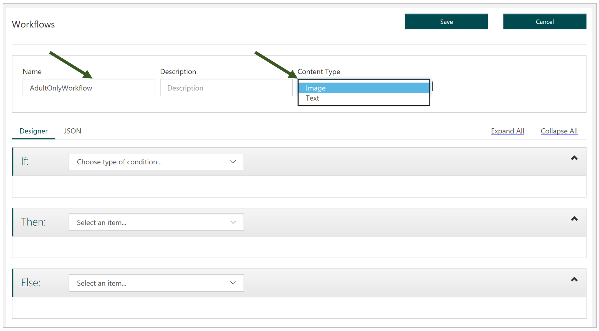
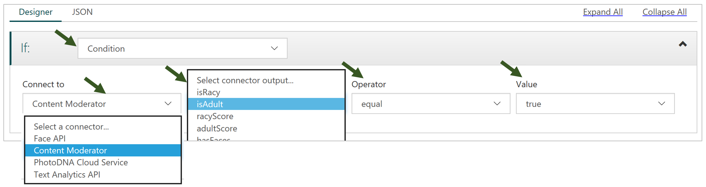
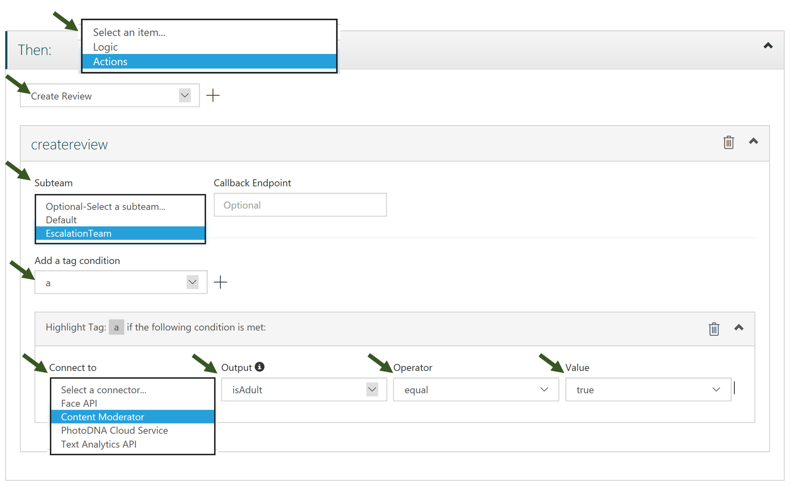
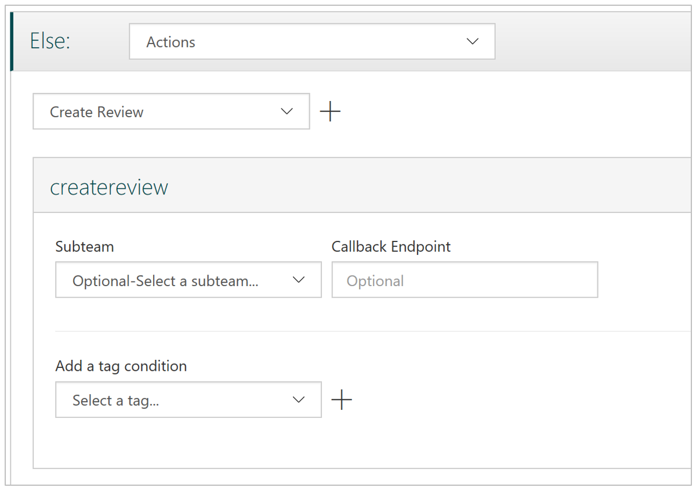
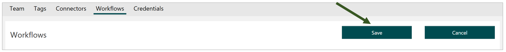

# Defining and using workflows  #

In addition to default workflow used for generating reviews, you can define custom workflows and thresholds based on content policies that are specific to your business. Content Moderator allows you to use other APIs in addition to its own API as long as a connector for that API is available.

## Make sure you have valid credentials ##

To get started on defining a workflow, make sure you have valid credentials for the API you intend to use in your workflow. Content Moderator includes a small set of Connectors by default.

## Navigate to the Workflows section ##

Select the **Workflows** option under **Settings**.

## Start a new workflow ##

Use the **Add Workflows** option to get started.

## Name your workflow ##

Name your workflow, provide a description, and select whether you want to process images or text.
In the screenshot below, you can see the fields and view the If-Then-Else selections that you need to make to define your custom workflows.

## Define the evaluation criteria (condition) ##

As a first step, enter all the information needed to define your criteria for executing the workflow. As shown in the screen below, this includes selecting the API you want to get results from. When you select one of the available APIs (that you have entered your credentials for in the very first step), the next drop-down will show the available outputs from the API. The next two fields allow you to specify the check to be performed.

## Define the action ##

Once you have defined the condition, you will tell Content Moderator what action to perform if the condition is met. The example shown below creates an image review and assigns it to a subteam. It also specifies an aditional criteria that must be fulfilled for the assigned 'a' tag to be selected. In this way, you can combine multiple conditions to get the results you want.

## Optionally, define the Else section ##

Optionally, expand the **Else** section to provide similar information like you did for the **If** section.

## Save the workflow ##

Finally, save your workflow and note the workflow name. You will need it to invoke the workflow with the Review API.

## Use the Review API ##

Now that you have a custom workflow defined, use the [**Review API**](https://westus.dev.cognitive.microsoft.com/docs/services/580519463f9b070e5c591178/operations/580519483f9b0709fc47f9c5) to start a moderation job with the workflow name as one of the parameters. This should be the workflow name that you noted in the previous step.
