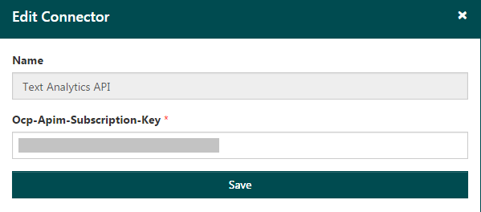

# Connectors

Azure Content Moderator workflows can use other APIs, in addition to Content Moderator APIs. You access other APIs by using a connector in Content Moderator. The connector provides a link to the other APIs.

Content Moderator includes these default connectors:

* Emotion API
* Face API
* PhotoDNA Cloud Service

## Verify your credentials 

Before you define a workflow, ensure that you have valid credentials for the connector API that you want to use:

1.	On the Review tool Dashboard, select **Settings** > **Connectors**.

  

2.	Select the **Edit** symbol next to the connector that you want to verify credentials for.

  

3.	The subscription key appears. If you make any edits, select **Save** when you are finished.

  
 
## Add a connector

1.	Before you add a connector, you need a subscription key. On the Review tool Dashboard, select **Settings** > **Credentials**. Select and copy the value that's in the **Ocp-Admin-Subscription-Key** box.

2.	Select **Connectors**. Select one of the available connectors that are displayed on the Review tool Dashboard. Then, select **Connect**. 

  

3.	In the **Ocp-Admin-Subscription-Key** box, paste the key that you copied. Then, select **Save**.

## Next steps

* Learn how to use connectors to [define custom workflows](workflows.md).
