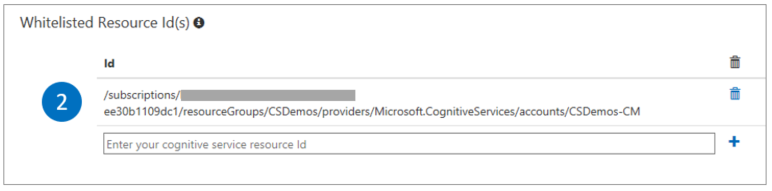

# Manage credentials

Your Content Moderator credentials are created in the following locations:

- [The Azure portal](https://ms.portal.azure.com/#create/Microsoft.CognitiveServicesContentModerator)
- [The Content Moderator review tool](http://contentmoderator.cognitive.microsoft.com/)

This article explains where to find them and how they relate to each other.

## The Azure portal

On the Azure portal dashboard, select your Content Moderator account. Under **Resource Management**, select **Keys**. To copy the key, select the icon to the right of the key.

To use the human review tool and the review APIs, copy the Resource ID listed on the **Properties** screen and enter it on the review tool's credentials screen as shown:

## The Review tool

On the Review tool Dashboard, on the **Settings** tab, select **Credentials**.

The following section examines the preceding image in more detail:

### API

The first part lists your **review API endpoint**, **team ID**, and the **Content Moderator trial key** generated as part of your review team creation. Use them to call the review API.

### Resource ID

The second part starts out as empty with no resource ID. To use your Content Moderator subscription with the review team and API, navigate to the resource Id screen as shown previously, and copy it into the field shown. Hit the **'+'** to save your resource ID.

> [!NOTE]
> Your Content Moderator subscription's region should match the review team's region for it to recognize your team and access the team data. For example, in the images on this page, The **West US** region **(4)** contains the Content Moderator Azure subscription and your review team.

### Workflows

The third part shows the information used for running workflows. It starts out showing the auto-generated trial key by default. Update it with the paid key (or another API key) as needed. The other two fields allow using term and image lists in the Screen Text and Evaluate Image operations respectively.

## Next steps

* Learn how to use the Content Moderator credentials in your [workflows](workflows.md).
