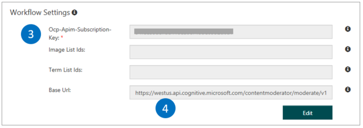
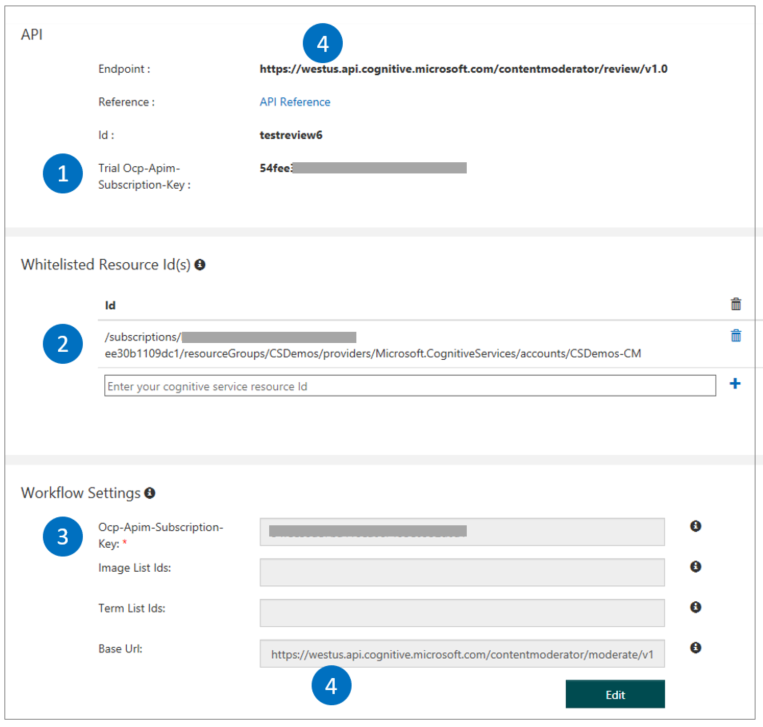
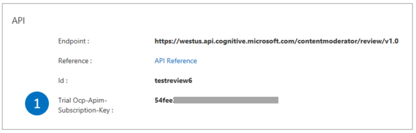

# Manage credentials

Your Content Moderator credentials are created in the following locations:

- [The Azure portal](https://ms.portal.azure.com/#create/Microsoft.CognitiveServicesContentModerator)
- [The Content Moderator review tool](http://contentmoderator.cognitive.microsoft.com/)

This article explains where to find them and how they relate to each other.

## The Azure portal

On the Azure portal dashboard, select your Content Moderator account. Under **Resource Management**, select **Keys**. To copy the key, select the icon to the right of the key.

### Use the Azure account with the review tool and review API
To use your Azure key with the review APIs, copy the Resource ID listed on the **Properties** screen in the following screenshot, and enter it on the review tool's credentials screen in the **Whitelisted Resource Id(s)** fields as shown in the following **Resource ID** section. 

> [!NOTE]
> Your Content Moderator subscription's region should match the review team's region for it to recognize your team and access 
> the team data. For example, in the images on this page, The **West US** region **(4)** contains the Content Moderator Azure
> subscription and your review team.
>
> Once you replace the two places in the review tool with the key and the Resource ID from your Azure subscription,
> your **Trial Ocp-Apim-Subscription-Key** displayed on the Credentials screen is no longer used, but is always available.
> The trial key limits you to maximum 5,000 transactions per month at 1 request per second (RPS).

### Use the Azure account with the workflows in the review tool

To use your Azure key for the workflows available within Content Moderator, enter it in the **Ocp-Apim-Subscription-Key** field in the **Workflow Settings** section as shown in the following **Workflows** section. Hit the **'+'** to save your resource ID.

## The Review tool

On the Review tool Dashboard, on the **Settings** tab, select **Credentials**.

The following section examines the preceding image in more detail:

### API

The first part lists your **review API endpoint**, **team ID**, and the **Ocp-Apim-Subscription-Key (Content Moderator trial key)** generated as part of your review team creation. Use them to call all Content Moderator APIs, including the review API.

Also note your region identifier for your API endpoint. For example, **westus** is the region in "https://westus.api.cognitive.microsoft.com/contentmoderator/review/v1.0"

### Resource ID

This set of fields is covered in the previous section, [Use the Azure account with the review tool and API](credentials.md#use-the-azure-account-with-the-review-tool-and-review-api). This field is usually blank unless you add your Azure Resource Id to this field as explained in the previous section.

### Workflows

This set of fields is covered in the previous section, [Use the Azure account with the workflows in the review tool](credentials.md#use-the-azure-account-with-the-workflows-in-the-review-tool). By default, the review tool uses its auto-generated trial key for running the workflows, and that's what shows up to begin with. The other two fields allow using term and image lists in the Screen Text and Evaluate Image operations respectively.

## Next steps

* Learn how to use the Content Moderator credentials in your [workflows](workflows.md).
