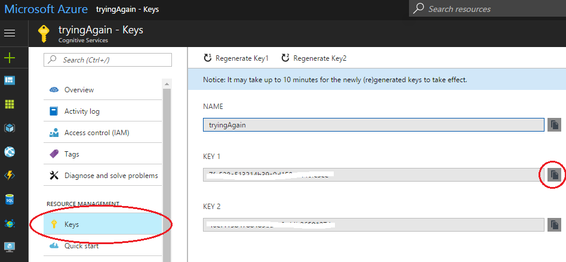

# Verify API credentials

You can verify credentials that you use with Azure Content Moderator APIs in two locations:
- In the Azure portal.
- In the Content Moderator Review tool.

## In the Azure portal

If you are accessing the APIs from the Azure portal, on the Dashboard, select the account. Under **Resource Management**, select **Keys**. To copy the key, select the icon to the right of the key.

## In the Review tool

On the Review tool Dashboard, on the **Settings** tab, select **Credentials**.

## Connector keys

When you build workflows in the Review tool, you likely will need a key for a connector. On the Dashboard, on the **Settings** tab, select **Connectors**. Select the **Edit** symbol next to the connector for which you want credentials.

## Next steps

* Learn how to use API credentials to [define custom workflows](workflows.md).
