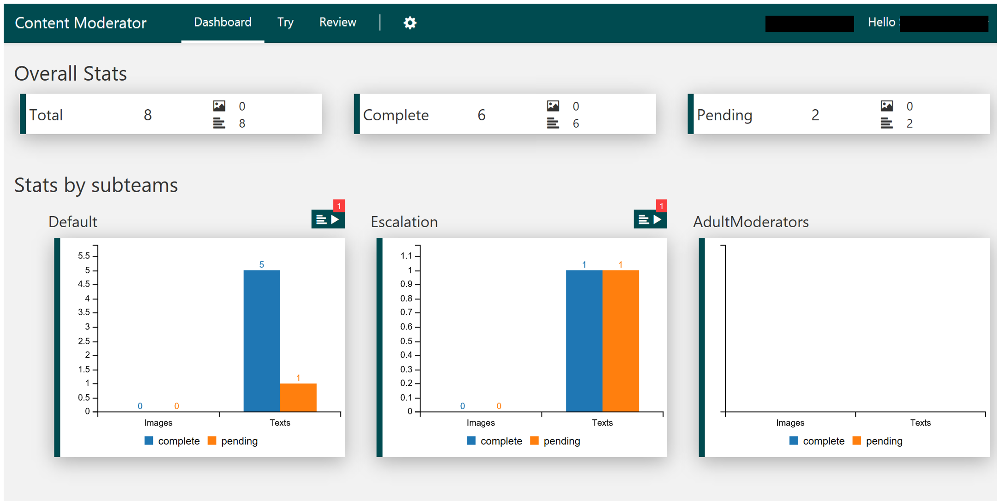

# Content Moderator Review tool

Azure Content Moderator provides services to combine machine learning content moderation with human reviews, and the [Review tool](https://contentmoderator.cognitive.microsoft.com) website is a user-friendly front end that gives detailed access to these services.

## What it does

The [Review tool](https://contentmoderator.cognitive.microsoft.com), when used in conjunction with the machine-assisted moderation APIs, allows you to accomplish the following tasks in the content moderation process:

- Use one set of tools to moderate content in multiple formats (text, image, and video).
- Automate the creation of human [reviews](../review-api.md#reviews) when moderation API results come in.
- Assign or escalate content reviews to multiple review teams, organized by content category or experience level.
- Use default or custom logic filters ([workflows](../review-api.md#workflows)) to sort and track content, without writing any code.
- Use [connectors](./configure.md#connectors) to process content with Microsoft PhotoDNA, Text Analytics, and Face APIs in addition to the Content Moderator APIs.
- Build your own connector to create workflows for any API or business process.
- Get key performance metrics on your content moderation processes.

## Review tool dashboard

On the **Dashboard** tab, you can see key metrics for content reviews done within the tool. See the number of total, complete, and pending reviews for image, text, and video content. You can also see the breakdown of users and teams that have completed reviews, as well as the moderation tags that have been applied.

## Review tool credentials

When you sign up with the [Review tool](https://contentmoderator.cognitive.microsoft.com), you'll be prompted to select an Azure region for you account. This is because the [Review tool](https://contentmoderator.cognitive.microsoft.com) generates a free trial key for Azure Content Moderator services; you will need this key to access any of the services from a REST call or client SDK. You can view your key and API endpoint URL by selecting **Settings** > **Credentials**.

## Next steps

See [Configure the Review tool](./configure.md) to learn how to access Review tool resources and change settings.