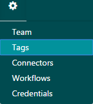
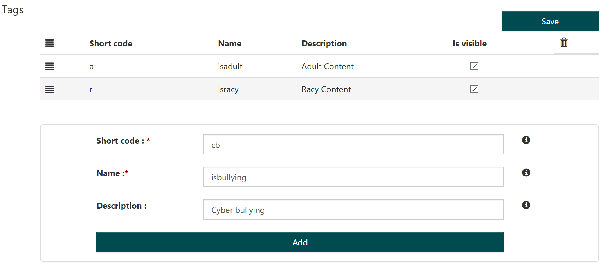
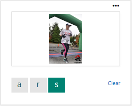
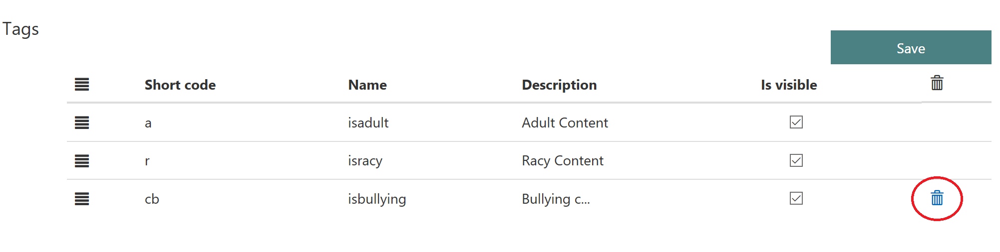

# About Tags #

In addition to the two default tags, **isadult** (**a**) and **isracy** (**r**), you can create custom tags for more targeted scanning. These custom tags are then available for human reviewers to assign to images or text.

## Create tags ##

1.	Select Tags from the Settings tab.

  

2.	Enter a two-letter Short code for the tag.
3.	Enter a Name for the tag. Keep the name short and descriptive. For example, **isbullying**.
4.	Enter a Description.
5.	Click Add.
6.	Click Save when you are done creating tags.

## Using Custom Tags ##

Custom tags are used during human review. They display on the preview, and the reviewer selects it by clicking on it.

You can turn off different tags for different reviews, by checking or unchecking Is Visible.
 

While you can’t delete the two default tags, **isadult** and **isracy**, you can delete any custom tags that you have defined. Click the trash can next to the tag you want to delete.

## Next steps ##

To learn how to use tags for image moderation, see [Review moderated images](Review-Moderated-Images.md).
