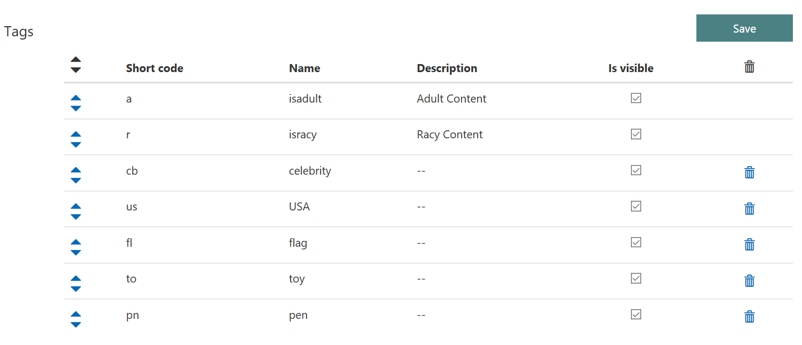
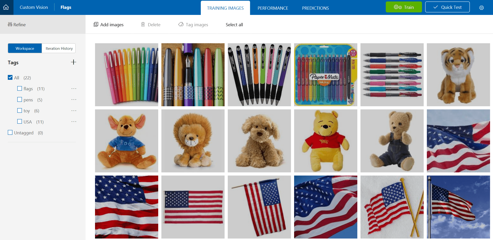
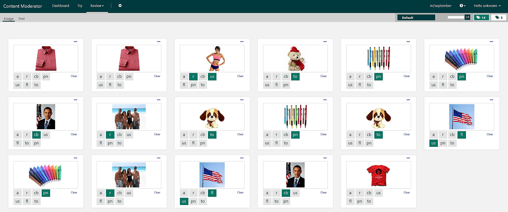

# Tutorial: Moderate e-commerce product images with Azure Content Moderator

In this tutorial, you'll learn how to use Azure Cognitive Services, including Content Moderator, to classify and moderate product images for an e-commerce scenario. You'll use Computer Vision and Custom Vision to apply tags (labels) to images, and then you will create a team review, which combines Content Moderator's machine-learning-based technologies with human review teams to provide an intelligent moderation system.

This tutorial shows you how to:

> [!div class="checklist"]
> * Sign up for Content Moderator and create a review team.
> * Use Content Moderator's image API to scan for potential adult and racy content.
> * Use the Computer Vision service to scan for celebrity content (or other Computer-Vision-detectable tags).
> * Use the Custom Vision service to scan for the presence of flags, toys, and pens (or other custom tags).
> * Present the combined scan results for human review and final decision making.

The complete sample code is available in the [Samples eCommerce Catalog Moderation](https://github.com/MicrosoftContentModerator/samples-eCommerceCatalogModeration) repository on GitHub.

If you don’t have an Azure subscription, create a [free account](https://azure.microsoft.com/free/?WT.mc_id=A261C142F) before you begin.

## Prerequisites

- A Content Moderator subscription key. Follow the instructions in [Create a Cognitive Services account](https://docs.microsoft.com/azure/cognitive-services/cognitive-services-apis-create-account) to subscribe to the Content Moderator service and get your key.
- A Computer Vision subscription key (same instructions as above).
- Any edition of [Visual Studio 2015 or 2017](https://www.visualstudio.com/downloads/).
- A set of images for each label that the Custom Vision classifier will use (in this case toys, pens, and US flags).

## Create a review team

Refer to the [Try Content Moderator on the web](quick-start.md) quickstart for instructions on how to sign up for the [Content Moderator Review tool](https://contentmoderator.cognitive.microsoft.com/) and create a review team. Take note of the **Team ID** value on the **Credentials** page.

## Create custom moderation tags

Next, create custom tags in the Review tool (see the [Tags](https://docs.microsoft.com/azure/cognitive-services/content-moderator/review-tool-user-guide/tags) article if you need help with this process). In this case, we will add the following tags: **celebrity**, **USA**, **flag**, **toy**, and **pen**. Not all of the tags need to be detectable categories in Computer Vision (like **celebrity**); you can add your own custom tags as long as you train the Custom Vision classifier to detect them later on.

## Create Visual Studio project

1. In Visual Studio, open the New Project dialog. Expand **Installed**, then **Visual C#**, then select **Console app (.NET Framework)**.
1. Name the application **EcommerceModeration**, then click **OK**.
1. If you're adding this project to an existing solution, select this project as the single startup project.

This tutorial highlights the code that is central to the project, but it won't cover every line of code. Copy the full contents of _Program.cs_ from the sample project ([Samples eCommerce Catalog Moderation](https://github.com/MicrosoftContentModerator/samples-eCommerceCatalogModeration)) into the _Program.cs_ file of your new project. Then, step through the following sections to learn about how the project works and how to use it yourself.

## Define API keys and endpoints

This tutorial uses three cognitive services; therefore, it requires three corresponding keys and API endpoints. See the following fields in the **Program** class:

[!code-csharp[define API keys and endpoint URIs](~/samples-eCommerceCatalogModeration/Fusion/Program.cs?range=21-29)]

You'll need to update the `___Key` fields with the values of your subscription keys (you'll get the `CustomVisionKey` later on), and you may need to change the `___Uri` fields so they contain the correct region identifiers. Fill in the `YOURTEAMID` part of the `ReviewUri` field with the ID of the review team you created earlier. You'll fill in the final part of the `CustomVisionUri` field later on.

## Primary method calls

See the following code in the **Main** method, which loops through a list of image URLs. It analyzes each image with the three different services, records the applied tags in the **ReviewTags** array, and then creates a review for human moderators by sending the images to the Content Moderator Review Tool. You will explore these methods in the following sections. If you wish, you can control which images are sent to review, using the **ReviewTags** array in a conditional statement to check which tags were applied.

[!code-csharp[Main: evaluate each image and create review](~/samples-eCommerceCatalogModeration/Fusion/Program.cs?range=53-70)]

## EvaluateAdultRacy method

See the **EvaluateAdultRacy** method in the **Program** class. This method takes an image URL and an array of key-value pairs as parameters. It calls the Content Moderator's Image API (using REST) to get the Adult and Racy scores of the image. If the score for either is greater than 0.4 (the range is between 0 and 1), it sets the corresponding value in the **ReviewTags** array to **True**.

[!code-csharp[define EvaluateAdultRacy method](~/samples-eCommerceCatalogModeration/Fusion/Program.cs?range=73-113)]

## EvaluateComputerVisionTags method

The next method takes an image URL and your Computer Vision subscription information and analyzes the image for the presence of celebrities. If one or more celebrities are found, it sets the corresponding value in the **ReviewTags** array to **True**.

[!code-csharp[define EvaluateCustomVisionTags method](~/samples-eCommerceCatalogModeration/Fusion/Program.cs?range=115-146)]

## EvaluateCustomVisionTags method

Next, see the **EvaluateCustomVisionTags** method, which classifies the actual products&mdash;in this case flags, toys, and pens. Follow the instructions in the [How to build a classifier](https://docs.microsoft.com/azure/cognitive-services/custom-vision-service/getting-started-build-a-classifier) guide to build your own custom image classifier and detect flags, toys, and pens (or whatever you chose as your custom tags) in images. You can use the images in the **sample-images** folder of the [GitHub repo](https://github.com/MicrosoftContentModerator/samples-eCommerceCatalogModeration) to quickly train some of the categories in this example.

Once you've trained your classifier, get the prediction key and prediction endpoint URL (see [Get the URL and prediction key](https://docs.microsoft.com/azure/cognitive-services/custom-vision-service/use-prediction-api#get-the-url-and-prediction-key) if you need help with retrieving them), and assign these values to your `CustomVisionKey` and `CustomVisionUri` fields, respectively. The method uses these values to query the classifier. If the classifier finds one or more of the custom tags in the image, this method sets the corresponding value(s) in the **ReviewTags** array to **True**.

[!code-csharp[define EvaluateCustomVisionTags method](~/samples-eCommerceCatalogModeration/Fusion/Program.cs?range=148-171)]

## Create reviews for Review tool

In the previous sections, you explored how the app scans incoming images for adult and racy content (Content Moderator), celebrities (Computer Vision), and various other objects (Custom Vision). Next, see the **CreateReview** method, which uploads the images with all of their applied tags (passed in as _Metadata_) to the Content Moderator Review Tool.

[!code-csharp[define CreateReview method](~/samples-eCommerceCatalogModeration/Fusion/Program.cs?range=173-196)]

The images will show up in the Review tab of the [Content Moderator Review tool](https://contentmoderator.cognitive.microsoft.com/).

## Submit a list of test images

As you can see in the **Main** method, this program looks for a "C:Test" directory with a _Urls.txt_ file that contains a list of image Urls. Create this file and directory, or change the path to point to your text file. Then populate this file with the URLs of images you'd like to test.

[!code-csharp[Main: set up test directory, read lines](~/samples-eCommerceCatalogModeration/Fusion/Program.cs?range=38-51)]

## Run the program

If you've followed all of the above steps, the program should process each image (querying all three services for their relevant tags) and then upload the images with tag information to the Content Moderator Review Tool.

## Next steps

In this tutorial, you set up a program to analyze product images, tag them by product type, and allow a review team to make informed decisions about content moderation. Next, learn more about the details of image moderation.

> [!div class="nextstepaction"]
> [Review moderated images](./review-tool-user-guide/review-moderated-images.md)
