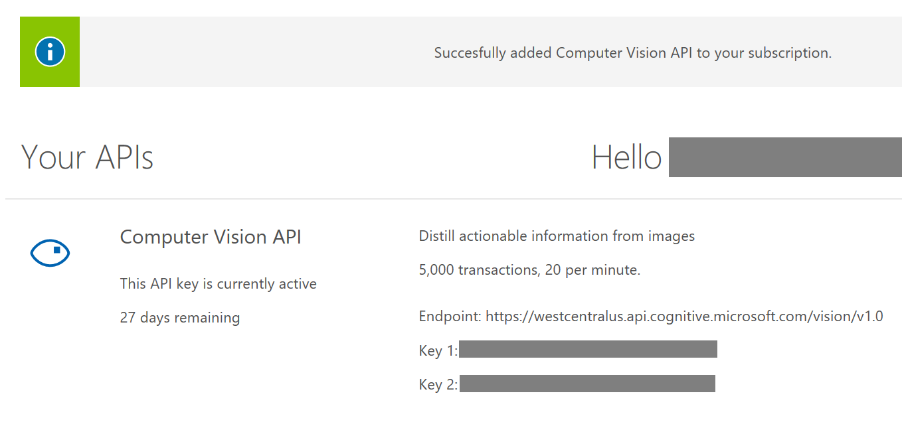

# Tutorial: eCommerce catalog moderation with machine learning

In this tutorial, we learn how to implement machine-learning-based intelligent ecommerce catalog moderation by combining machine-assisted AI technologies with human moderation to provide an intelligent catalog system.

## Business scenario

Use machine-assisted technologies to classify and moderate product images in these categories:

1. Adult (Nudity)
2. Racy (Suggestive)
3. Celebrities
4. US Flags
5. Toys
6. Pens

## Tutorial steps

The tutorial guides you through these steps:

1. Sign up and create a Content Moderator team.
2. Configure moderation tags (labels) for potential celebrity and flag content.
3. Use Content Moderator's image API to scan for potential adult and racy content.
4. Use the Computer Vision API to scan for potential celebrities.
5. Use the Custom Vision service to scan for possible presence of flags.
6. Present the nuanced scan results for human review and final decision making.

## Create a team

Refer to the [Quickstart](quick-start.md) page to sign up for Content Moderator and create a team. Note the **Team ID** from the **Credentials** page.

## Define custom tags

Refer to the [Tags](https://docs.microsoft.com/azure/cognitive-services/content-moderator/review-tool-user-guide/tags) article to add custom tags. In addition to the built-in **adult** and **racy** tags, the new tags allow the review tool to display the descriptive names for the tags.

In our case, we define these custom tags (**celebrity**, **flag**, **us**, **toy**, **pen**):

## List your API keys and endpoints

1. The tutorial uses three APIs and the corresponding keys and API end points.
2. Your API end points are different based on your subscription regions and the Content Moderator Review Team ID.

> [!NOTE]
> The tutorial is designed to use subscription keys in the regions visible in the following endpoints. Be sure to match your API keys with the region Uris otherwise your keys may not work with the following endpoints:

         // Your API keys
        public const string ContentModeratorKey = "XXXXXXXXXXXXXXXXXXXX";
        public const string ComputerVisionKey = "XXXXXXXXXXXXXXXXXXXX";
        public const string CustomVisionKey = "XXXXXXXXXXXXXXXXXXXX";

        // Your end points URLs will look different based on your region and Content Moderator Team ID.
        public const string ImageUri = "https://westus.api.cognitive.microsoft.com/contentmoderator/moderate/v1.0/ProcessImage/Evaluate";
        public const string ReviewUri = "https://westus.api.cognitive.microsoft.com/contentmoderator/review/v1.0/teams/YOURTEAMID/reviews";
        public const string ComputerVisionUri = "https://westcentralus.api.cognitive.microsoft.com/vision/v1.0";
        public const string CustomVisionUri = "https://southcentralus.api.cognitive.microsoft.com/customvision/v1.0/Prediction/XXXXXXXXXXXXXXXXXXXX/url";

## Scan for adult and racy content

1. The function takes an image URL and an array of key-value pairs as parameters.
2. It calls the Content Moderator's Image API to get the Adult and Racy scores.
3. If the score is greater than 0.4 (range is from 0 to 1), it sets the value in the **ReviewTags** array to **True**.
4. The **ReviewTags** array is used to highlight the corresponding tag in the review tool.

        public static bool EvaluateAdultRacy(string ImageUrl, ref KeyValuePair[] ReviewTags)
        {
            float AdultScore = 0;
            float RacyScore = 0;

            var File = ImageUrl;
            string Body = $"{{\"DataRepresentation\":\"URL\",\"Value\":\"{File}\"}}";

            HttpResponseMessage response = CallAPI(ImageUri, ContentModeratorKey, CallType.POST,
                                                   "Ocp-Apim-Subscription-Key", "application/json", "", Body);

            if (response.IsSuccessStatusCode)
            {
                // {“answers”:[{“answer”:“Hello”,“questions”:[“Hi”],“score”:100.0}]}
                // Parse the response body. Blocking!
                GetAdultRacyScores(response.Content.ReadAsStringAsync().Result, out AdultScore, out RacyScore);
            }

            ReviewTags[0] = new KeyValuePair();
            ReviewTags[0].Key = "a";
            ReviewTags[0].Value = "false";
            if (AdultScore > 0.4)
            {
                ReviewTags[0].Value = "true";
            }

            ReviewTags[1] = new KeyValuePair();
            ReviewTags[1].Key = "r";
            ReviewTags[1].Value = "false";
            if (RacyScore > 0.3)
            {
                ReviewTags[1].Value = "true";
            }
            return response.IsSuccessStatusCode;
        }

## Scan for celebrities

1. Sign up for a [free trial](https://azure.microsoft.com/try/cognitive-services/?api=computer-vision) of the [Computer Vision API](https://azure.microsoft.com/services/cognitive-services/computer-vision/).
2. Click the **Get API Key** button.
3. Accept the terms.
4. To login, choose from the list of Internet accounts available.
5. Note the API keys displayed on your service page.
    
   
    
6. Refer to the project source code for the function that scans the image with the Computer Vision API.

         public static bool EvaluateComputerVisionTags(string ImageUrl, string ComputerVisionUri, string ComputerVisionKey, ref KeyValuePair[] ReviewTags)
        {
            var File = ImageUrl;
            string Body = $"{{\"URL\":\"{File}\"}}";

            HttpResponseMessage Response = CallAPI(ComputerVisionUri, ComputerVisionKey, CallType.POST,
                                                   "Ocp-Apim-Subscription-Key", "application/json", "", Body);

            if (Response.IsSuccessStatusCode)
            {
                ReviewTags[2] = new KeyValuePair();
                ReviewTags[2].Key = "cb";
                ReviewTags[2].Value = "false";

                ComputerVisionPrediction CVObject = JsonConvert.DeserializeObject<ComputerVisionPrediction>(Response.Content.ReadAsStringAsync().Result);

                if ((CVObject.categories[0].detail != null) && (CVObject.categories[0].detail.celebrities.Count() > 0))
                {                 
                    ReviewTags[2].Value = "true";
                }
            }

            return Response.IsSuccessStatusCode;
        }

## Classify into flags, toys, and pens

1. [Sign in](https://azure.microsoft.com/services/cognitive-services/custom-vision-service/) to the [Custom Vision API preview](https://www.customvision.ai/).
2. Use the [Quickstart](https://docs.microsoft.com/azure/cognitive-services/custom-vision-service/getting-started-build-a-classifier) to build your custom classifier to detect the potential presence of flags, toys, and pens.
   
3. [Get the prediction endpoint URL](https://docs.microsoft.com/azure/cognitive-services/custom-vision-service/use-prediction-api) for your custom classifier.
4. Refer to the project source code to see the function that calls your custom classifier prediction endpoint to scan your image.

        public static bool EvaluateCustomVisionTags(string ImageUrl, string CustomVisionUri, string CustomVisionKey, ref KeyValuePair[] ReviewTags)
        {
            var File = ImageUrl;
            string Body = $"{{\"URL\":\"{File}\"}}";

            HttpResponseMessage response = CallAPI(CustomVisionUri, CustomVisionKey, CallType.POST,
                                                   "Prediction-Key", "application/json", "", Body);

            if (response.IsSuccessStatusCode)
            {
                // Parse the response body. Blocking!
                SaveCustomVisionTags(response.Content.ReadAsStringAsync().Result, ref ReviewTags);
            }
            return response.IsSuccessStatusCode;
        }       
 
## Reviews for human-in-the-loop

1. In the previous sections, you scanned the incoming images for adult and racy (Content Moderator), celebrities (Computer Vision) and Flags (Custom Vision).
2. Based on our match thresholds for each scan, make the nuanced cases available for human review in the review tool.
        public static bool CreateReview(string ImageUrl, KeyValuePair[] Metadata)
        {

            ReviewCreationRequest Review = new ReviewCreationRequest();
            Review.Item[0] = new ReviewItem();
            Review.Item[0].Content = ImageUrl;
            Review.Item[0].Metadata = new KeyValuePair[MAXTAGSCOUNT];
            Metadata.CopyTo(Review.Item[0].Metadata, 0);

            //SortReviewItems(ref Review);

            string Body = JsonConvert.SerializeObject(Review.Item);

            HttpResponseMessage response = CallAPI(ReviewUri, ContentModeratorKey, CallType.POST,
                                                   "Ocp-Apim-Subscription-Key", "application/json", "", Body);

            return response.IsSuccessStatusCode;
        }

## Submit batch of images

1. This tutorial assumes a "C:Test" directory with a text file that has a list of image Urls.
2. The following code checks for the existence of the file and reads all Urls into memory.
            // Check for a test directory for a text file with the list of Image URLs to scan
            var topdir = @"C:\test\";
            var Urlsfile = topdir + "Urls.txt";

            if (!Directory.Exists(topdir))
                return;

            if (!File.Exists(Urlsfile))
            {
                return;
            }

            // Read all image URLs in the file
            var Urls = File.ReadLines(Urlsfile);

## Initiate all scans

1. This top-level function loops through all image URLs in the text file we mentioned earlier.
2. It scans them with each API and if the match confidence score falls within our criteria, creates a review for human moderators.
             // for each image URL in the file...
            foreach (var Url in Urls)
            {
                // Initiatize a new review tags array
                ReviewTags = new KeyValuePair[MAXTAGSCOUNT];

                // Evaluate for potential adult and racy content with Content Moderator API
                EvaluateAdultRacy(Url, ref ReviewTags);

                // Evaluate for potential presence of celebrity (ies) in images with Computer Vision API
                EvaluateComputerVisionTags(Url, ComputerVisionUri, ComputerVisionKey, ref ReviewTags);

                // Evaluate for potential presence of custom categories other than Marijuana
                EvaluateCustomVisionTags(Url, CustomVisionUri, CustomVisionKey, ref ReviewTags);

                // Create review in the Content Moderator review tool
                CreateReview(Url, ReviewTags);
            }

## License

All Microsoft Cognitive Services SDKs and samples are licensed with the MIT License. For more details, see [LICENSE](https://microsoft.mit-license.org/).

## Developer Code of Conduct

Developers using Cognitive Services, including this client library & sample, are expected to follow the “Developer Code of Conduct for Microsoft Cognitive Services”, found at http://go.microsoft.com/fwlink/?LinkId=698895.

## Next steps

Build and extend the tutorial by using the [project source files](https://github.com/MicrosoftContentModerator/samples-eCommerceCatalogModeration) on Github.
