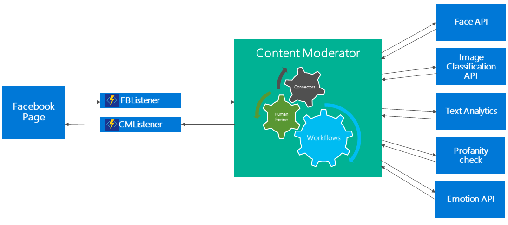
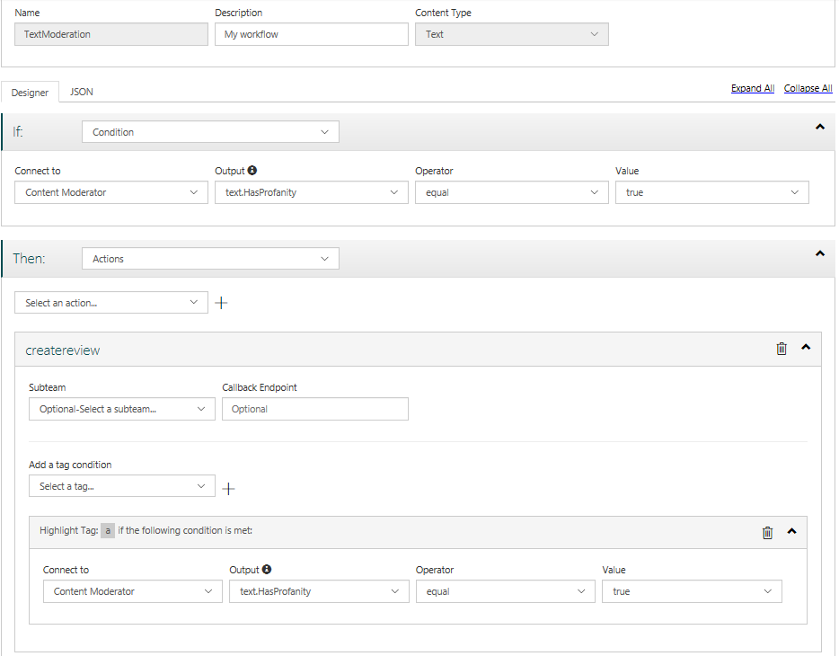
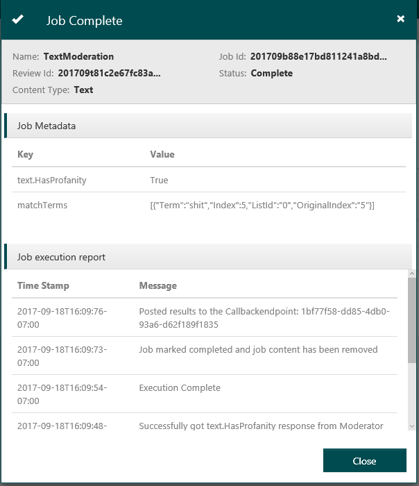

# Tutorial: Facebook content moderation with Content Moderator

In this tutorial, we learn how to use machine-learning-based Content Moderator to help moderate Facebook posts and comments.

The tutorial guides you through these steps:

1. Create a Content Moderator team.
2. Create Azure Functions that listen for HTTP events from Content Moderator and Facebook.
3. Create a Facebook Page and App, and connect it to Content Moderator.

After we are done, Facebook will send the content posted by the visitors to Content Moderator. Based on the match thresholds, your Content Moderator workflows either publish the content or create reviews within the review tool. 

The following figure shows the building blocks of the solution.

## Create a Content Moderator team

Refer to the [Quickstart](quick-start.md) page to sign up for Content Moderator and create a team.

## Configure image moderation workflow (threshold)

Refer to the [Workflows](review-tool-user-guide/workflows.md) page to configure a custom image workflow (threshold). Note the workflow **name**.

## 3. Configure text moderation workflow (threshold)

Use steps similar to the [Workflows](review-tool-user-guide/workflows.md) page to configure a custom text threshold and workflow. Note the workflow **name**.

Test your workflow by using the "Execute Workflow" button.

## Create Azure Functions

Sign in to the [Azure Management Portal](https://portal.azure.com/) to create your Azure Functions. Follow these steps:

1. Create an Azure Function App as shown on the [Azure Functions](https://docs.microsoft.com/azure/azure-functions/functions-create-function-app-portal) page.
2. Open the newly created Function App.
3. Within the App, navigate to **Platform features -> Application Settings**
4. Define the following [application settings](https://docs.microsoft.com/azure/azure-functions/functions-how-to-use-azure-function-app-settings#settings):

> [!NOTE]
> The **cm: Region** should be the name of the region (without any spaces).
> For example, **westeurope**, not West Europe, **westcentralus**, not West Central US, and so on.
>

| App Setting | Description   | 
| -------------------- |-------------|
| cm:TeamId   | Your Content Moderator TeamId  | 
| cm:SubscriptionKey | Your Content Moderator subscription key - See [Credentials](review-tool-user-guide/credentials.md) | 
| cm:Region | Your Content Moderator region name, without the spaces. See preceding note. |
| cm:ImageWorkflow | Name of the workflow to run on Images |
| cm:TextWorkflow | Name of the workflow to run on Text |
| cm:CallbackEndpoint | Url for the CMListener Function App that you create later in this guide |
| fb:VerificationToken | The secret token, also used to subscribe to the Facebook feed events |
| fb:PageAccessToken | The Facebook graph api access token does not expire and allows the function Hide/Delete posts on your behalf. |

5. Create a new **HttpTrigger-CSharp** function named **FBListener**. This function receives events from Facebook. Create this function by following these steps:

    1. Keep the [Azure Functions Creation](https://docs.microsoft.com/azure/azure-functions/functions-create-function-app-portal) page open for reference.
    2. Click the **+** add to create new function.
    3. Instead of the built-in templates, choose the **Get started on your own/custom function** option.
    4. Click on the tile that says **HttpTrigger-CSharp**.
    5. Enter the name **FBListener**. The **Authorization Level** field should be set to **Function**.
    6. Click **Create**.
    7. Replace the contents of the **run.csx** with the contents from [**FbListener/run.csx**](https://github.com/MicrosoftContentModerator/samples-fbPageModeration/blob/master/FbListener/run.csx).

6. Create a new **HttpTrigger-CSharp** function named **CMListener**. This function receives events from Content Moderator. Follow these steps to create this function.

    1. Keep the [Azure Functions Creation](https://docs.microsoft.com/azure/azure-functions/functions-create-function-app-portal) page open for reference.
    2. Click the **+** add to create new function.
    3. Instead of the built-in templates, choose the **Get started on your own/custom function** option.
    4. Click on the tile that says **HttpTrigger-CSharp**
    5. Enter the name **CMListener**. The **Authorization Level** field should be set to **Function**.
    6. Click **Create**.
    7. Replace the contents of the **run.csx** with the contents from [**CMListener/run.csx**](https://github.com/MicrosoftContentModerator/samples-fbPageModeration/blob/master/CmListener/run.csx).

## Configure the Facebook page and App
1. Create a Facebook App.

    1. Navigate to the [Facebook developer site](https://developers.facebook.com/)
    2. Click on **My Apps**.
    3. Add a New App.
    4. Select **Webhooks -> Get Started**
    5. Select **Page -> Subscribe to this topic**
    6. Provide the **FBListener Url** as the Callback URL and the **Verify Token** you configured under the **Function App Settings**
    7. Once subscribed, scroll down to feed and select **subscribe**.

2. Create a Facebook Page.

    1. Navigate to [Facebook](https://www.facebook.com/bookmarks/pages) and create a **new Facebook Page**.
    2. Allow the Facebook App to access this page by following these steps:
        1. Navigate to the [Graph API Explorer](https://developers.facebook.com/tools/explorer/).
        2. Select **Application**.
        3. Select **Page Access Token**, Send a **Get** request.
        4. Click the **Page ID** in the response.
        5. Now append the **/subscribed_apps** to the URL and Send a **Get** (empty response) request.
        6. Submit a **Post** request. You get the response as **success: true**.

3. Create a non-expiring Graph API access token.

    1. Navigate to the [Graph API Explorer](https://developers.facebook.com/tools/explorer/).
    2. Select the **Application** option.
    3. Select the **Get User Access Token** option.
    4. Under the **Select Permissions**, select **manage_pages** and **publish_pages** options.
    5. We will use the **access token** (Short Lived Token) in the next step.

4. We use Postman for the next few steps.

    1. Open **Postman** (or get it [here](https://www.getpostman.com/)).
    2. Import these two files:
        1. [Postman Collection](https://github.com/MicrosoftContentModerator/samples-fbPageModeration/blob/master/Facebook%20Permanant%20Page%20Access%20Token.postman_collection.json)
        2. [Postman Environment](https://github.com/MicrosoftContentModerator/samples-fbPageModeration/blob/master/FB%20Page%20Access%20Token%20Environment.postman_environment.json)       
    3. Update these environment variables:
    
    | Key | Value   | 
    | -------------------- |-------------|
    | appId   | Insert your Facebook App Identifier here  | 
    | appSecret | Insert your Facebook App's secret here | 
    | short_lived_token | Insert the short lived user access token you generated in the previous step |
    4. Now run the 3 APIs listed in the collection: 
        1. Select **Generate Long-Lived Access Token** and click **Send**.
        2. Select **Get User ID** and click **Send**.
        3. Select **Get Permanent Page Access Token** and click **Send**.
    5. Copy the **access_token** value from the response and assign it to the App setting, **fb:PageAccessToken**.

That's it!

The solution sends all images and text posted on your Facebook page to Content Moderator. The workflows that you configured earlier are invoked. The content that does not pass your criteria defined in the workflows results in reviews within the review tool. The rest of the content gets published.

## License

All Microsoft Cognitive Services SDKs and samples are licensed with the MIT License. For more details, see [LICENSE](https://microsoft.mit-license.org/).

## Developer Code of Conduct

Developers using Cognitive Services, including this client library & sample, are expected to follow the “Developer Code of Conduct for Microsoft Cognitive Services”, found at http://go.microsoft.com/fwlink/?LinkId=698895.

## Next steps

1. [Watch a demo (video)](https://channel9.msdn.com/Events/Build/2017/T6033) of this solution from Microsoft Build 2017.
1. [The Facebook sample on Github](https://github.com/MicrosoftContentModerator/samples-fbPageModeration)
1. https://docs.microsoft.com/azure/azure-functions/functions-create-github-webhook-triggered-function
2. http://ukimiawz.github.io/facebook/2015/08/12/webhook-facebook-subscriptions/
3. http://stackoverflow.com/questions/17197970/facebook-permanent-page-access-token
