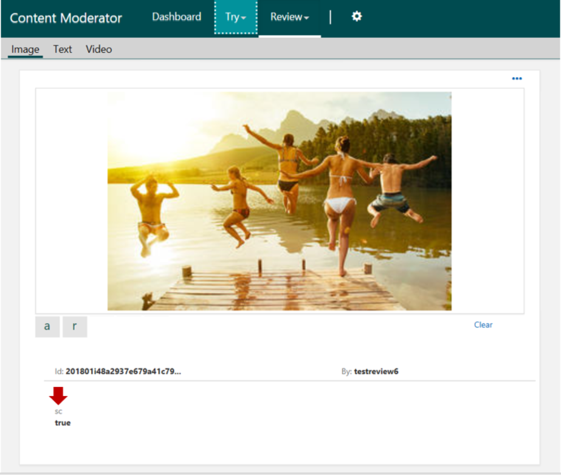

# Learn image moderation concepts

Use Content Moderator's machine-assisted image moderation and [Review tool](Review-Tool-User-Guide/human-in-the-loop.md) to moderate images for adult and racy content. Scan images for text content and extract that text, and detect faces. You can match images against custom lists, and take further action.

## Evaluating for adult and racy content

The **Evaluate** operation returns a confidence score between 0 and 1. It also returns boolean data equal to true or false. These values predict whether the image contains potential adult or racy content. When you call the API with your image (file or URL), the returned response includes the following information:

    "ImageModeration": {
      .............
      "adultClassificationScore": 0.019196987152099609,
      "isImageAdultClassified": false,
      "racyClassificationScore": 0.032390203326940536,
      "isImageRacyClassified": false,
      ............
      ],

> [!NOTE]
> 
> - `isImageAdultClassified` represents the potential presence of images that may be considered sexually explicit or adult in certain situations.
> - `isImageRacyClassified` represents the potential presence of images that may be considered sexually suggestive or mature in certain situations.
> - The scores are between 0 and 1. The higher the score, the higher the model is predicting that the category may be applicable. This preview relies on a statistical model rather than manually coded outcomes. We recommend testing with your own content to determine how each category aligns to your requirements.
> - The boolean values are either true or false depending on the internal score thresholds. Customers should assess whether to use this value or decide on custom thresholds based on their content policies.

## Detecting text with Optical Character Recognition (OCR)

The **Optical Character Recognition (OCR)** operation predicts the presence of text content in an image and extracts it for text moderation, among other uses. You can specify the language. If you do not specify a language, the detection defaults to English.

The response includes the following information:
- The original text.
- The detected text elements with their confidence scores.

Example extract:

    "TextDetection": {
      "status": {
        "code": 3000.0,
        "description": "OK",
        "exception": null
      },
      .........
      "language": "eng",
      "text": "IF WE DID \r\nALL \r\nTHE THINGS \r\nWE ARE \r\nCAPABLE \r\nOF DOING, \r\nWE WOULD \r\nLITERALLY \r\nASTOUND \r\nOURSELVE \r\n",
      "candidates": []
    },

## Detecting faces

Detecting faces helps to detect personal data such as faces in the images. You detect potential faces and the number of potential faces in each image.

A response includes this information:

- Faces count
- List of locations of faces detected

Example extract:

    "FaceDetection": {
       ......
      "result": true,
      "count": 2,
      "advancedInfo": [
      .....
      ],
      "faces": [
        {
          "bottom": 598,
          "left": 44,
          "right": 268,
          "top": 374
        },
        {
          "bottom": 620,
          "left": 308,
          "right": 532,
          "top": 396
        }
      ]
    }

## Creating and managing custom lists

In many online communities, after users upload images or other type of content, offensive items may get shared multiple times over the following days, weeks, and months. The costs of repeatedly scanning and filtering out the same image or even slightly modified versions of the image from multiple places can be expensive and error-prone.

Instead of moderating the same image multiple times, you add the offensive images to your custom list of blocked content. That way, your content moderation system compares incoming images against your custom lists and stops any further processing.

> [!NOTE]
> There is a maximum limit of **5 image lists** with each list to **not exceed 10,000 images**.
>

The Content Moderator provides a complete [Image List Management API](try-image-list-api.md) with operations for managing lists of custom images. Start with the [Image Lists API Console](try-image-list-api.md) and use the REST API code samples. Also check out the [Image List .NET quickstart](image-lists-quickstart-dotnet.md) if you are familiar with Visual Studio and C#.

## Matching against your custom lists

The Match operation allows fuzzy matching of incoming images against any of your custom lists, created and managed using the List operations.

If a match is found, the operation returns the identifier and the moderation tags of the matched image. The response includes this information:

- Match score (between 0 and 1)
- Matched image
- Image tags (assigned during previous moderation)
- Image labels

Example extract:

    {
    ..............,
    "IsMatch": true,
    "Matches": [
        {
            "Score": 1.0,
            "MatchId": 169490,
            "Source": "169642",
            "Tags": [],
            "Label": "Sports"
        }
    ],
    ....
    }

## Review tool

For more nuanced cases, use the Content Moderator [Review tool](Review-Tool-User-Guide/human-in-the-loop.md) and its API to surface the moderation results and content in the review for your human moderators. They review the machine-assigned tags and confirm their final decisions.

## Next steps

Test drive the [Image Moderation API console](try-image-api.md) and use the REST API code samples. Also see [Reviews, workflows, and jobs](./review-api.md) to learn how to set up human reviews.
