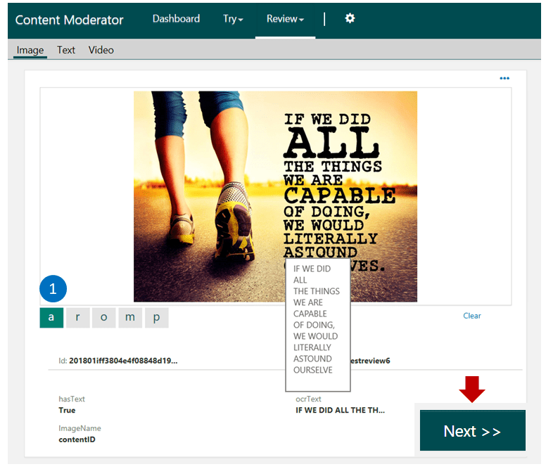

# Quickstart: Start moderation jobs using .NET

This article provides information and code samples to help you get started using the [Content Moderator SDK for .NET](https://www.nuget.org/packages/Microsoft.Azure.CognitiveServices.ContentModerator/) to:
 
- Start a moderation job to scan and create reviews for human moderators
- Get the status of the pending review
- Track and get the final status of the review
- Submit the result to the callback Url

This article assumes that you are already familiar with Visual Studio and C#.

## Sign up for Content Moderator

Before you can use Content Moderator services through the REST API or the SDK, you need a subscription key.
Refer to the [Quickstart](quick-start.md) to learn how you can obtain the key.

## Sign up for a review tool account if not completed in the previous step

If you got your Content Moderator from the Azure portal, also [sign up for the review tool account](https://contentmoderator.cognitive.microsoft.com/) and create a review team. You need the team Id and the review tool to call the review API to start a Job and view the reviews in the review tool.

## Ensure your API key can call the review API for review creation

After completing the previous steps, you may end up with two Content Moderator keys if you started from the Azure portal. 

If you plan to use the Azure-provided API key in your SDK sample, follow the steps mentioned in the [Using Azure key with the review API](review-tool-user-guide/credentials.md#use-the-azure-account-with-the-review-tool-and-review-api) section to allow your application to call the review API and create reviews.

If you use the free trial key generated by the review tool, your review tool account already knows about the key and therefore, no additional steps are required.

## Define a custom moderation workflow

A moderation job scans your content using the APIs and uses a **workflow** to determine whether to create reviews or not.
While the review tool contains a default workflow, let's [define a custom workflow](Review-Tool-User-Guide/Workflows.md) for this quickstart.

You use the name of the workflow in your code that starts the moderation job.

## Create your Visual Studio project

1. Add a new **Console app (.NET Framework)** project to your solution.

   In the sample code, name the project **CreateReviews**.

1. Select this project as the single startup project for the solution.

### Install required packages

Install the following NuGet packages:

- Microsoft.Azure.CognitiveServices.ContentModerator
- Microsoft.Rest.ClientRuntime
- Newtonsoft.Json

### Update the program's using statements

Modify the program's using statements.

	using Microsoft.Azure.CognitiveServices.ContentModerator;
	using Microsoft.CognitiveServices.ContentModerator;
	using Microsoft.CognitiveServices.ContentModerator.Models;
	using Newtonsoft.Json;
	using System;
	using System.Collections.Generic;
	using System.IO;
	using System.Threading;

### Create the Content Moderator client

Add the following code to create a Content Moderator client for your subscription.

> [!IMPORTANT]
> Update the **AzureRegion** and **CMSubscriptionKey** fields with 
> the values of your region identifier and subscription key.

    /// 

    /// Wraps the creation and configuration of a Content Moderator client.
    /// 

    /// <remarks>This class library contains insecure code. If you adapt this 
    /// code for use in production, use a secure method of storing and using
    /// your Content Moderator subscription key.</remarks>
    public static class Clients
    {
        /// 

        /// The region/location for your Content Moderator account, 
        /// for example, westus.
        /// 

        private static readonly string AzureRegion = "YOUR API REGION";

        /// 

        /// The base URL fragment for Content Moderator calls.
        /// 

        private static readonly string AzureBaseURL =
            $"https://{AzureRegion}.api.cognitive.microsoft.com";

        /// 

        /// Your Content Moderator subscription key.
        /// 

        private static readonly string CMSubscriptionKey = "YOUR API KEY";

        /// 

        /// Returns a new Content Moderator client for your subscription.
        /// 

        /// <returns>The new client.</returns>
        /// <remarks>The <see cref="ContentModeratorClient"/> is disposable.
        /// When you have finished using the client,
        /// you should dispose of it either directly or indirectly. </remarks>
        public static ContentModeratorClient NewClient()
        {
            // Create and initialize an instance of the Content Moderator API wrapper.
            ContentModeratorClient client = new ContentModeratorClient(new ApiKeyServiceClientCredentials(CMSubscriptionKey));

            client.Endpoint = AzureBaseURL;
            return client;
        }
    }

### Initialize application-specific settings

Add the following constants and static fields to the **Program** class in Program.cs.

> [!NOTE]
> You set the TeamName constant to the name you used when you
> created your Content Moderator subscription. You retrieve TeamName from the
> [Content Moderator web site](https://westus.contentmoderator.cognitive.microsoft.com/).
> Once you log in, select **Credentials** from the **Settings** (gear) menu.
>
> Your team name is the value of the **Id** field in the **API** section.

	/// 

    /// The moderation job will use this workflow that you defined earlier.
    /// See the quickstart article to learn how to setup custom workflows.
    /// 

    private const string WorkflowName = "OCR";
	
	/// 

	/// The name of the team to assign the job to.
	/// 

	/// <remarks>This must be the team name you used to create your 
	/// Content Moderator account. You can retrieve your team name from
	/// the Content Moderator web site. Your team name is the Id associated 
	/// with your subscription.</remarks>
	private const string TeamName = "***";

	/// 

	/// The URL of the image to create a review job for.
	/// 

	private const string ImageUrl =
    	"https://moderatorsampleimages.blob.core.windows.net/samples/sample5.png";

	/// 

	/// The name of the log file to create.
	/// 

	/// <remarks>Relative paths are relative to the execution directory.</remarks>
	private const string OutputFile = "OutputLog.txt";

	/// 

    /// The number of seconds to delay after a review has finished before
    /// getting the review results from the server.
    /// 

    private const int latencyDelay = 45;

    /// 

    /// The callback endpoint for completed reviews.
    /// 

    /// <remarks>Reviews show up for reviewers on your team. 
    /// As reviewers complete reviews, results are sent to the
    /// callback endpoint using an HTTP POST request.</remarks>
    private const string CallbackEndpoint = "";

## Add code to auto-moderate, create a review, and get the job details

> [!Note]
> In practice, you set the callback URL **CallbackEndpoint** to the URL
> that receives the results of the manual review (via an HTTP POST request).

Start by adding the following code to the **Main** method.

	using (TextWriter writer = new StreamWriter(OutputFile, false))
	{
    	using (var client = Clients.NewClient())
    	{
        	writer.WriteLine("Create review job for an image.");
        	var content = new Content(ImageUrl);
		
			// The WorkflowName contains the name of the workflow defined in the online review tool.
           	// See the quickstart article to learn more.
           	var jobResult = client.Reviews.CreateJobWithHttpMessagesAsync(
            		TeamName, "image", "contentID", WorkflowName, "application/json", content, CallbackEndpoint);

        	// Record the job ID.
        	var jobId = jobResult.Result.Body.JobIdProperty;

        	// Log just the response body from the returned task.
        	writer.WriteLine(JsonConvert.SerializeObject(
            	jobResult.Result.Body, Formatting.Indented));

        	Thread.Sleep(2000);
        	writer.WriteLine();

        	writer.WriteLine("Get review job status.");
        	var jobDetails = client.Reviews.GetJobDetailsWithHttpMessagesAsync(
            		TeamName, jobId);

        	// Log just the response body from the returned task.
        	writer.WriteLine(JsonConvert.SerializeObject(
            		jobDetails.Result.Body, Formatting.Indented));

			Console.WriteLine();
           	Console.WriteLine("Perform manual reviews on the Content Moderator site.");
           	Console.WriteLine("Then, press any key to continue.");
           	Console.ReadKey();

           	Console.WriteLine();
           	Console.WriteLine($"Waiting {latencyDelay} seconds for results to propagate.");
            Thread.Sleep(latencyDelay * 1000);

            writer.WriteLine("Get review details.");
            jobDetails = client.Reviews.GetJobDetailsWithHttpMessagesAsync(
            TeamName, jobId);

            // Log just the response body from the returned task.
            writer.WriteLine(JsonConvert.SerializeObject(
            jobDetails.Result.Body, Formatting.Indented));
		}
        writer.Flush();
        writer.Close();
	}

> [!NOTE]
> Your Content Moderator service key has a requests per second (RPS)
> rate limit. If you exceed the limit, the SDK throws an exception with a 429 error code. 
>
> A free tier key has a one RPS rate limit.

## Run the program and review the output

You see the following sample output in the console:

	Perform manual reviews on the Content Moderator site.
	Then, press any key to continue.

Sign into the Content Moderator review tool to see the pending image review.

Use the **Next** button to submit.

## See the sample output in the log file

> [!NOTE]
> In your output file, the strings **Teamname**, **ContentId**, **CallBackEndpoint**, and **WorkflowId**
> reflect the values you used earlier.

	Create moderation job for an image.
	{
		"JobId": "2018014caceddebfe9446fab29056fd8d31ffe"
	}

	Get review details.
	{
		"Id": "2018014caceddebfe9446fab29056fd8d31ffe",
		"TeamName": "some team name",
		"Status": "InProgress",
		"WorkflowId": "OCR",
		"Type": "Image",
		"CallBackEndpoint": "",
		"ReviewId": "",
		"ResultMetaData": [],
		"JobExecutionReport": [
    	{
      		"Ts": "2018-01-07T00:38:26.7714671",
      		"Msg": "Successfully got hasText response from Moderator"
    	},
    	{
      		"Ts": "2018-01-07T00:38:26.4181346",
      		"Msg": "Getting hasText from Moderator"
    	},
    	{
      		"Ts": "2018-01-07T00:38:25.5122828",
      		"Msg": "Starting Execution - Try 1"
    	}
		]
	}

## Your callback Url if provided, receives this response.

You see a response like the following example:

> [!NOTE]
> In your callback response, the strings **ContentId** and **WorkflowId**
> reflect the values you used earlier.

	{
		"JobId": "2018014caceddebfe9446fab29056fd8d31ffe",
		"ReviewId": "201801i28fc0f7cbf424447846e509af853ea54",
		"WorkFlowId": "OCR",
		"Status": "Complete",
		"ContentType": "Image",
		"CallBackType": "Job",
		"ContentId": "contentID",
		"Metadata": {
			"hastext": "True",
			"ocrtext": "IF WE DID \r\nALL \r\nTHE THINGS \r\nWE ARE \r\nCAPABLE \r\nOF DOING, \r\nWE WOULD \r\nLITERALLY \r\nASTOUND \r\nOURSELVE \r\n",
			"imagename": "contentID"
		}
	}

## Next steps

Get the [Content Moderator .NET SDK](https://www.nuget.org/packages/Microsoft.Azure.CognitiveServices.ContentModerator/) and the [Visual Studio solution](https://github.com/Azure-Samples/cognitive-services-dotnet-sdk-samples/tree/master/ContentModerator) for this and other Content Moderator quickstarts for .NET, and get started on your integration.
