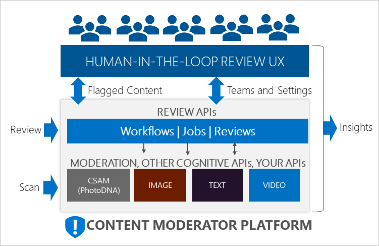
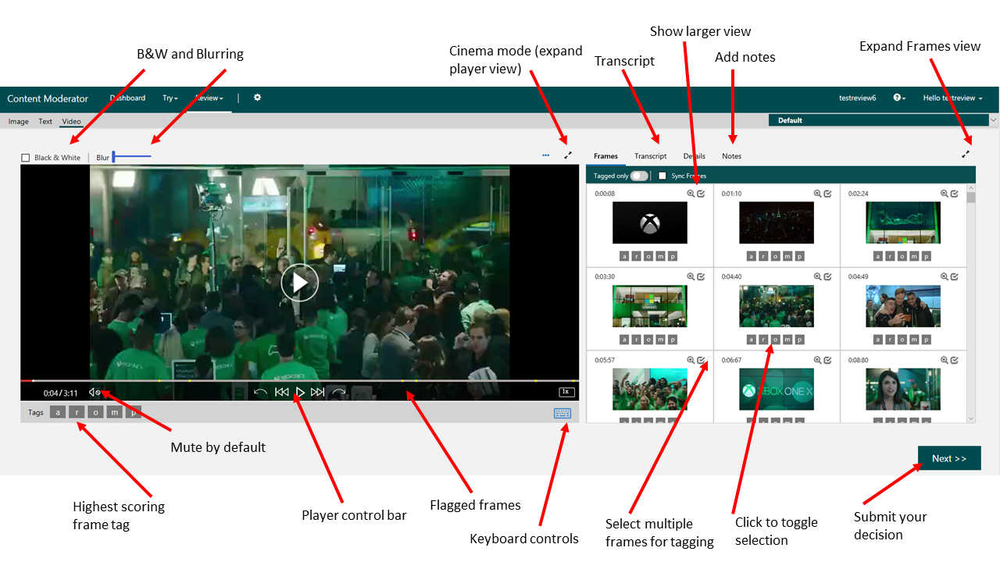

# What is Content Moderator?

Content moderation is the process of monitoring text, image, or video content for material that is potentially offensive, undesirable, or risky. Flagged content can then be hidden or otherwise addressed in order to comply with regulations or maintain an intended environment for users.

## Where it is used

The following list shows a few example scenarios where Content Moderator can be used:

- Online marketplaces moderating product catalogs and user-generated content
- Gaming companies moderating user-generated game artifacts and chat rooms
- Social messaging platforms moderating images, text, and videos added by their users
- Enterprise media companies implementing centralized content moderation for their content
- K-12 education solution providers filtering out inappropriate and offensive content for students and educators

## What it includes

Content Moderator consists of several web service APIs and a built-in human-in-the-loop review tool that help moderate images, text, and videos.

### APIs

The Content Moderator service includes the following APIs:
  - [**Text moderation API**](text-moderation-api.md): Use this API to scan text for possible profanity, explicit, suggestive, offensive, and personally identifiable information (PII).
  - [**Custom term list API**](try-terms-list-api.md): Use this API to match against custom lists of terms in addition to the built-in terms. Use these lists to block or allow content as per your content policies.  
  - [**Image moderation API**](image-moderation-api.md): Use this API to scan images for adult and racy content, detect text in images with the Optical Character Recognition (OCR) capability, and detect faces.
  - [**Custom image list API**](try-image-list-api.md): Use this API to match against custom lists of images, pre-identified content that you don’t need to classify again.
  - [**Video moderation API**](video-moderation-api.md): Use this API to scan videos for potential adult and racy content.
  - [**Review APIs**](try-review-api-job.md): Use the [Jobs](try-review-api-job.md), [Reviews](try-review-api-review.md), and [Workflow](try-review-api-workflow.md) operations to create and automate human-in-the-loop workflows within the review tool.

### Human review tool

Your Content Moderator subscription includes the built-in [human review tool](Review-Tool-User-Guide/human-in-the-loop.md). Use the previously mentioned Review API to create reviews of text, images, and videos for your human moderators to take final decisions.

## Next steps

Use the [Quickstart](quick-start.md) to get started with Content Moderator.
