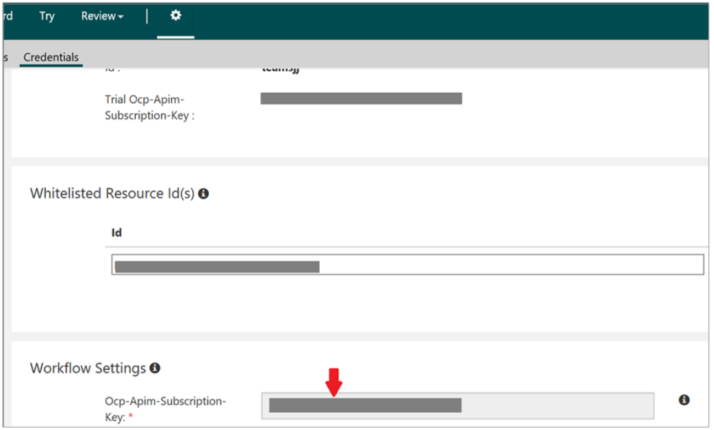

# Content Moderator overview

Content moderation is the process of monitoring user-generated content on online and social media websites, chat and messaging platforms, enterprise environments, gaming platforms, and peer communication platforms. The goal is to track, flag, assess, and filter out offensive and unwanted content that creates risk for your organization. Moderated content might include text, images, and videos.

## Why moderate content

Moderating text, image, and video content has multiple benefits:
- Text moderation benefits communities, family-based websites, in-game communities, chat and messaging platforms, and user-generated content marketing.
- Image moderation works great for ensuring that profile pictures, social media posts, and business documents are appropriate. Using moderation on image-sharing sites saves resources by providing a first-level scan and by flagging potentially damaging content.
- Video moderation is designed for video publishing sites, news sites, and video content sites. Use it anywhere that videos are likely to be uploaded.

## Three ways to moderate content

The method you use to moderate content depends on the resources and requirements that are available to you:

- Human moderation uses teams and the community to moderate all content.
- Automated moderation applies machine learning and AI to cost-effectively moderate at scale, without human involvement.
- Hybrid moderation is automated moderation that is augmented by a human-in-the-loop component (human oversight).

You can use Azure Content Moderator in all three scenarios. Human moderators can use Content Moderator to apply tags to content and submit moderation decisions. Content Moderator can scan and automatically tag items and submit them, if specified in a moderation workflow. Content Moderator also can automatically tag and present items for human review in an online review tool.

## Integrated tools

Content moderation in Content Moderator consists of several web service APIs and human-in-the-loop capabilities via the Review tool:

Content Moderator uses the following APIs:
  - **Text Moderation API**: Use to scan and tag text.
  - **Image Moderation API**: Use to scan and tag images.
  - **Video Moderation API**: Use to scan and tag videos.
  - **Review API**: Use to review text, images, or videos, and apply and remove tags.
  - **List Management API**: Use to create and use custom lists of images and text to match against pre-identified content that you don’t need to scan again.
  - **Workflow API**: Select additional APIs. Define conditional logic and actions that are specific to your content policies.

All of these features work together to help you efficiently moderate content and prevent inappropriate material from being posted to your platform.

## Get started with the human review tool

Hybrid moderation by using the Content Moderator [Review tool](quick-start.md) is a good way to try out the Content Moderator APIs. It easily and intuitively augments automated moderation with human-in-the-loop capabilities. The Review tool internally calls the automated moderation APIs, and then presents the items for review, right in your web browser. In the Review tool, you can invite other users to review content, track pending invites, and assign permissions to team members.

Use the [Review API](review-api.md) to auto-moderate content in bulk and review tagged images or text in the Review tool. Provide your API callback point so that you are notified when reviewers submit their moderation decisions. You can use this feature to automate post-review workflows by integrating it with your own systems.

## Use the automated moderation APIs

If you sign up for the Review tool, to get your free tier key, select **Settings** > **Credentials**. Your subscription key is the value in the **Ocp-Apim-Subscription-Key** box.

You can also sign up for the free tiers of the [Text Moderation API](text-moderation-api.md) and the [Image Moderation API](image-moderation-api.md). You can use these subscriptions to learn how to automatically moderate large amounts of content, and integrate the content moderation with your review tools and processes. While you’re at it, apply to use the private preview of the [Video Moderation API](video-moderation-api.md).

