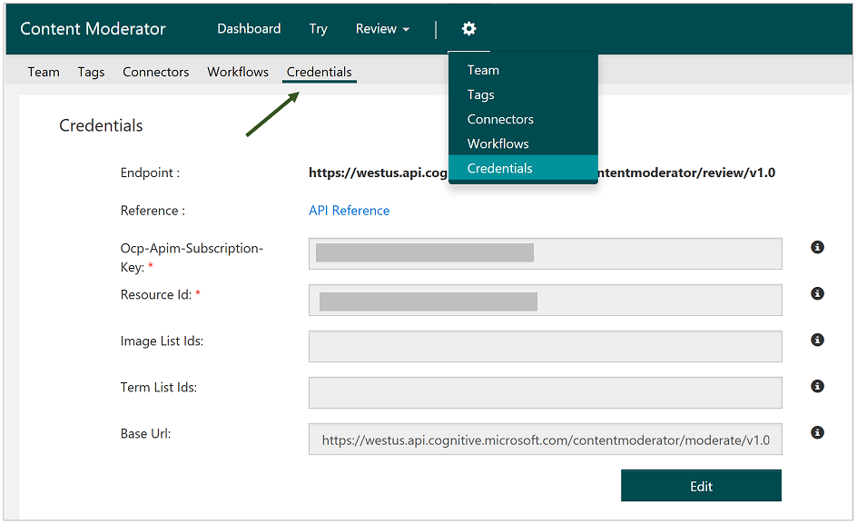

# Overview

Content moderation is the process of monitoring User Generated Content (UGC) on online and social media web sites, chat and messaging platforms, enterprise environments, gaming platforms, and peer communication platforms. The goal is to track, flag, assess, and filter out offensive and unwanted content that creates risks for businesses. The content can include text, images, and videos.

## Why moderate content?

Moderating all three types of content has several benefits, including:
- Image moderation works great for ensuring profile pictures, social media, and business documents are appropriate. Using it on image sharing sites saves resources by providing a first-level scan and flagging potentially damaging content.
- Text moderation benefits communities, family-based web sites, in-game communities, chat and messaging platforms, and user-generated content marketing.
- Video moderation is designed for video publishing sites, news sites, video content sites -- anywhere that videos are likely to be uploaded.

## Three ways to moderate content

The method used depends on available resources and requirements.

- Human moderation uses teams and the community to moderate all content.
- Automated moderation applies machine learning and AI to cost-effectively moderate at scale, with no human involvement.
- Hybrid moderation combines automated moderation augmented by the human-in-the-loop (human oversight).

Microsoft Content Moderator enables all three scenarios. It can be used by human moderators to apply tags to content and submit their decisions; it can scan and automatically tag items and submit them as specified in the workflow; or it can automatically tag and present items within an online tool for additional human review.

## The tools work together

Content moderation consists of several web service APIs and human-in-the-loop capabilities via a review tool:

- A review tool that uses the following APIs.
- Text Moderation API – Scan and tag text.
- Image Moderation API – Scan and tag images.
- Video Moderation API – Scan and tag videos.
- Review API – Review text, images, or videos and apply/remove tags.
- List Manager API – Create and use custom lists of images and text for matching against pre-identified content that you don’t need to scan repeatedly.
- Workflow API – Select additional APIs, and define conditional logic and actions specific to your content policies.

All of these features work together to efficiently moderate content and prevent inappropriate material from being posted to your platform.

## Get started with the human review tool

Hybrid moderation using the [review tool](quick-start.md) is a good way to try out the content moderation APIs. It easily and intuitively augments automated moderation with human-in-the-loop capabilities. The review tool internally calls the automated moderation APIs and presents the items for review right within your web browser. You can invite other users to review, track pending invites, and assign permissions to your team members.

Use the [review API](review-api.md) to auto-moderate content in bulk and review the tagged images or text within the review tool. Provide your API callback point so that you get notified when the reviewers submit their decisions. This feature allows you to automate the post-review workflow by integrating with your own systems.

## Directly use the automated moderation APIs
If you sign up for the review tool, you will find your free tier key in the Credentials tab under Settings, as shown in the following screenshot:

You can also sign up for the free tiers of [text moderation](text-moderation-api.md) and [image moderation](image-moderation-api.md) APIs to see how to automatically moderate large amounts of content and integrate with your review tools and processes. While you’re at it, apply to use the private preview of the [video moderation](video-moderation-api.md) APIs.
