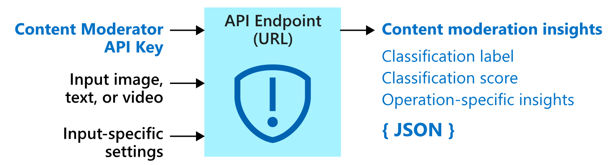
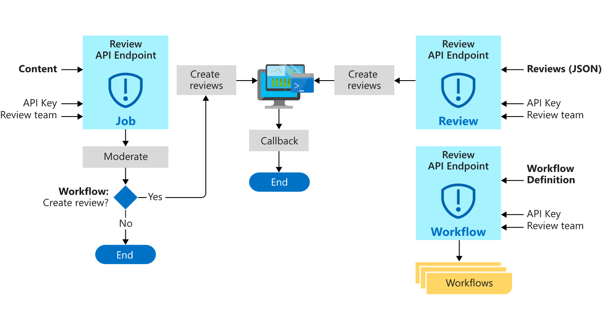

# What is Azure Content Moderator?

[!INCLUDE [TLS 1.2 enforcement](../../../includes/cognitive-services-tls-announcement.md)]

Azure Content Moderator is an AI service that lets you handle content that is potentially offensive, risky, or otherwise undesirable. It includes the AI-powered content moderation service which scans text, image, and videos and applies content flags automatically, as well as the Review tool, an online moderator environment for a team of human reviewers.

You may want to build content filtering software into your app to comply with regulations or maintain the intended environment for your users.

This documentation contains the following article types:  

* [**Quickstarts**](client-libraries.md) are getting-started instructions to guide you through making requests to the service.  
* [**How-to guides**](try-text-api.md) contain instructions for using the service in more specific or customized ways.  
* [**Concepts**](text-moderation-api.md) provide in-depth explanations of the service functionality and features.  
* [**Tutorials**](ecommerce-retail-catalog-moderation.md) are longer guides that show you how to use the service as a component in broader business solutions.  

## Where it's used

The following are a few scenarios in which a software developer or team would require a content moderation service:

- Online marketplaces that moderate product catalogs and other user-generated content.
- Gaming companies that moderate user-generated game artifacts and chat rooms.
- Social messaging platforms that moderate images, text, and videos added by their users.
- Enterprise media companies that implement centralized moderation for their content.
- K-12 education solution providers filtering out content that is inappropriate for students and educators.

> [!IMPORTANT]
> You cannot use Content Moderator to detect illegal child exploitation images. However, qualified organizations can use the [PhotoDNA Cloud Service](https://www.microsoft.com/photodna "Microsoft PhotoDNA Cloud Service") to screen for this type of content.

## What it includes

The Content Moderator service consists of several web service APIs available through both REST calls and a .NET SDK. It also includes the Review tool, which allows human reviewers to aid the service and improve or fine-tune its moderation function.

## Moderation APIs

The Content Moderator service includes Moderation APIs, which check content for material that is potentially inappropriate or objectionable.

The following table describes the different types of moderation APIs.

| API group | Description |
| ------ | ----------- |
|[**Text moderation**](text-moderation-api.md)| Scans text for offensive content, sexually explicit or suggestive content, profanity, and personal data.|
|[**Custom term lists**](try-terms-list-api.md)| Scans text against a custom list of terms along with the built-in terms. Use custom lists to block or allow content according to your own content policies.|  
|[**Image moderation**](image-moderation-api.md)| Scans images for adult or racy content, detects text in images with the Optical Character Recognition (OCR) capability, and detects faces.|
|[**Custom image lists**](try-image-list-api.md)| Scans images against a custom list of images. Use custom image lists to filter out instances of commonly recurring content that you don't want to classify again.|
|[**Video moderation**](video-moderation-api.md)| Scans videos for adult or racy content and returns time markers for said content.|

## Review APIs

The Review APIs let you integrate your moderation pipeline with human reviewers. Use the [Jobs](review-api.md#jobs), [Reviews](review-api.md#reviews), and [Workflow](review-api.md#workflows) operations to create and automate human-in-the-loop workflows with the [Review tool](#review-tool) (below).

> [!NOTE]
> The Workflow API is not yet available in the .NET SDK but can be used with the REST endpoint.

## Review tool

The Content Moderator service also includes the web-based [Review tool](Review-Tool-User-Guide/human-in-the-loop.md), which hosts the content reviews for human moderators to process. The human input doesn't train the service, but the combined work of the service and human review teams allows developers to strike the right balance between efficiency and accuracy. The Review tool also provides a user-friendly front end for several Content Moderator resources.

## Data privacy and security

As with all of the Cognitive Services, developers using the Content Moderator service should be aware of Microsoft's policies on customer data. See the [Cognitive Services page](https://www.microsoft.com/trustcenter/cloudservices/cognitiveservices) on the Microsoft Trust Center to learn more.

## Next steps

To get started using Content Moderator on the web portal, follow [Try Content Moderator on the web](quick-start.md). Or, complete a [client library or REST API quickstart](client-libraries.md) to implement the basic scenarios in code.