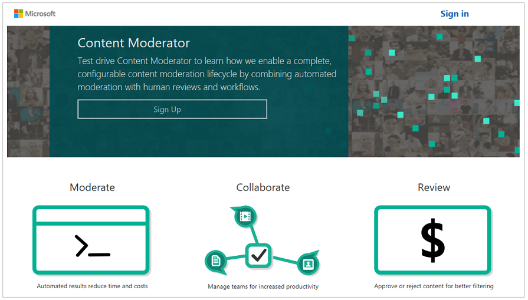
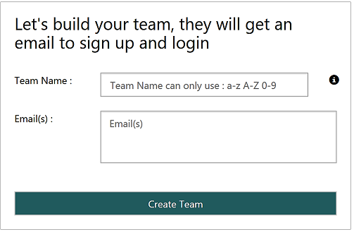
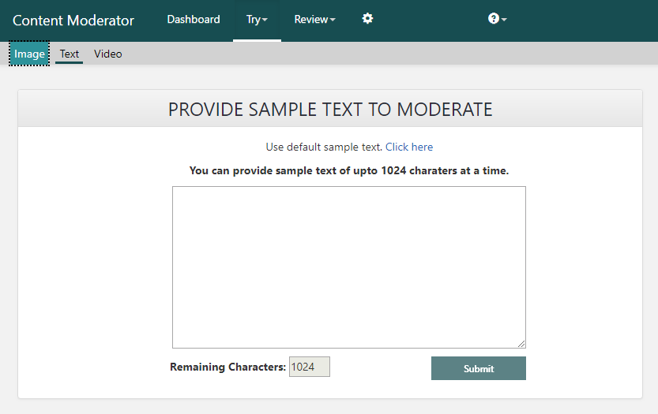
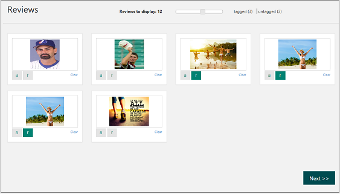

# Get started with Content Moderator

You get started with Content Moderator in the following ways:

- [Start with the review tool](#start-with-the-review-tool) to get the API key and create a review team. The benefit is that you can use the API key to call the moderation APIs for scanning content and the review APIs for generating reviews, without additional steps.
- [Subscribe to Content Moderator](#start-with-the-apis) in Azure to get the API key. Check out the [API reference](api-reference.md) and the [SDKs](sdk-and-samples.md#sdks-for-python-java-nodejs-and-net). You still need to sign up online to create a review team.
- [Use the Flow connector and templates](https://flow.microsoft.com/connectors/shared_cognitiveservicescontentmoderator/content-moderator/) to check out a wide range of integrations with an easy-to-use designer.

Regardless of the option you choose, see the [Managing credentials](review-tool-user-guide/credentials.md) article to find your API credentials.

## Start with the review tool
[Sign up](http://contentmoderator.cognitive.microsoft.com/) on the Content Moderator review tool web site.

### Create a review team
Give your team a name. If you want to invite your colleagues, you can do so by entering their email addresses.

### Upload images or enter text
Click **Try > Image** or **Try > Text**. Upload up to five sample images or enter sample text for moderation.

### Submit for automated moderation
Submit your content for automated moderation. Internally, the review tool calls the moderation APIs to scan your content. Once the scanning is complete, you see a message informing you about the results waiting for your review.

### Review and confirm results
Review the auto-moderated tags, change if needed, and submit by using the **Next** button. As your business application calls the Moderator APIs, the tagged content starts queuing up, ready to be reviewed by the human review teams. You quickly review large volumes of content using this approach.

Learn how to use all the [review tool's features](Review-Tool-User-Guide/human-in-the-loop.md) or continue with the next section to learn about the APIs. Skip the sign-up step because you have the API key provisioned for you in the review tool as shown in the [Managing credentials](review-tool-user-guide/credentials.md) article.

### Use the APIs

Learn how to integrate Content Moderator with your business applications. Check out the [API reference](api-reference.md) and the [SDKs](sdk-and-samples.md#sdks-for-python-java-nodejs-and-net).

## Subscribe in the Azure portal

[Subscribe to Content Moderator](https://ms.portal.azure.com/#create/Microsoft.CognitiveServicesContentModerator) in the Azure portal. Start with one of the following APIs:

### Image moderation

Start with the [API console](try-image-api.md) or use the [.NET quickstart](image-moderation-quickstart-dotnet.md) to scan images and detect potential adult and racy content by using tags, confidence scores, and other extracted information.

### Text moderation

Start with the [API console](try-text-api.md) or use the [.NET quickstart](text-moderation-quickstart-dotnet.md) to scan text content for potential profanity, machine-assisted unwanted text classification (preview), and personally identifiable information (PII). 

### Video moderation

Start with the [.NET quickstart](video-moderation-api.md) to scan videos and detect potential adult and racy content. 

### Review APIs

Start here by choosing from the Job, Review, and Workflow APIs.

- The [Job API](try-review-api-job.md) scans your content by using the moderation APIs and generates reviews in the review tool. 
- The [Review API](try-review-api-review.md) directly creates image, text, or video reviews for human moderators without first scanning the content. 
- The [Workflow API](try-review-api-workflow.md) creates, updates, and gets details about the custom workflows that your team creates.

## Next steps

Check out the [API reference](api-reference.md) and the [SDKs](sdk-and-samples.md#sdks-for-python-java-nodejs-and-net). Jumpstart your integration with the [.NET SDK samples](sdk-and-samples.md#net-sdk-samples), [REST API samples in C#](https://github.com/sanjeev3/azure-docs-pr/blob/master/articles/cognitive-services/Content-Moderator/sdk-and-samples.md#rest-api-samples-in-c) and [tutorials](sdk-and-samples.md#tutorials).
