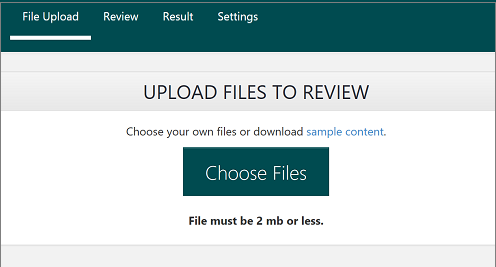
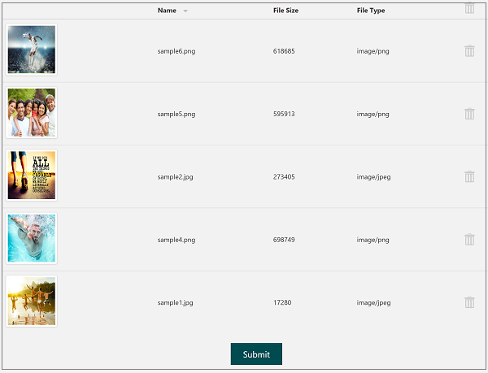
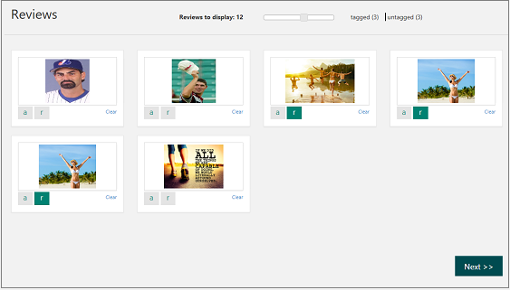

# Get started with Content Moderator #

## 1. Create a review team
Sign up to try the [human review tool](http://contentmoderator.cognitive.microsoft.com/ "Content Moderator Review Tool"). Then upload images or submit sample text to try the automated moderation and human review capabilities without writing any code.

Also read: [Review Tool User Guide](review-tool-user-guide/human-in-the-loop.md)

### a. Sign up and invite others
Sign up to try the [review tool](http://contentmoderator.cognitive.microsoft.com/ "Content Moderator Review Tool") by either using your existing Microsoft account or create an account within the review tool. Optionally, invite your colleagues by entering their email addresses.

### b. Upload images or enter text
Use the File Upload feature to upload a set of sample images or enter your text for moderation.

### c. Submit for automated moderation
Submit your content for automated moderation. Internally, the review tool calls the moderation APIs to scan your content. Once the scanning is complete, you see a message informing you about the results waiting for your review.

### d. Review and confirm results
As your business application calls the Moderator APIs, the tagged content starts queuing up, ready to be reviewed by the human review teams. You can quickly review large volumes of content using this approach. You are doing a few different things as part of your moderation workflow such as browsing the tagged content, changing the tags, and submitting your decisions.

## 2. Directly call the moderation APIs ("scan")
Use your Content Moderator free tier keys available in the **Credentials** TAB under **Settings** to directly try the image and text moderation APIs. You can use the Image APIs to scan images from URLs or binary data. You can use the Text APIs to scan up to a maximum of 1024 characters at a time for profanity, adult, racy, and offensive content. You can either use the "**Try API**" test console within the API reference or write your own application. When you are ready to purchase, you can [upgrade to a paid subscription](https://portal.azure.com/#create/Microsoft.CognitiveServices/apitype/ContentModerator) and swap out the keys in your application.

## 3. Call the review API for best-of-both ("scan and review")
Use your Content Moderator free tier keys as shown in the previous section, to try the review API's **Job** operation. The **Job** operation calls the underlying moderation APIs (Image or Text). Based on the criteria defined in your custom workflow, it creates **reviews** within the review tool. Once the human reviewers have examined the auto-assigned tags and conveyed their agreement of disagreement by changing them, the review API sends all data to your API callback endpoint.

You can either use the "**Try API**" test console within the API reference or write your own application. When you are ready to purchase, you can [upgrade to a paid subscription](https://portal.azure.com/#create/Microsoft.CognitiveServices/apitype/ContentModerator) and swap out the keys in your application.
