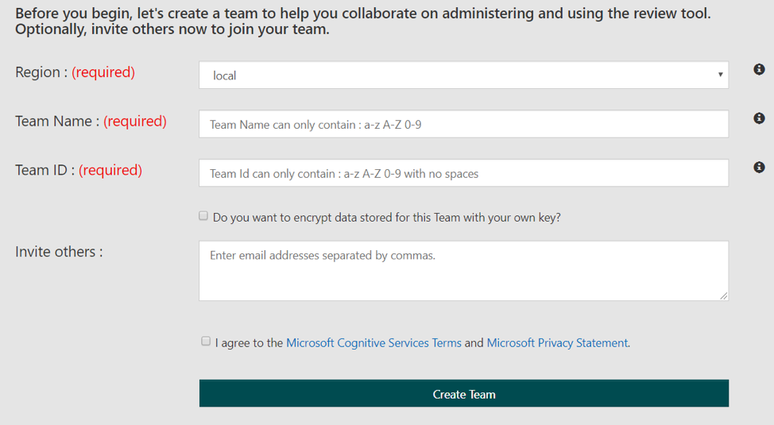
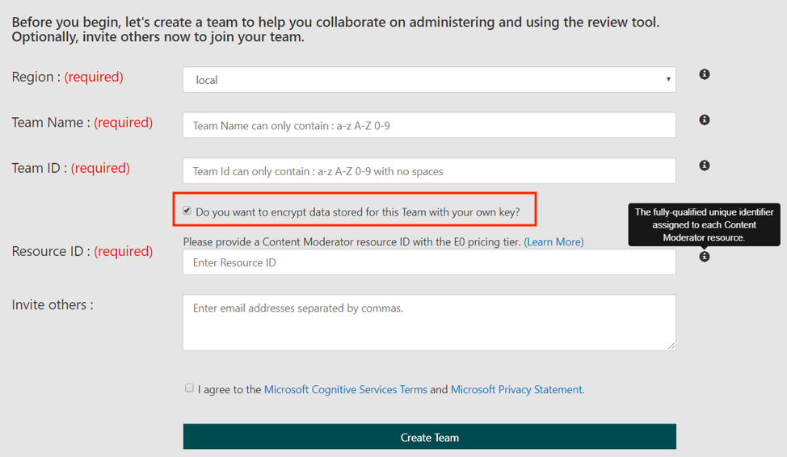
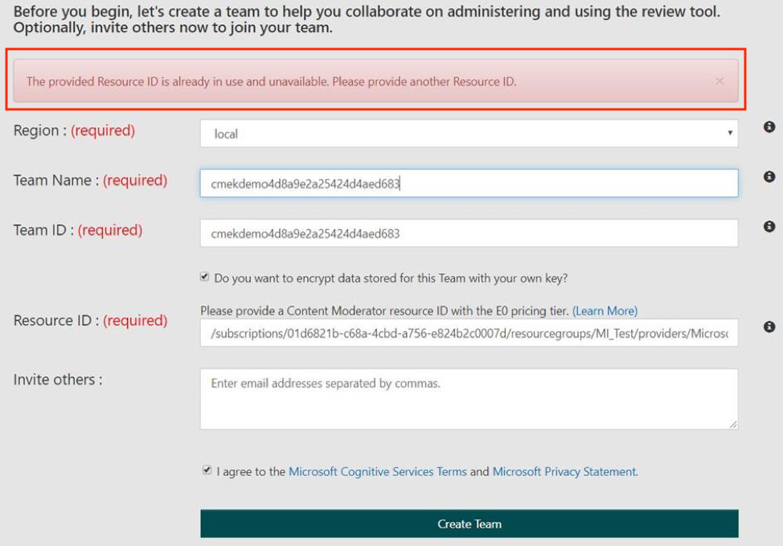
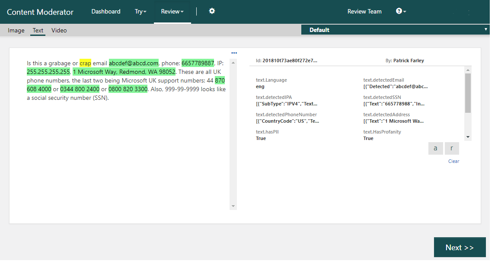

# Quickstart: Try Content Moderator on the web

In this quickstart, you'll use the online Content Moderator Review tool to test out the basic functionality of Content Moderator without having to write any code. If you wish to integrate this service into your app more quickly, see the other quickstarts in the [Next steps](#next-steps) section.

## Prerequisites

- A web browser

## Set up the review tool
The Content Moderator Review tool is a web-based tool that allows human reviewers to aid the cognitive service in making decisions. In this guide, you will go through the short process of setting up the review tool so that you can see how the Content Moderator service works. Go to the [Content Moderator Review tool](https://contentmoderator.cognitive.microsoft.com/) site and sign up.

## Create a review team

Next, create a review team. In a working scenario, this will be the group of people who will manually review the service's moderation decisions. To create a team, you'll need to select a **Region**, and provide a **Team Name** and a **Team ID**. If you wish to invite colleagues to the team, you can do so by entering their email addresses here.

> [!NOTE]
> **Team Name** is a friendly name for your review team. This is the name displayed in the Azure portal. The **Team ID** is what's used to identify your review team programatically.

> [!div class="mx-imgBorder"]
> 

If you choose to encrypt data using a customer-managed key (CMK), you'll be prompted for the **Resource ID** for your Content Moderator resource in the E0 pricing tier. The resource you provide must be new. 

> [!div class="mx-imgBorder"]
> 

If you try to reuse a Content Moderator resource, you'll see this warning: 

> [!div class="mx-imgBorder"]
> 

## Upload sample content

Now you're ready to upload sample content. Select **Try > Image**, **Try > Text**, or **Try > Video**.

Submit your content for moderation. Internally, the review tool will call the moderation APIs to scan your content. Once the scanning is complete, you'll see a message informing you that there are results waiting for your review.

## Review moderation tags

Review the applied moderation tags. You can see which tags were applied to your content and what the score was in each category. See the [Image](image-moderation-api.md), [Text](text-moderation-api.md), and [Video](video-moderation-api.md) moderation topics to learn more about what the different content tags indicate.

In a project, you or your review team can change these tags or add more tags as needed. You'll submit these changes with the **Next** button. As your business application calls the Moderator APIs, the tagged content will queue up here, ready to be reviewed by the human review teams. You can quickly review large volumes of content using this approach.

At this point, you have used the Content Moderator Review tool to see examples of what the Content Moderator service can do. Next, you can either learn more about the review tool and how to integrate it into a software project using the Review APIs, or you can skip to the [Next steps](#next-steps) section to learn how to use the Moderation APIs themselves in your app.

## Learn more about the review tool

To learn more about how to use the Content Moderator Review tool, take a look at the [Review tool](Review-Tool-User-Guide/human-in-the-loop.md) guide, and see the Review tool APIs to learn how to fine-tune the human review experience:
- The [Job API](try-review-api-job.md) scans your content by using the moderation APIs and generates reviews in the review tool. 
- The [Review API](try-review-api-review.md) directly creates image, text, or video reviews for human moderators without first scanning the content. 
- The [Workflow API](try-review-api-workflow.md) creates, updates, and gets details about the custom workflows that your team creates.

Or, continue with the next steps to get started using the Moderation APIs in your code.

## Next steps

Learn how to use the Moderation APIs themselves in your app.
- Implement image moderation. Use the [API console](try-image-api.md) or follow the the [.NET SDK quickstart](dotnet-sdk-quickstart.md) to scan images and detect potential adult and racy content by using tags, confidence scores, and other extracted information.
- Implement text moderation. Use the [API console](try-text-api.md) or use the [.NET SDK quickstart](dotnet-sdk-quickstart.md) to scan text content for potential profanity, machine-assisted unwanted text classification (preview), and personal data.
- Implement video moderation. Follow the [Video moderation how-to guide for C#](video-moderation-api.md) to scan videos and detect potential adult and racy content. 
