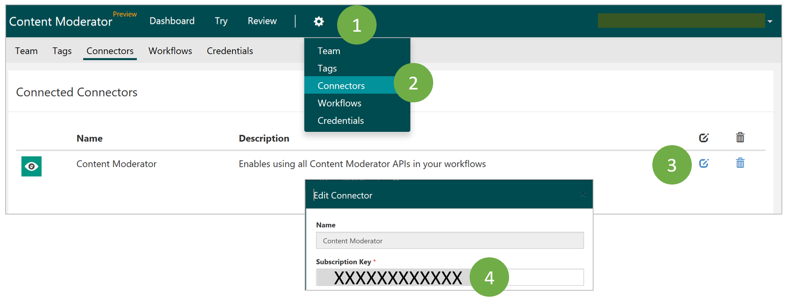

# Get Started
Start by signing up for the [review tool](http://contentmoderator.cognitive.microsoft.com/ "Content Moderator Review Tool") and uploading images or entering text to explore the automated moderation and review the results right within your web browser.

Also read: [Review Tool User Guide](review-tool-user-guide/human-in-the-loop.md)

## What if I want to directly try the image and text moderation APIs?
Use your free trial key for the Content Moderator APIs from the **Connectors** TAB in the **Settings** section. When you are ready to purchase, you can [upgrade to a paid subscription](https://portal.azure.com/#create/Microsoft.CognitiveServices/apitype/ContentModerator) and swap out the keys.

## 1. Sign up and invite others
Sign up to try the [review tool](http://contentmoderator.cognitive.microsoft.com/ "Content Moderator Review Tool") by either using your existing Microsoft account or create a new account within the review tool. Optionally, invite your colleagues by entering their email addresses.

## 2. Upload images or enter text
Use the File Upload feature to upload a set of sample images or enter your text for moderation. You will find a link to download the sample images or use the sample text.

## 3. Submit for automated moderation
Submit your content for automated moderation. Internally, the review tool will call the moderation APIs to scan your content. Once the scanning is complete, you will see a message informing you about the results waiting for your review.

## 4. Review and confirm results
As your business application calls the Moderator APIs, the tagged content will start queuing up, ready to be reviewed by the human review teams. You can quickly review large volumes of content using this approach. You will be doing a few different things as part of your moderation workflow such as:

- Browsing the reviews on-screen
- Reviewing moderation scores and results
- Confirming or modifying the tags returned by the API

