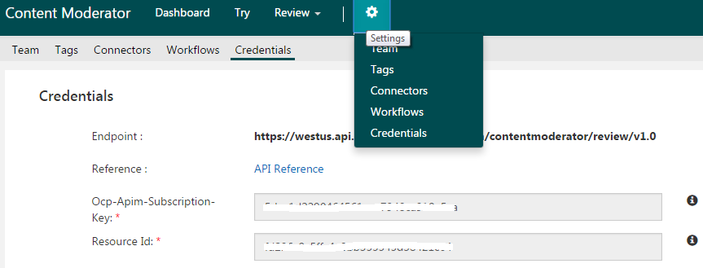
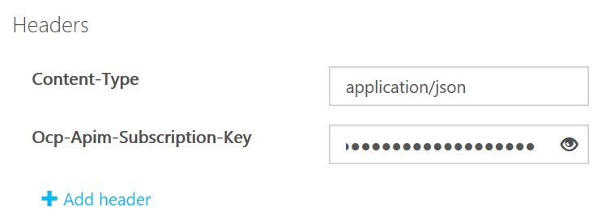
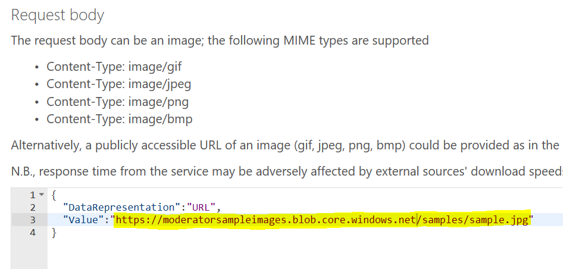
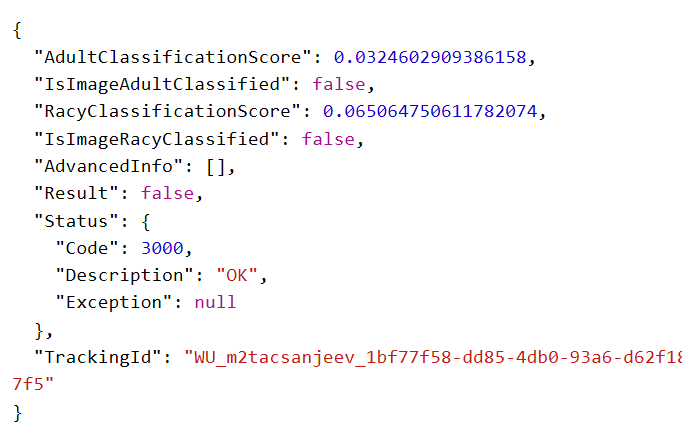
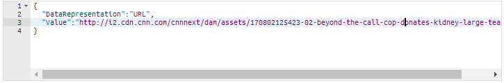
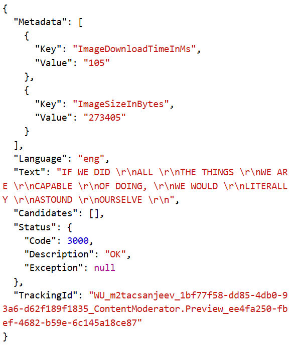

# Try Image Moderation API

Use the [Image Moderation API](https://westus.dev.cognitive.microsoft.com/docs/services/57cf753a3f9b070c105bd2c1/operations/57cf753a3f9b070868a1f66c) to initiate scan-and-review moderation workflows with text content. The moderation job scans your content for profanity, comparing it against custom and/or shared blacklists.

## Try with the API console
Before you can test-drive the API from the online console, you will need the **Ocp-Apim-Subscription-Key**. This is found under the Settings tab, as shown below.

1.	Navigate to the **[Image Moderation API Reference](https://westus.dev.cognitive.microsoft.com/docs/services/57cf753a3f9b070c105bd2c1/operations/57cf753a3f9b070868a1f66c)** page. Click the button that most closely describes your location, under Open API testing console.

  

2.  You will land on the **Image - Evaluate** API console.

3.  Enter your subscription key in the **Ocp-Apim-Subscription-Key** field.

  

4.  Use the default sample image included in the **Request Body** field or specify the image you wish to scan. You can submit the image itself as binary bit data, or specify a publicly accessible URL to an image. For this example, use the path provided in the Request Body and click Send. 

   

5.  This is the image on that URL:

   

5. Click "**Send**".

6. The API returns a probability score for each classification, and a determination of whether the image meets the conditions (“true” or “false”). 

  

## Face detection

1.	The Image Moderation API can be used to locate faces in an image, useful when you have privacy concerns and want to prevent a particular face from being posted. In the API Reference section, click Image – Find Faces. You will land on the [Face operation page](https://westus.dev.cognitive.microsoft.com/docs/services/57cf753a3f9b070c105bd2c1/operations/57cf753a3f9b070868a1f66a).

2.	Click the button that most closely describes your location, under Open API testing console. The Image – Find Faces console opens.
  

3. Specify the image you wish to scan. You can submit the image itself as binary bit data, or specify a publicly accessible URL to an image. This example links to an image used in a CNN story.

  
  

4. Click **Send**. The API found two faces, and returns their coordinates within the image.

   

## Text detection via OCR capability

1. Click the "**OCR**" option on the left hand side menu. You land on the [OCR reference](https://westus.dev.cognitive.microsoft.com/docs/services/57cf753a3f9b070c105bd2c1/operations/57cf753a3f9b070868a1f66b) page.

2. Click the button that most closely describes your location, under **Open API testing console**.

  

  You land on the [OCR test console](https://westus.dev.cognitive.microsoft.com/docs/services/57cf753a3f9b070c105bd2c1/operations/57cf753a3f9b070868a1f66b).

3. Enter your subscription key in the **Ocp-Apim-Subscription-Key** field.

4.  Use the default sample image included in the **Request Body** field. This is the same image as above.

5. Click **Send**. You will see the extracted text in the JSON as shown below:

  

## Next steps

To learn how to use the text moderation API, see the [Try text moderation](try-text-api.md) article.
