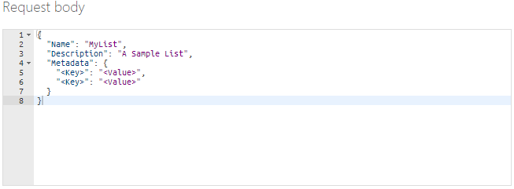
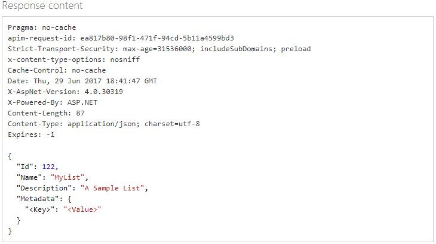
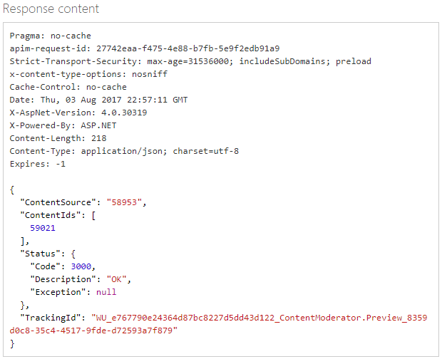
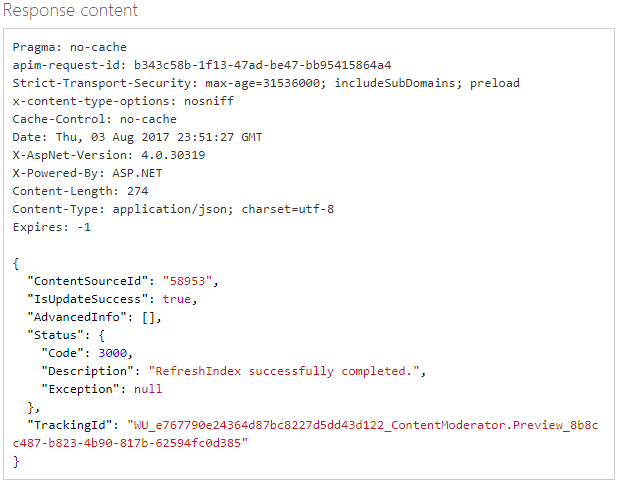

# Try custom image lists with the Image Moderation API

The [Image List Management API](https://westus.dev.cognitive.microsoft.com/docs/services/57cf755e3f9b070c105bd2c2/operations/57cf755e3f9b070868a1f672) allows you to create custom lists of images for use with the Image Moderation API. The image moderation operation will evalue your image and if given a custom list, will match it against the images in your custom lists. These lists can be used to block or pass through the image.

You can also create lists of terms to be used with the Text Moderation API. This tutorial focuses on lists of images.

The Image List management API includes these operations:

- Create a list.
- Add images to your list.
- Screen images against the ones in the list.
- Delete image or images from the list.
- Delete the list.
- Edit list information.
- Refresh the index so that changes are found during a scan.

## Try with the API console ##
Before you can test-drive the API from the online console, you will need the **Ocp-Apim-Subscription-Key**. This is found under the **Settings** tab, as shown in the [Overview](overview.md) article.

## Creating an image list ##
1.	Navigate to the [Image list management API reference](https://westus.dev.cognitive.microsoft.com/docs/services/57cf755e3f9b070c105bd2c2/operations/57cf755e3f9b070868a1f672) page.

2.	You land on the **Image Lists > Create** operation. 

3.	Click the button that most closely describes your location, under **Open API testing console**. The **Image Lists – Create** API Console opens.

  
 
4.	Enter your subscription key.

5.	In the Request Body, type a **Name** for the term list, and a brief **Description**.
  

6.	Use the key-value pair placeholders to assign more descriptive metadata to your list. For example, you could enter something on these lines:
    {
      "Name": "MyExclusionList",
      "Description": "MyListDescription",
      "Metadata": {
      "Category": "Competitors",
      "Type": "Exclude"
      }
    }

  Note that we are adding list metadata as key value pairs, not the actual terms.
 
7.	Click Send. Your list is created. Make note of the Id number that is associated with the new list. You will need this for other List Management functions.

  
 
8.	Now you need to add terms to MyList. On the left, click **Term > Add Term**. Click the button that most closely describes your location, under **Open API testing console**.

  

9.	The **Term – Add Term** console opens.
 
10.	Enter the **listId** that you have generated above, and enter the URL of the image you wish to add. Enter your **subscription key** and click **Send**.

11.	Verify the image has been added by using the **Image > Get All Image Ids** API. Enter the **listId** and your **subscription key**, and click **Send**.

  
 
10.	Add a few more images. Now that you have created a custom list of images, try [evaluating images](try-image-api.md) against it. 

## Deleting images and lists ##

Deleting an image or a list is straightforward. You can:

- Delete an image. **(Image > Delete)**
- Delete all the images in a list without deleting the list. **(Image > Delete All Images)**
- Delete the list and all of its contents. **(Image Lists > Delete)**

This example deletes a single image.

1. On the left, click **Image > Delete**. Click the button that most closely describes your location, under **Open API testing console**. 

  
 
  The **Image – Delete** console opens.
 
2.	Enter the **listId** for the list you are concerned with. This is the number **(“contentsource” 58953)** that was returned with the **Get all Image Ids** for **MyList**, in the section above. Enter the **ImageId** of the image you wish to delete. This is the “**ContentIds**” **59021** in the example above.

3.	Enter your subscription key and click Send.

4.	Verify the image has been deleted by using the Image > Get all Image Ids API.

 
## Changing a list’s information ##

You can edit a list’s name and description, and add metadata items.

1.	On the left, click **Image Lists > Update Details**. Click the button that most closely describes your location, under **Open API testing console**. The **Image Lists – Update Details** API console opens.

  
 
2.	Enter the **listId** and your **subscription key**.

3.	Make your edits in the **Request Body** field, and click **Send**.

  
 
## Refresh Search Index ##

After you have made changes to a list, its index must be refreshed before subsequent scans will “see” the changes. This is similar to how a search engine on your desktop (if enabled) or a web search engine continually refreshes its index to include new files or pages.

1.	On the left, click **Image Lists > Refresh** Search Index. Click the button that most closely describes your location, under **Open API testing console**. The **Image Lists – Refresh Search Index** API console opens.

  

2.	Enter the **listId** and your **subscription key**, and click **Send**.

  

## Next steps ##

To learn how to use the text terms list management API, see the [Try Terms List Management](try-terms-list-api.md) article.
