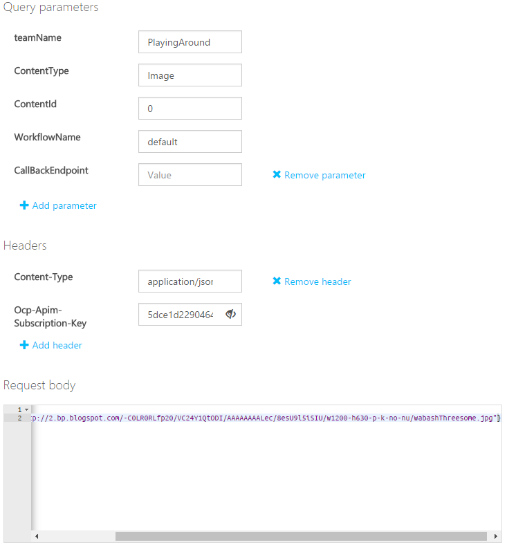
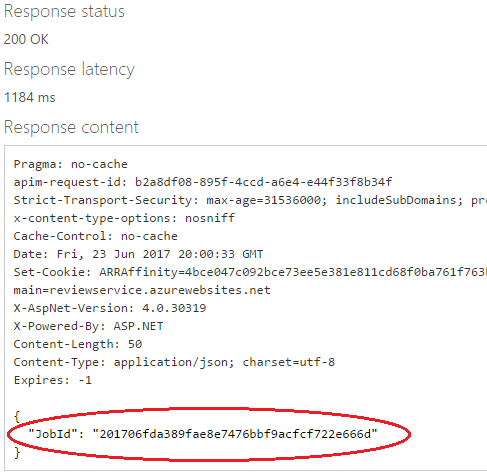
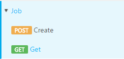
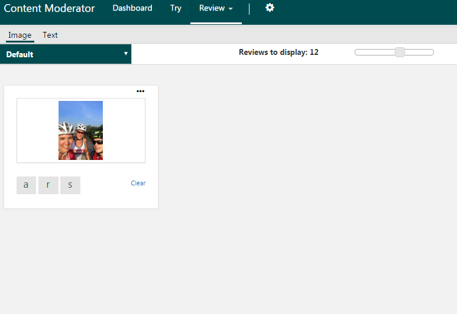

# Try the Job operations

Use the Review API's [Job operations](https://westus.dev.cognitive.microsoft.com/docs/services/580519463f9b070e5c591178/operations/580519483f9b0709fc47f9c5) to initiate end-to-end scan-and-review moderation jobs with image or text content. The moderation job scans your content by using the image or text moderation APIs. It then uses the default and custom workflows (defined within the Review Tool) to generate reviews within the Review Tool. Once your human moderators have reviewed the auto-assigned tags and prediction data and submitted their final decision, the Review API submits all information to your API endpoint.

## Try with the API console
Before you can test-drive the API from the online console, you will need a few values.

- teamName: The team name you created when you set up your review tool account. 
- ContentId: A string, this is passed to the API and returned through the callback, and is useful for associating internal identifiers or metadata with the results of a moderation job.
- Workflowname: The name of the workflow you have created. For a quick test, you can use “Default”.
- Ocp-Apim-Subscription-Key: This is found under the Settings tab, as shown in the [Overview](overview.md) article.

The simplest way to access a testing console is from the Credentials window.
1.	From the Credentials window, click **[API Reference](https://westus.dev.cognitive.microsoft.com/docs/services/580519463f9b070e5c591178/operations/580519483f9b0709fc47f9c5)**.

2.	The **Job – Create** API opens. Click the button that most closely describes your location, under Open API testing console.

  
  
3.	Fill in the required values, and edit the Request Body to specify the location of the 
information being scanned.

  
  
4.	Click **Send**. A JobID is created. Copy this to use in the next steps.

  
  
5.	Click **Get**, then open the API by clicking the button matching your region.

  
  
6.	Fill in **teamName** and the **JobID** you just created. Enter your subscription key and click Send. The results of the scan are returned.

  
  
7.	Go to the Content Moderator Dashboard, and click **Review > Image**. The image you just scanned displays, ready for human review.

  

## Next steps

To learn how to create reviews with no scanning, see the [Review operation](try-review-api-review.md) article.
