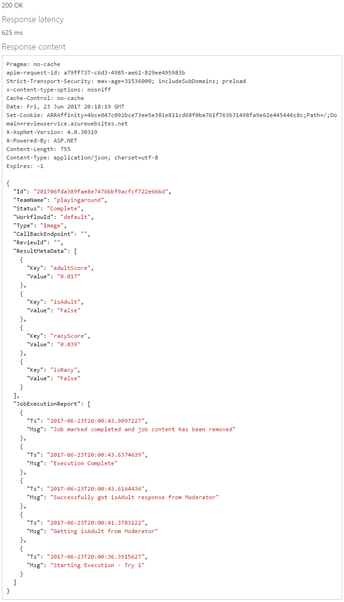

# Define and use moderation jobs (REST)

A moderation job serves as a kind of wrapper for the functionality of content moderation, workflows and reviews. This guide shows you how to use the job REST APIs to initiate and check content moderation jobs. Once you understand the structure of the APIs, you can easily port these calls to any REST-compatible platform.

## Prerequisites

- Sign in or create an account on the Content Moderator [Review tool](https://contentmoderator.cognitive.microsoft.com/) site.
- (Optional) [Define a custom workflow](./Review-Tool-User-Guide/Workflows.md) to use with your job; you can also use the default workflow.

## Create a job

To create a moderation job, go to the [Job - Create](https://westus2.dev.cognitive.microsoft.com/docs/services/580519463f9b070e5c591178/operations/580519483f9b0709fc47f9c5) API reference page and select the button for your key region (you can find this in the Endpoint URL on the **Credentials** page of the [Review tool](https://contentmoderator.cognitive.microsoft.com/)). This starts the API console, where you can easily construct and run REST API calls.


### Enter REST call parameters

Enter the following values to construct the REST call:

- **teamName**: The team ID that you created when you set up your [Review tool](https://contentmoderator.cognitive.microsoft.com/) account (found in the **Id** field on your Review tool's Credentials screen).
- **ContentType**: This can be "Image", "Text", or "Video".
- **ContentId**: A custom identifier string. This string is passed to the API and returned through the callback. It is useful for associating internal identifiers or metadata with the results of a moderation job.
- **Workflowname**: The name of the workflow you previously created (or "default" for the default workflow).
- **CallbackEndpoint**: (Optional) The URL to receive callback information when the review is completed.
- **Ocp-Apim-Subscription-Key**: Your Content Moderator key. You can find this  on the **Settings** tab of the [Review tool](https://contentmoderator.cognitive.microsoft.com).

### Fill in the request body

The body of your REST call contains one field, **ContentValue**. Paste in the raw text content if you are moderating text, or enter an image or video URL if you're moderating image/video. You can use the following sample image URL: [https://moderatorsampleimages.blob.core.windows.net/samples/sample2.jpg](https://moderatorsampleimages.blob.core.windows.net/samples/sample2.jpg)


### Submit your request

Select **Send**. If the operation succeeds, the **Response status** is `200 OK`, and the **Response content** box displays an ID for the job. Copy this ID to use in the following steps.


## Get job status

To get the status and details of a running or completed job, go to the [Job - Get](https://westus2.dev.cognitive.microsoft.com/docs/services/580519463f9b070e5c591178/operations/580519483f9b0709fc47f9c3) API reference page and select the button for your region (the region in which your key is administered).


Enter the REST call parameters as in the above section. For this step, **JobId** is the unique ID string you received when you created the job. Select **Send**. If the operation succeeds, the **Response status** is `200 OK`, and the **Response content** box displays the job in JSON format, like the following:

```json
{  
  "Id":"2018014caceddebfe9446fab29056fd8d31ffe",
  "TeamName":"some team name",
  "Status":"Complete",
  "WorkflowId":"OCR",
  "Type":"Image",
  "CallBackEndpoint":"",
  "ReviewId":"201801i28fc0f7cbf424447846e509af853ea54",
  "ResultMetaData":[  
    {  
      "Key":"hasText",
      "Value":"True"
    },
    {  
      "Key":"ocrText",
      "Value":"IF WE DID \r\nALL \r\nTHE THINGS \r\nWE ARE \r\nCAPABLE \r\nOF DOING, \r\nWE WOULD \r\nLITERALLY \r\nASTOUND \r\nOURSELVE \r\n"
    }
  ],
  "JobExecutionReport":[  
    {  
      "Ts":"2018-01-07T00:38:29.3238715",
      "Msg":"Posted results to the Callbackendpoint: https://requestb.in/vxke1mvx"
    },
    {  
      "Ts":"2018-01-07T00:38:29.2928416",
      "Msg":"Job marked completed and job content has been removed"
    },
    {  
      "Ts":"2018-01-07T00:38:29.0856472",
      "Msg":"Execution Complete"
    },
    {  
      "Ts":"2018-01-07T00:38:26.7714671",
      "Msg":"Successfully got hasText response from Moderator"
    },
    {  
      "Ts":"2018-01-07T00:38:26.4181346",
      "Msg":"Getting hasText from Moderator"
    },
    {  
      "Ts":"2018-01-07T00:38:25.5122828",
      "Msg":"Starting Execution - Try 1"
    }
  ]
}
```



### Examine the new review(s)

If your content job resulted in the creation of a review, you can view it in the [Review tool](https://contentmoderator.cognitive.microsoft.com). Select **Review** > **Image**/**Text**/**Video** (depending on what content you used). The content should appear, ready for human review. After a human moderator reviews the auto-assigned tags and prediction data and submits a final moderation decision, the jobs API submits all of this information to the designated callback endpoint endpoint.

## Next steps

In this guide, you learned how to create and query content moderation jobs using the REST API. Next, integrate jobs into an end-to-end moderation scenario, such as the [E-commerce moderation](./ecommerce-retail-catalog-moderation.md) tutorial.