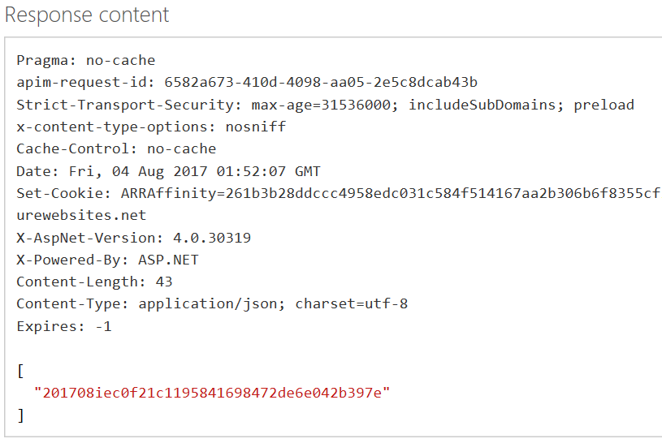
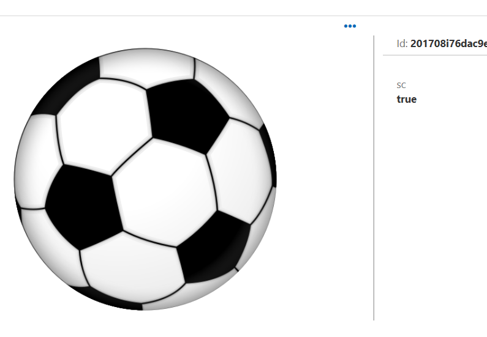
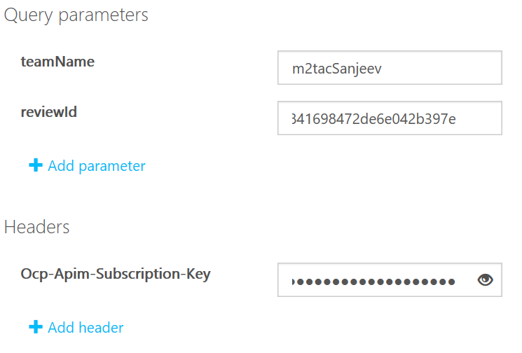

# Create human reviews (REST)

[Reviews](./review-api.md#reviews) store and display content for human moderators to assess. When a user completes a review, the results are sent to a specified callback endpoint. In this guide, you'll learn how to set up reviews using the review REST APIs through the API console. Once you understand the structure of the APIs, you can easily port these calls to any REST-compatible platform.

## Prerequisites

- Sign in or create an account on the Content Moderator [Review tool](https://contentmoderator.cognitive.microsoft.com/) site.

## Create a review

To create a review, go to the **[Review - Create](https://westus2.dev.cognitive.microsoft.com/docs/services/580519463f9b070e5c591178/operations/580519483f9b0709fc47f9c4)** API reference page and select the button for your key region (you can find this in the Endpoint URL on the **Credentials** page of the [Review tool](https://contentmoderator.cognitive.microsoft.com/)). This starts the API console, where you can easily construct and run REST API calls.


### Enter REST call parameters

Enter values for **teamName**, and **Ocp-Apim-Subscription-Key**:

- **teamName**: The team ID that you created when you set up your [Review tool](https://contentmoderator.cognitive.microsoft.com/) account (found in the **Id** field on your Review tool's Credentials screen).
- **Ocp-Apim-Subscription-Key**: Your Content Moderator key. You can find this  on the **Settings** tab of the [Review tool](https://contentmoderator.cognitive.microsoft.com).

### Enter a review definition

Edit the **Request body** box to enter the JSON request with the following fields:

- **Metadata**: Custom key-value pairs to be returned to your callback endpoint. If the key is a short code that is defined in the [Review tool](https://contentmoderator.cognitive.microsoft.com), it appears as a tag.
- **Content**: In the case of Image and Video content, this is a URL string pointing to the content. For text content, this is the actual text string.
- **ContentId**: A custom identifier string. This string is passed to the API and returned through the callback. It is useful for associating internal identifiers or metadata with the results of a moderation job.
- **CallbackEndpoint**: (Optional) The URL to receive callback information when the review is completed.

The default request body shows examples of the different types of reviews you can create:

```json
[Image]
[
  {
    "Metadata": [
      {
        "Key": "string",
        "Value": "string"
      }
    ],
    "Type": "Image",
    "Content": "<Content Url>",
    "ContentId": "<Your identifier for this content>",
    "CallbackEndpoint": "<Url where you would receive callbacks>"
  }
]
[Text]
[
  {
    "Metadata": [
      {
        "Key": "string",
        "Value": "string"
      }
    ],
    "Type": "Text",
    "Content": "<Your Text Content>",
    "ContentId": "<Your identifier for this content>",
    "CallbackEndpoint": "<Url where you would receive callbacks>"
  }
]
[Video]
[
  {
    "VideoFrames":[
      {
          "Id": "<Frame Id>",
          "Timestamp": "<Frame Timestamp",
          "FrameImage":"<Frame Image URL",
          "Metadata": [
            {
              "Key": "<Key>",
              "Value": "<Value"
            }
          ],
          "ReviewerResultTags": [
          ]
    ], 
    "Metadata": [
      {
        "Key": "string",
        "Value": "string"
      },
      //For encrypted Videos
        {
          "Key": "protectedType",
          "Value": "AES or FairPlay or Widevine or Playready"
        },
        {
          "Key": "authenticationToken",
          "Value": "your viewtoken(In case of Video Indexer AES encryption type, this value is viewtoken from breakdown json)"
        },
      //For FairPlay encrypted type video include certificateUrl as well
        {
          "Key": "certificateUrl",
          "Value": "your certificate url"
        }
    ],
    "Type": "Video",
    "Content": "<Stream Url>",
    "ContentId": "<Your identifier for this content>",
    "CallbackEndpoint": "<Url where you would receive callbacks>",
    [Optional]
    "Timescale": "<Timescale of the video>
  }
]
```

### Submit your request
  
Select **Send**. If the operation succeeds, the **Response status** is `200 OK`, and the **Response content** box displays an ID for the review. Copy this ID to use in the following steps.



### Examine the new review

In the [Review tool](https://contentmoderator.cognitive.microsoft.com), select **Review** > **Image**/**Text**/**Video** (depending on what content you used). The content that you uploaded should appear, ready for human review.



## Get review details

To retrieve details about an existing review, go to the [Review - Get](https://westus2.dev.cognitive.microsoft.com/docs/services/580519463f9b070e5c591178/operations/580519483f9b0709fc47f9c2) API reference page and select the button for your region (the region in which your key is administered).


Enter the REST call parameters as in the above section. For this step, **reviewId** is the unique ID string you received when you created the review.


  
Select **Send**. If the operation succeeds, the **Response status** is `200 OK`, and the **Response content** box displays the review details in JSON format, like the following:

```json
{  
  "reviewId":"201712i46950138c61a4740b118a43cac33f434",
  "subTeam":"public",
  "status":"Complete",
  "reviewerResultTags":[  
    {  
      "key":"a",
      "value":"False"
    },
    {  
      "key":"r",
      "value":"True"
    },
    {  
      "key":"sc",
      "value":"True"
    }
  ],
  "createdBy":"<teamname>",
  "metadata":[  
    {  
      "key":"sc",
      "value":"true"
    }
  ],
  "type":"Image",
  "content":"https://reviewcontentprod.blob.core.windows.net/<teamname>/IMG_201712i46950138c61a4740b118a43cac33f434",
  "contentId":"0",
  "callbackEndpoint":"<callbackUrl>"
}
```

Take note of the following fields in the response:

- **status**
- **reviewerResultTags**: This appears if any tags have been manually added by the human review team (shown the **createdBy** field).
- **metadata**: This shows the tags that were initially added in the review, before the human review team made changes.

## Next steps

In this guide, you learned how to create content moderation reviews using the REST API. Next, integrate reviews into an end-to-end moderation scenario, such as the [E-commerce moderation](./ecommerce-retail-catalog-moderation.md) tutorial.