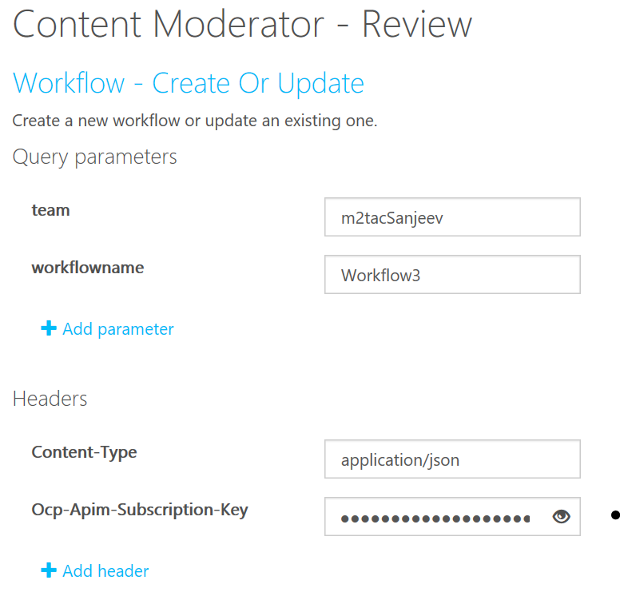
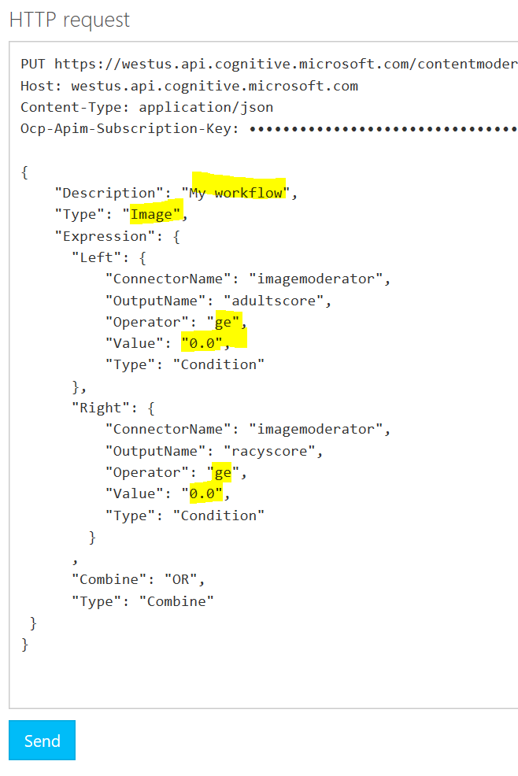
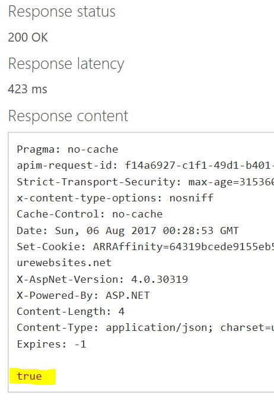
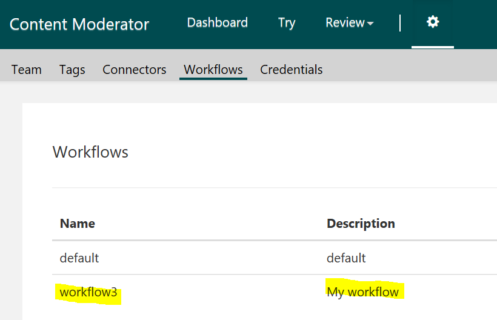
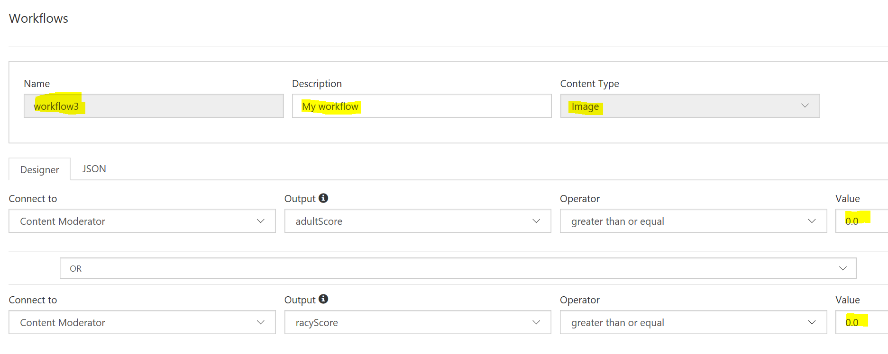
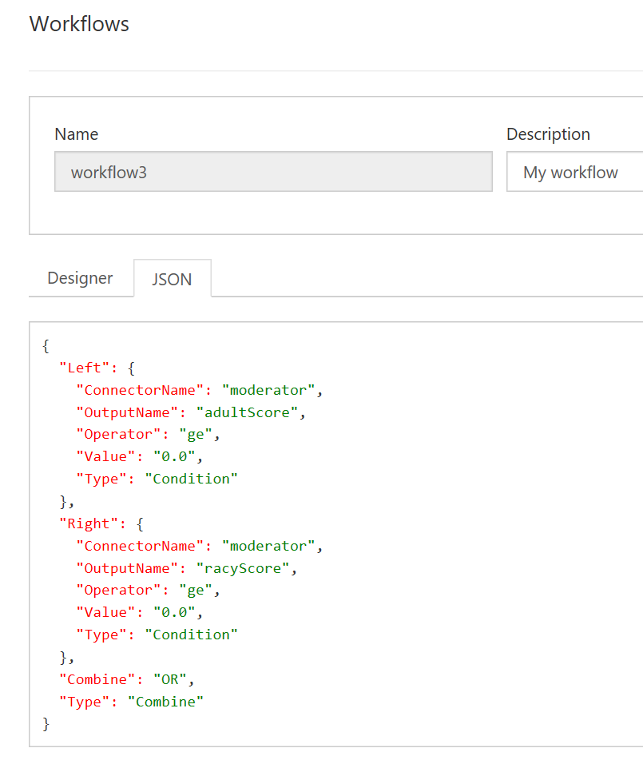

# Workflow operations

Use the Review API's [Workflow operations](https://westus.dev.cognitive.microsoft.com/docs/services/580519463f9b070e5c591178/operations/5813b46b3f9b0711b43c4c59) to create or update or get workflow details by using the Review API. You can define simple or complex and even nested expressions for your workflows by using this API. These workflows appear within the review tool for your team and are used by the Review API's Job operations.

## Use the API console
Before you can test-drive the API from the online console, you will need a few values.

- **team**: The team name you created when you set up your review tool account. 
- **workflowname**: The name for your workflow
- **Ocp-Apim-Subscription-Key**: This is found under the **Settings** tab, as shown in the [Overview](overview.md) article.

The simplest way to access a testing console is from the Credentials window.
1.	From the Credentials window, click **[API Reference](https://westus.dev.cognitive.microsoft.com/docs/services/580519463f9b070e5c591178/operations/5813b46b3f9b0711b43c4c59)**.

2.	Navigate to the **Review – Create** operation. Click the button that most closely describes your location, under Open API testing console.

  

3.  Enter the **team**, **workflowname**, and **Ocp-Apim-Subscription-Key**.

  
  
3.	Edit the Request Body to complete the **description**, **type** (image or text workflow) and the **expression** details.

  
  
4.	Click **Send**. if the operation succeeds, your will see **True** on your screen.

  
  
5.	Log in to the review tool and navigate to the Settings section. You should see your new workflow listed and ready for use.

  
  
6.	Select the edit option for your workflow to see the designer view of the workflow.

  
  
7.	Select the JSON TAB to see the JSON view of the workflow.

  

## Next steps

To learn how to use workflows with **Jobs**, see the [Try Moderation Jobs](try-review-api-job.md) article.
