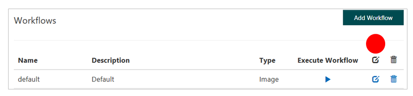

# Workflows from the API console

Use the [workflow operations](https://westus.dev.cognitive.microsoft.com/docs/services/580519463f9b070e5c591178/operations/5813b46b3f9b0711b43c4c59) in Azure Content Moderator to create or update a workflow or get workflow details by using the Review API. You can define simple, complex, and even nested expressions for your workflows by using this API. The workflows appear in the Review tool for your team to use. The workflows also are used by the Review API's Job operations.

## Prerequisites

1. Go to the [Review tool](https://contentmoderator.cognitive.microsoft.com/). Sign up if you haven't done so yet. 
2. In the Review tool, under **Settings**, select the **Workflows** tab, as shown in the Review tool's [workflow tutorial](Review-Tool-User-Guide/Workflows.md).

### Browse to the workflows screen

On the Content Moderator dashboard, select **Review** > **Settings** > **Workflows**. You see a default workflow.

  

### Get the JSON definition of the default workflow

Select the **Edit** option for your workflow, and then select the **JSON** tab. You see the following JSON expression:

	{
		"Type": "Logic",
		"If": {
    		"ConnectorName": "moderator",
    		"OutputName": "isAdult",
    		"Operator": "eq",
    		"Value": "true",
    		"Type": "Condition"
			},
		"Then": {
		"Perform": [
      	{
        	"Name": "createreview",
        	"CallbackEndpoint": null,
        	"Tags": []
      	}
    	],
    	"Type": "Actions"
		}
	}

## Get workflow details

Use the **Workflow - Get** operation to get details of your existing default workflow.

In the Review tool, go to the [Credentials](Review-Tool-User-Guide/credentials.md#the-review-tool) section.

### Browse to the API reference

1. In the **Credentials** view, select [API reference](https://westus.dev.cognitive.microsoft.com/docs/services/580519463f9b070e5c591178/operations/5813b46b3f9b0711b43c4c59). 
2. When the **Workflow - Create Or Update** page opens, go to the [Workflow - Get](https://westus.dev.cognitive.microsoft.com/docs/services/580519463f9b070e5c591178/operations/5813b44b3f9b0711b43c4c58) reference.

### Select your region

For **Open API testing console**, select the region that most closely describes your location.

  

  The **Workflow - Get** API console opens.

### Enter parameters

Enter values for **team**, **workflowname**, and **Ocp-Apim-Subscription-Key** (your subscription key):

- **team**: The team ID that you created when you set up your [Review tool account](https://contentmoderator.cognitive.microsoft.com/). 
- **workflowname**: The name of your workflow. Use `default`.
- **Ocp-Apim-Subscription-Key**: Located on the **Settings** tab. For more information, see [Overview](overview.md).

  

### Submit your request
  
Select **Send**. If the operation succeeds, the **Response status** is `200 OK`, and the **Response content** box displays the following JSON workflow:

	{
		"Name": "default",
		"Description": "Default",
		"Type": "Image",
		"Expression": {
    	"If": {
      		"ConnectorName": "moderator",
      		"OutputName": "isadult",
      		"Operator": "eq",
      		"Value": "true",
      		"AlternateInput": null,
      		"Type": "Condition"
    		},
    	"Then": {
      		"Perform": [{
        		"Name": "createreview",
        		"Subteam": null,
        		"CallbackEndpoint": null,
        		"Tags": []
      		}],
      		"Type": "Actions"
    		},
    		"Else": null,
    		"Type": "Logic"
			}
	}

## Create a workflow

In the Review tool, go to the [Credentials](Review-Tool-User-Guide/credentials.md#the-review-tool) section.

### Browse to the API reference

In the **Credentials** view, select [API reference](https://westus.dev.cognitive.microsoft.com/docs/services/580519463f9b070e5c591178/operations/5813b46b3f9b0711b43c4c59). The **Workflow - Create Or Update** page opens.

### Select your region

For **Open API testing console**, select the region that most closely describes your location.

  

  The **Workflow - Create Or Update** API console opens.

### Enter parameters

Enter values for **team**, **workflowname**, and **Ocp-Apim-Subscription-Key** (your subscription key):

- **team**: The team ID that you created when you set up your [Review tool account](https://contentmoderator.cognitive.microsoft.com/). 
- **workflowname**: The name of your new workflow.
- **Ocp-Apim-Subscription-Key**: Located on the **Settings** tab. For more information, see [Overview](overview.md).

  

### Enter the workflow definition

1. Edit the **Request body** box to enter the JSON request with details for **Description** and **Type** (Image or Text). 
2. For **Expression**, copy the default workflow expression from the preceding section, as shown here:

		{
			"Description": "Default workflow from API console",
			"Type": "Image",
			"Expression": 
				// Copy the default workflow expression from the preceding section
		}

	Your request body looks like the following JSON request:

		{
			"Description": "Default workflow from API console",
			"Type": "Image",
			"Expression": {
				"Type": "Logic",
				"If": {
					"ConnectorName": "moderator",
					"OutputName": "isAdult",
					"Operator": "eq",
					"Value": "true",
					"Type": "Condition"
					},
				"Then": {
				"Perform": [
				{
					"Name": "createreview",
					"CallbackEndpoint": null,
					"Tags": [ ]
				}
				],
				"Type": "Actions"
				}
			}
		}
 
### Submit your request
  
Select **Send**. If the operation succeeds, the **Response status** is `200 OK`, and the **Response content** box displays `true`.

### Check out the new workflow

In the Review tool, select **Review** > **Settings** > **Workflows**. Your new workflow appears and is ready to use.

  
  
### Review your new workflow details

1. Select the **Edit** option for your workflow, and then select the **Designer** and **JSON** tabs.

   

2. To see the JSON view of the workflow, select the **JSON** tab.

## Next steps

* For more complex workflow examples, see the [Workflows overview](workflow-api.md).
* Learn how to use workflows with [content moderation jobs](try-review-api-job.md).
