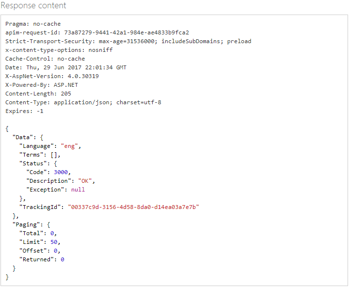

# Text moderation with custom terms in the API console

The default global list of terms in Azure Content Moderator is sufficient for most content moderation needs. However, you might need to screen for terms that are specific to your organization or industry. For example, you might want to tag competitor names for further review. 

You can use the [List Management API](https://westus.dev.cognitive.microsoft.com/docs/services/57cf755e3f9b070c105bd2c2/operations/57cf755e3f9b070868a1f67f) to create custom lists of terms to use with the Text Moderation API. The **Text - Screen** operation scans your text for profanity, and also compares text against custom and shared blacklists.

You can also create custom lists of images to be used with the List Moderation API. 

This tutorial focuses on lists of terms.

You can use the List Management APIs to do these operations:
- Create a list.
- Add terms to a list.
- Screen terms against the terms in a list.
- Delete terms from a list.
- Delete a list.
- Edit list information.
- Refresh the index so that changes to the list are included in a new scan.

## Use the API console
Before you can test-drive the API in the online console, you need your subscription key. This is found on the **Settings** tab, in the **Ocp-Apim-Subscription-Key** box. For more information, see [Overview](overview.md).

## Create a term list
1.	Go to the [Term Lists API reference](https://westus.dev.cognitive.microsoft.com/docs/services/57cf755e3f9b070c105bd2c2/operations/57cf755e3f9b070868a1f67f). The **Term Lists - Create** list management page opens.

2.	For **Open API testing console**, select the region that most closely describes your location. 

  

  The **Term Lists - Create** console opens.
 
3.	In the **Ocp-Apim-Subscription-Key** box, enter your subscription key.

4.	In the **Request body** box, enter values for **Name** (for example, MyList) and **Description**.

  

5.	Use key-value pair placeholders to assign more descriptive metadata to your list. For example, you can enter something like this:

        {
           "Name": "MyExclusionList",
           "Description": "MyListDescription",
           "Metadata": 
           {
              "Category": "Competitors",
              "Type": "Exclude"
           }
        }

  Here we add list metadata as key-value pairs, and not actual terms.
 
6.	Select **Send**. Your list is created. Take note of the **Id** value that is associated with the new list. You will need this for other term list management functions.

  
 
7.	Next, add terms to MyList. In the left menu, under **Term**, select **Add Term**. 

  The **Term - Add Term** list management page opens. 

8.	For **Open API testing console**, select the region that most closely describes your location. 

  

  The **Term - Add Term** console opens.
 
9.	Under **Query parameters**, for **listId**, enter the ID that you generated earlier, and select a value for **language**. Enter your subscription key, and then select **Send**.

  
 
10.	To verify that the term has been added, in the left menu, select **Term**, and then select **Get All Terms**. The **Term - Get All Terms** console opens.

11. Under **Query parameters**, for **listId**, enter the list ID, and then enter your subscription key. Select **Send**.

12. In the **Response content** box, verify the terms you entered.

  
 
13.	Add a few more terms. Now that you have created a custom list of terms, try [scanning some text](try-text-api.md) by using the custom term list. 

## Delete terms and lists

Deleting a term or a list is straightforward. The API supports these operations:

- Delete a term. **(Term - Delete)**
- Delete all the terms in a list without deleting the list. **(Term - Delete All Terms)**
- Delete a list and all of its contents. **(Term Lists - Delete)**

This example deletes a single term.

1.	In the left menu, select **Term**, and then select **Delete**. 

  The **Term - Delete** list management page opens.

2. For **Open API testing console**, select the region that most closely describes your location. 

  

  The **Term - Delete** console opens.
  
2.	Under **Query parameters**, for **listId**, enter the ID OF the list you want to delete a term from. This is the number (in our example, **122**) that is returned in the **Term Lists - Get Details** console for MyList. Enter the term and select a language.
 
  

3.	Enter your subscription key, and then select **Send**.

4.	To verify that the term has been deleted, use the **Term Lists - Get All** console.

  
 
## Change list information

You can edit a list’s name and description, and add metadata items.

1.	In the left menu, select **Term Lists**, and then select **Update Details**. 

  The **Term Lists - Update Details** list management page opens.

2. For **Open API testing console**, select the region that most closely describes your location. 

  

  The **Term Lists - Update Details** console opens.

3.	Under **Query parameters**, for **listId**, enter the list ID, and then enter your subscription key.

3.	In the **Request Body** box, make your edits, and then select **Send**.

  
 
## Refresh Search Index

After you make changes to a term list, you must refresh its index for changes to be included in future scans. This is similar to how a search engine on your desktop (if enabled) or a web search engine continually refreshes its index to include new files or pages.

1.	In the left menu, select **Term Lists**, and then select **Refresh Search Index**. 

  The **Term Lists - Refresh Search Index** list management page opens.

2. For **Open API testing console**, select the region that most closely describes your location. 

  

  The **Term Lists - Refresh Search Index** console opens.

2.	Under **Query parameters**, for **listId**, enter the list ID. Enter your subscription key, and then select **Send**.

## Next steps

To learn how to use the Image List API, see [Try Image List API](try-image-list-api.md).
