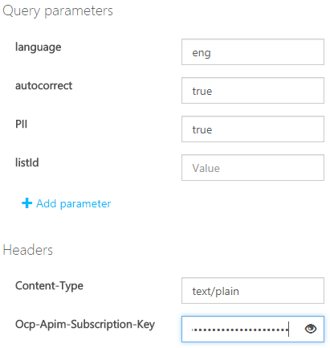
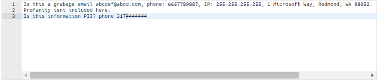
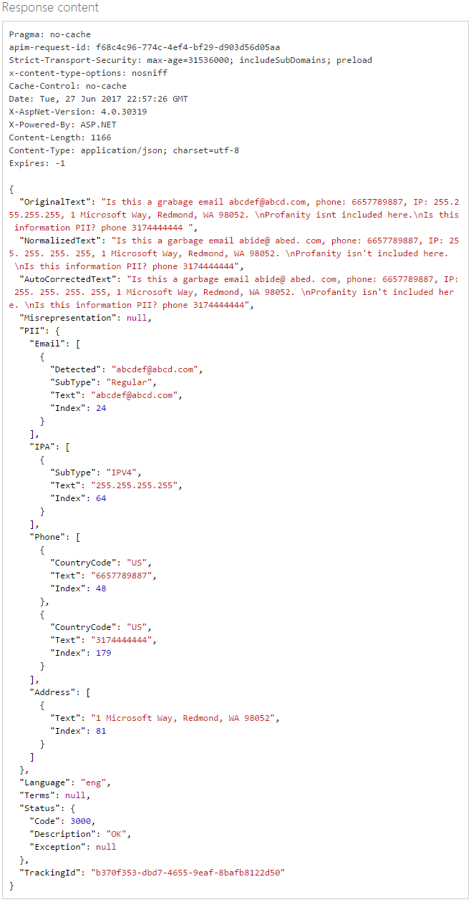

# Text Moderation API

Use the [Text Moderation API](https://westus.dev.cognitive.microsoft.com/docs/services/57cf753a3f9b070c105bd2c1/operations/57cf753a3f9b070868a1f66f) to scan-your text content. The operation scans your content for profanity, comparing it against custom and/or shared blacklists.

## Use the API console
Before you can test-drive the API from the online console, you will need the **Ocp-Apim-Subscription-Key**. This is found under the **Settings** tab, as shown in the [Overview](overview.md) article.

1.	Navigate to the **[Text Moderation API Reference](https://westus.dev.cognitive.microsoft.com/docs/services/57cf753a3f9b070c105bd2c1/operations/57cf753a3f9b070868a1f66f)** page. Click the button that most closely describes your location, under Open API testing console.

  

2.  You will land on the **Text - Screen** API reference.
 
3.	Fill in the desired values. For this example, use the default value for **language**, and select “**true**” for **autocorrect** and **PII**.

  
 
4.	Specify the Content-Type and enter your subscription key. For this example, use the default “**text/plain**” text type.

5.	Enter some text in the Request Body field. Deliberately include a typo or two.

  

6.	Notice how the API handled the misspelled words and personally identifiable information.

  

## Next steps

To learn how to use the image moderation API, see the [Try Image Moderation API](try-image-api.md) article.
