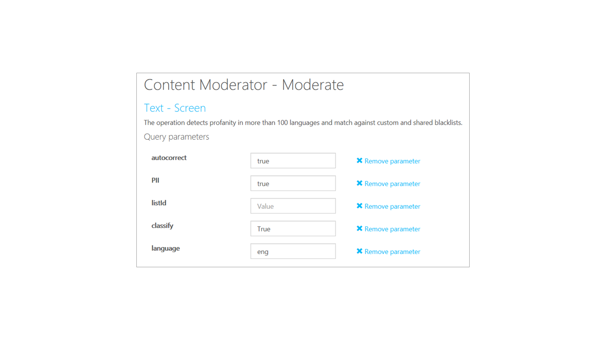

# Moderate text from the API console

Use the [Text Moderation API](https://westus.dev.cognitive.microsoft.com/docs/services/57cf753a3f9b070c105bd2c1/operations/57cf753a3f9b070868a1f66f) in Azure Content Moderator to scan your text content. The operation scans your content for profanity, and compares the content against custom and shared blacklists.


## Get your API key
Before you can test-drive the API in the online console, you need your subscription key. This is located on the **Settings** tab, in the **Ocp-Apim-Subscription-Key** box. For more information, see [Overview](overview.md).

## Navigate to the API reference
Go to the [Text Moderation API reference](https://westus.dev.cognitive.microsoft.com/docs/services/57cf753a3f9b070c105bd2c1/operations/57cf753a3f9b070868a1f66f). 

  The **Text - Screen** page opens.

## Open the API console
For **Open API testing console**, select the region that most closely describes your location. 

  

  The **Text - Screen** API console opens.

## Select the inputs

### Parameters
Select the query parameters that you want to use in your text screen. For this example, use the default value for **language**. You can also leave it blank because the operation will automatically detect the likely language as part of its execution.

> [!NOTE]
> For the **language** parameter, assign `eng` or leave it empty to see the machine-assisted **classification** response (preview feature). **This feature supports English only**.
>
> For **profanity terms** detection, use the [ISO 639-3 code](http://www-01.sil.org/iso639-3/codes.asp) of the supported languages listed in this article, or leave it empty.

For **autocorrect**, **PII**, and **classify (preview)**, select **true**. Leave the **ListId** field empty.

  

### Content type
For **Content-Type**, select the type of content you want to screen. For this example, use the default **text/plain** content type. In the **Ocp-Apim-Subscription-Key** box, enter your subscription key.

### Sample text to scan
In the **Request body** box, enter some text. The following example shows an intentional typo in the text.

> [!NOTE]
> The invalid social security number in the following sample text is intentional. The purpose is to convey the sample input and output format.

```
	Is this a grabage or crap email abcdef@abcd.com, phone: 6657789887, IP: 255.255.255.255, 1 Microsoft Way, Redmond, WA 98052.
	These are all UK phone numbers, the last two being Microsoft UK support numbers: +44 870 608 4000 or 0344 800 2400 or 0800 820 3300.
	Also, 999-99-9999 looks like a social security number (SSN).
```

### Text classification feature

In the following example, you see Content Moderator’s machine-assisted text classification response. It helps detect potentially undesired content. The flagged content may be deemed as inappropriate depending on context. In addition to conveying the likelihood of each category, it may recommend a human review of the content. The feature uses a trained model to identify possible abusive, derogatory or discriminatory language. This includes slang, abbreviated words, offensive, and intentionally misspelled words for review. 

#### Explanation

- `Category1` represents the potential presence of language that may be considered sexually explicit or adult in certain situations.
- `Category2` represents the potential presence of language that may be considered sexually suggestive or mature in certain situations.
- `Category3` represents the potential presence of language that may be considered offensive in certain situations.
- `Score` is between 0 and 1. The higher the score, the higher the model is predicting that the category may be applicable. This preview relies on a statistical model rather than manually coded outcomes. We recommend testing with your own content to determine how each category aligns to your requirements.
- `ReviewRecommended` is either true or false depending on the internal score thresholds. Customers should assess whether to use this value or decide on custom thresholds based on their content policies.

### Analyze the response
The following response shows the various insights from the API. It contains potential profanity, PII, classification (preview), and the auto-corrected version.

> [!NOTE]
> The machine-assisted 'Classification' feature is in preview and supports English only.

```
{
	"OriginalText": "Is this a grabage or crap email abcdef@abcd.com, phone: 6657789887, IP: 255.255.255.255, 1 Microsoft Way, Redmond, WA 98052.\r\nThese are all UK phone numbers, the last two being Microsoft UK support numbers: +44 870 608 4000 or 0344 800 2400 or 0800 820 3300.\r\nAlso, 544-56-7788 looks like a social security number (SSN).",
	"NormalizedText": "Is this a grabage or crap email abcdef@ abcd. com, phone: 6657789887, IP: 255. 255. 255. 255, 1 Microsoft Way, Redmond, WA 98052. \r\nThese are all UK phone numbers, the last two being Microsoft UK support numbers: +44 870 608 4000 or 0344 800 2400 or 0800 820 3300. \r\nAlso, 544- 56- 7788 looks like a social security number ( SSN) .",
"Misrepresentation": null,
	"PII": {
    		"Email": [{
      			"Detected": "abcdef@abcd.com",
      			"SubType": "Regular",
      			"Text": "abcdef@abcd.com",
      			"Index": 32
    			}],
    		"IPA": [{
      			"SubType": "IPV4",
      			"Text": "255.255.255.255",
      			"Index": 72
    			}],
    		"Phone": [{
      			"CountryCode": "US",
      			"Text": "6657789887",
      			"Index": 56
    			}, {
      			"CountryCode": "US",
      			"Text": "870 608 4000",
      			"Index": 211
    			}, {
      			"CountryCode": "UK",
      			"Text": "+44 870 608 4000",
      			"Index": 207
    			}, {
      			"CountryCode": "UK",
      			"Text": "0344 800 2400",
      			"Index": 227
    			}, {
      			"CountryCode": "UK",
      			"Text": "0800 820 3300",
      			"Index": 244
    		}],
   		 "Address": [{
     			 "Text": "1 Microsoft Way, Redmond, WA 98052",
      			"Index": 89
    		}],
    		"SSN": [{
      			"Text": "999999999",
      			"Index": 56
    		}, {
      			"Text": "999-99-9999",
      			"Index": 266
    		}]
  		},
	"Classification": {
    	"ReviewRecommended": true,
    	"Category1": {
      		"Score": 1.5113095059859916E-06
    	},
    	"Category2": {
      		"Score": 0.12747249007225037
    	},
    	"Category3": {
      		"Score": 0.98799997568130493
    	}
  		},
  	"Language": "eng",
  	"Terms": [{
    		"Index": 21,
    		"OriginalIndex": 21,
    		"ListId": 0,
   		 "Term": "crap"
  		}],
  	"Status": {
    		"Code": 3000,
    		"Description": "OK",
    		"Exception": null
  		},
 	 "TrackingId": "2eaa012f-1604-4e36-a8d7-cc34b14ebcb4"
}
```

For a detailed explanation of all sections in the JSON response, refer to the [text moderation API overview](text-moderation-api.md).

## Next steps

Use the REST API in your code or start with the [text moderation .NET quickstart](text-moderation-quickstart-dotnet.md) to integrate with your application.
