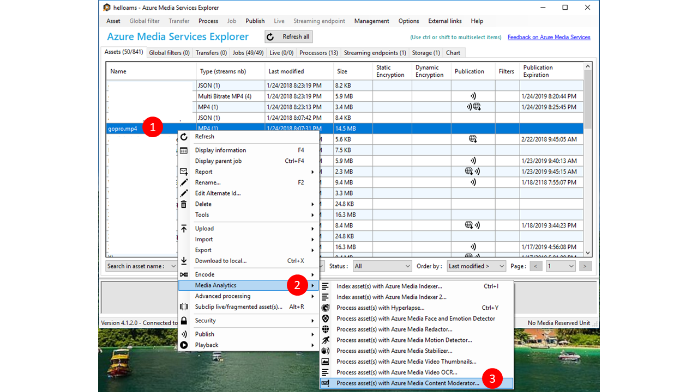

# Analyze video content for objectionable material in C#

This article provides information and code samples to help you get started using the [Content Moderator SDK for .NET](https://www.nuget.org/packages/Microsoft.Azure.CognitiveServices.ContentModerator/) to scan video content for adult or racy content.

If you don't have an Azure subscription, create a [free account](https://azure.microsoft.com/free/?WT.mc_id=A261C142F) before you begin. 

## Prerequisites
- Any edition of [Visual Studio 2015 or 2017](https://www.visualstudio.com/downloads/)

## Set up Azure resources

The Content Moderator's video moderation capability is available as a free public preview **media processor** in Azure Media Services (AMS). Azure Media Services is a specialized Azure service for storing and streaming video content. 

### Create an Azure Media Services account

Follow the instructions in [Create an Azure Media Services account](https://docs.microsoft.com/azure/media-services/media-services-portal-create-account) to subscribe to AMS and create an associated Azure storage account. In that storage account, create a new Blob storage container.

### Create an Azure Active Directory application

Navigate to your new AMS subscription in the Azure portal and select **API access** from the side menu. Select **Connect to Azure Media Services with service principal**. Note the value in the **REST API endpoint** field; you will need this later.

In the **Azure AD app** section, select **Create New** and name your new Azure AD application registration (for example, "VideoModADApp"). Click **Save** and wait a few minutes while the application is configured. Then, you should see your new app registration under the **Azure AD app** section of the page.

Select your app registration and click the **Manage application** button below it. Note the value in the **Application ID** field; you will need this later. Select **Settings** > **Keys**, and enter a description for a new key (such as "VideoModKey"). Click **Save**, and then notice the new key value. Copy this string and save it somewhere secure.

For a more thorough walkthrough of the above process, See [Get started with Azure AD authentication](https://docs.microsoft.com/azure/media-services/media-services-portal-get-started-with-aad).

Once you've done this, you can use the video moderation media processor in two different ways.

## Use Azure Media Services Explorer

The Azure Media Services Explorer is a user-friendly frontend for AMS. Use it to browse your AMS account, upload videos, and scan content with the Content Moderator media processor. Download and install it from [GitHub](https://github.com/Azure/Azure-Media-Services-Explorer/releases), or see the [Azure Media Services Explorer blog post](https://azure.microsoft.com/blog/managing-media-workflows-with-the-new-azure-media-services-explorer-tool/) for more information.



## Create the Visual Studio project

1. In Visual Studio, create a new **Console app (.NET Framework)** project and name it **VideoModeration**. 
1. If there are other projects in your solution, select this one as the single startup project.
1. Get the required NuGet packages. Right-click on your project in the Solution Explorer and select **Manage NuGet Packages**; then find and install the following packages:
    - windowsazure.mediaservices
    - windowsazure.mediaservices.extensions

## Add video moderation code

Next, you'll copy and paste the code from this guide into your project to implement a basic content moderation scenario.

### Update the program's using statements

Add the following `using` statements to the top of your _Program.cs_ file.

```csharp
using System;
using System.Linq;
using System.Threading.Tasks;
using Microsoft.WindowsAzure.MediaServices.Client;
using System.IO;
using System.Threading;
using Microsoft.WindowsAzure.Storage.Blob;
using Microsoft.WindowsAzure.Storage;
using Microsoft.WindowsAzure.Storage.Auth;
using System.Collections.Generic;
```

### Set up resource references

Add the following static fields to the **Program** class in _Program.cs_. These fields hold the information necessary for connecting to your AMS subscription. Fill them in with the values you got in the steps above. Note that `CLIENT_ID` is the **Application ID** value of your Azure AD app, and `CLIENT_SECRET` is the value of the "VideoModKey" that you created for that app.

```csharp
// declare constants and globals
private static CloudMediaContext _context = null;
private static CloudStorageAccount _StorageAccount = null;

// Azure Media Services (AMS) associated Storage Account, Key, and the Container that has 
// a list of Blobs to be processed.
static string STORAGE_NAME = "YOUR AMS ASSOCIATED BLOB STORAGE NAME";
static string STORAGE_KEY = "YOUR AMS ASSOCIATED BLOB STORAGE KEY";
static string STORAGE_CONTAINER_NAME = "YOUR BLOB CONTAINER FOR VIDEO FILES";

private static StorageCredentials _StorageCredentials = null;

// Azure Media Services authentication. 
private const string AZURE_AD_TENANT_NAME = "microsoft.onmicrosoft.com";
private const string CLIENT_ID = "YOUR CLIENT ID";
private const string CLIENT_SECRET = "YOUR CLIENT SECRET";

// REST API endpoint, for example "https://accountname.restv2.westcentralus.media.azure.net/API".      
private const string REST_API_ENDPOINT = "YOUR API ENDPOINT";

// Content Moderator Media Processor Nam
private const string MEDIA_PROCESSOR = "Azure Media Content Moderator";

// Input and Output files in the current directory of the executable
private const string INPUT_FILE = "VIDEO FILE NAME";
private const string OUTPUT_FOLDER = "";

// JSON settings file
private static readonly string CONTENT_MODERATOR_PRESET_FILE = "preset.json";

```

If you wish to use a local video file (simplest case), add it to the project and enter its path as the `INPUT_FILE` value (relative paths are relative to the execution directory).

You will also need to create the _preset.json_ file in the current directory and use it to specify a version number. For example:

```JSON
{
    "version": "2.0"
}
```

### Load the input video(s)

The **Main** method of the **Program** class will create an Azure Media Context and then an Azure Storage Context (in case your videos are in blob storage). The remaining code scans a video from a local folder, blob, or multiple blobs within an Azure storage container. You can try all options by commenting out the other lines of code.

```csharp
// Create Azure Media Context
CreateMediaContext();

// Create Storage Context
CreateStorageContext();

// Use a file as the input.
IAsset asset = CreateAssetfromFile();

// -- OR ---

// Or a blob as the input
// IAsset asset = CreateAssetfromBlob((CloudBlockBlob)GetBlobsList().First());

// Then submit the asset to Content Moderator
RunContentModeratorJob(asset);

//-- OR ----

// Just run the content moderator on all blobs in a list (from a Blob Container)
// RunContentModeratorJobOnBlobs();
```

### Create an Azure Media Context

Add the following method to the **Program** class. This uses your AMS credentials to allow communication with AMS.

```csharp
// Creates a media context from azure credentials
static void CreateMediaContext()
{
    // Get Azure AD credentials
    var tokenCredentials = new AzureAdTokenCredentials(AZURE_AD_TENANT_NAME,
        new AzureAdClientSymmetricKey(CLIENT_ID, CLIENT_SECRET),
        AzureEnvironments.AzureCloudEnvironment);

    // Initialize an Azure AD token
    var tokenProvider = new AzureAdTokenProvider(tokenCredentials);

    // Create a media context
    _context = new CloudMediaContext(new Uri(REST_API_ENDPOINT), tokenProvider);
}
```

### Add the code to create an Azure Storage Context

Add the following method to the **Program** class. You use the Storage Context, created from your storage credentials, to access your blob storage.

```csharp
// Creates a storage context from the AMS associated storage name and key
static void CreateStorageContext()
{
    // Get a reference to the storage account associated with a Media Services account. 
    if (_StorageCredentials == null)
    {
        _StorageCredentials = new StorageCredentials(STORAGE_NAME, STORAGE_KEY);
    }
    _StorageAccount = new CloudStorageAccount(_StorageCredentials, false);
}
```

### Add the code to create Azure Media Assets from local file and blob

The Content Moderator media processor runs jobs on **Assets** within the Azure Media Services platform.
These methods create the Assets from a local file or an associated blob.

```csharp
// Creates an Azure Media Services Asset from the video file
static IAsset CreateAssetfromFile()
{
    return _context.Assets.CreateFromFile(INPUT_FILE, AssetCreationOptions.None); ;
}

// Creates an Azure Media Services asset from your blog storage
static IAsset CreateAssetfromBlob(CloudBlockBlob Blob)
{
    // Create asset from the FIRST blob in the list and return it
    return _context.Assets.CreateFromBlob(Blob, _StorageCredentials, AssetCreationOptions.None);
}
```

### Add the code to scan a collection of videos (as blobs) within a container

```csharp
// Runs the Content Moderator Job on all Blobs in a given container name
static void RunContentModeratorJobOnBlobs()
{
    // Get the reference to the list of Blobs. See the following method.
    var blobList = GetBlobsList();

    // Iterate over the Blob list items or work on specific ones as needed
    foreach (var sourceBlob in blobList)
    {
        // Create an Asset
        IAsset asset = _context.Assets.CreateFromBlob((CloudBlockBlob)sourceBlob,
                            _StorageCredentials, AssetCreationOptions.None);
        asset.Update();

        // Submit to Content Moderator
        RunContentModeratorJob(asset);
    }
}

// Get all blobs in your container
static IEnumerable<IListBlobItem> GetBlobsList()
{
    // Get a reference to the Container within the Storage Account
    // that has the files (blobs) for moderation
    CloudBlobClient CloudBlobClient = _StorageAccount.CreateCloudBlobClient();
    CloudBlobContainer MediaBlobContainer = CloudBlobClient.GetContainerReference(STORAGE_CONTAINER_NAME);

    // Get the reference to the list of Blobs 
    var blobList = MediaBlobContainer.ListBlobs();
    return blobList;
}
```

### Add the method to run the Content Moderator Job

```csharp
// Run the Content Moderator job on the designated Asset from local file or blob storage
static void RunContentModeratorJob(IAsset asset)
{
    // Grab the presets
    string configuration = File.ReadAllText(CONTENT_MODERATOR_PRESET_FILE);

    // grab instance of Azure Media Content Moderator MP
    IMediaProcessor mp = _context.MediaProcessors.GetLatestMediaProcessorByName(MEDIA_PROCESSOR);

    // create Job with Content Moderator task
    IJob job = _context.Jobs.Create(String.Format("Content Moderator {0}",
            asset.AssetFiles.First() + "_" + Guid.NewGuid()));

    ITask contentModeratorTask = job.Tasks.AddNew("Adult and racy classifier task",
            mp, configuration,
            TaskOptions.None);
    contentModeratorTask.InputAssets.Add(asset);
    contentModeratorTask.OutputAssets.AddNew("Adult and racy classifier output",
        AssetCreationOptions.None);

    job.Submit();


    // Create progress printing and querying tasks
    Task progressPrintTask = new Task(() =>
    {
        IJob jobQuery = null;
        do
        {
            var progressContext = _context;
            jobQuery = progressContext.Jobs
            .Where(j => j.Id == job.Id)
                .First();
                Console.WriteLine(string.Format("{0}\t{1}",
                DateTime.Now,
                jobQuery.State));
                Thread.Sleep(10000);
            }
            while (jobQuery.State != JobState.Finished &&
            jobQuery.State != JobState.Error &&
            jobQuery.State != JobState.Canceled);
    });
    progressPrintTask.Start();

    Task progressJobTask = job.GetExecutionProgressTask(
    CancellationToken.None);
    progressJobTask.Wait();

    // If job state is Error, the event handling 
    // method for job progress should log errors.  Here we check 
    // for error state and exit if needed.
    if (job.State == JobState.Error)
    {
        ErrorDetail error = job.Tasks.First().ErrorDetails.First();
        Console.WriteLine(string.Format("Error: {0}. {1}",
        error.Code,
        error.Message));
    }

    DownloadAsset(job.OutputMediaAssets.First(), OUTPUT_FOLDER);
}
```

### Add helper functions

These methods download the Content Moderator output file (JSON) from the Azure Media Services asset, and help track the status of the moderation job so that the program can log a running status to the console.

```csharp
static void DownloadAsset(IAsset asset, string outputDirectory)
{
    foreach (IAssetFile file in asset.AssetFiles)
    {
        file.Download(Path.Combine(outputDirectory, file.Name));
    }
}

// event handler for Job State
static void StateChanged(object sender, JobStateChangedEventArgs e)
{
    Console.WriteLine("Job state changed event:");
    Console.WriteLine("  Previous state: " + e.PreviousState);
    Console.WriteLine("  Current state: " + e.CurrentState);
    switch (e.CurrentState)
    {
        case JobState.Finished:
            Console.WriteLine();
            Console.WriteLine("Job finished.");
            break;
        case JobState.Canceling:
        case JobState.Queued:
        case JobState.Scheduled:
        case JobState.Processing:
            Console.WriteLine("Please wait...\n");
            break;
        case JobState.Canceled:
            Console.WriteLine("Job is canceled.\n");
            break;
        case JobState.Error:
            Console.WriteLine("Job failed.\n");
            break;
        default:
            break;
    }
}
```

### Run the program and review the output

After the Content Moderation job is completed, analyze the JSON response. It consists of these elements:

- Video information summary
- **Shots** as "**fragments**"
- **Key frames** as "**events**" with a **reviewRecommended" (= true or false)"** flag based on **Adult** and **Racy** scores
- **start**, **duration**, **totalDuration**, and **timestamp** are in "ticks". Divide by **timescale** to get the number in seconds.
 
> [!NOTE]
> - `adultScore` represents the potential presence and prediction score of content that may be considered sexually explicit or adult in certain situations.
> - `racyScore` represents the potential presence and prediction score of content that may be considered sexually suggestive or mature in certain situations.
> - `adultScore` and `racyScore` are between 0 and 1. The higher the score, the higher the model is predicting that the category may be applicable. This preview relies on a statistical model rather than manually coded outcomes. We recommend testing with your own content to determine how each category aligns to your requirements.
> - `reviewRecommended` is either true or false depending on the internal score thresholds. Customers should assess whether to use this value or decide on custom thresholds based on their content policies.

```json
{
"version": 2,
"timescale": 90000,
"offset": 0,
"framerate": 50,
"width": 1280,
"height": 720,
"totalDuration": 18696321,
"fragments": [
{
    "start": 0,
    "duration": 18000
},
{
    "start": 18000,
    "duration": 3600,
    "interval": 3600,
    "events": [
    [
        {
        "reviewRecommended": false,
        "adultScore": 0.00001,
        "racyScore": 0.03077,
        "index": 5,
        "timestamp": 18000,
        "shotIndex": 0
        }
    ]
    ]
},
{
    "start": 18386372,
    "duration": 119149,
    "interval": 119149,
    "events": [
    [
        {
        "reviewRecommended": true,
        "adultScore": 0.00000,
        "racyScore": 0.91902,
        "index": 5085,
        "timestamp": 18386372,
        "shotIndex": 62
        }
    ]
    ]
}
]
}
```

## Next steps

Learn how to generate [video reviews](video-reviews-quickstart-dotnet.md) from your moderation output.

Add [transcript moderation](video-transcript-moderation-review-tutorial-dotnet.md) to your video reviews.

Check out the detailed tutorial on how to build a [complete video and transcript moderation solution](video-transcript-moderation-review-tutorial-dotnet.md).

[Download the Visual Studio solution](https://github.com/Azure-Samples/cognitive-services-dotnet-sdk-samples/tree/master/ContentModerator) for this and other Content Moderator quickstarts for .NET.
