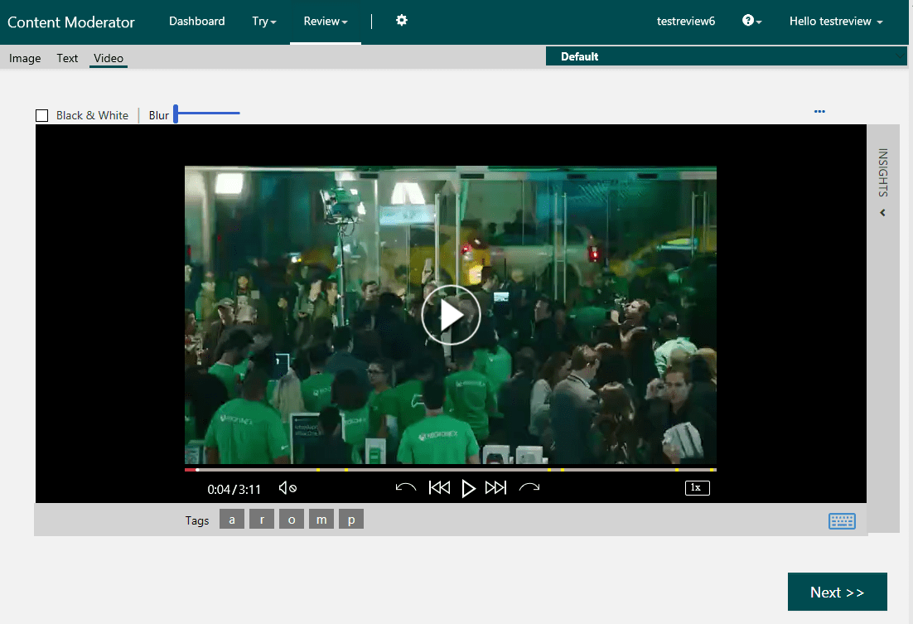
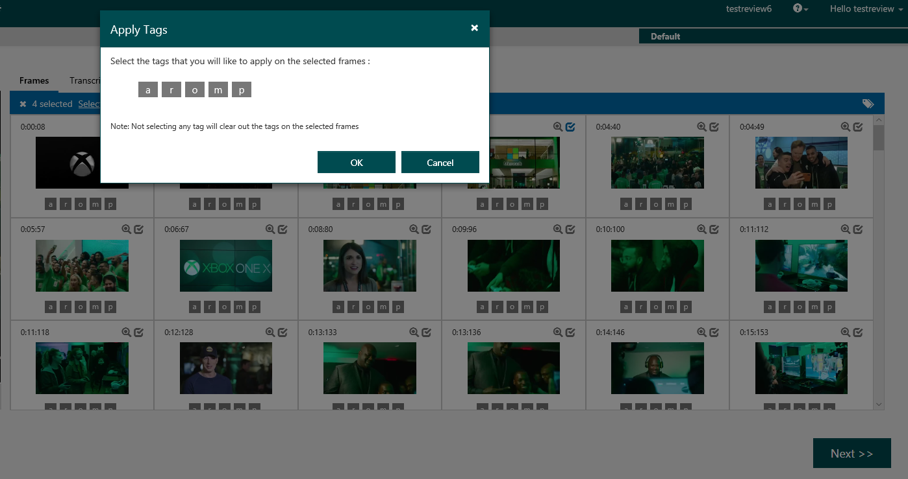
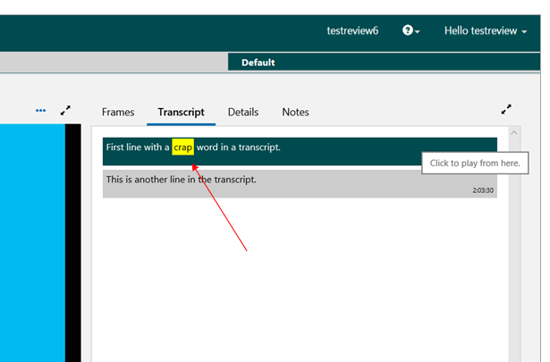

# Video moderation with human review

Use Content Moderator’s machine-assisted [video moderation](video-moderation-api.md) and [human review tool](Review-Tool-User-Guide/human-in-the-loop.md) to moderate videos and transcripts for adult (explicit) and racy (suggestive) content to get the best results for your business.

## Video-trained classifier (preview)

Machine-assisted video classification is either achieved with image trained models or video trained models. Unlike image-trained video classifiers, Microsoft's adult and racy video classifier is trained with videos. This method results in better match quality.

## Shot detection

When outputting the classification details, additional video intelligence helps with more flexibility in analyzing videos. Instead of outputting just the frames, Microsoft's video moderation service provides shot-level information too. You now have the option to analyze your videos at the shot level and the frame level.
 
## Key frame detection

Instead of outputting frames at regular intervals, the video moderation service identifies and outputs only potentially complete (good) frames. The feature allows efficient frame generation for frame-level adult and racy analysis.

The following extract shows a partial response with potential shots, key frames, and adult and racy scores:

	"fragments": [
    {
      "start": 0,
      "duration": 18000
    },
    {
      "start": 18000,
      "duration": 3600,
      "interval": 3600,
      "events": [
        [
          {
            "reviewRecommended": false,
            "adultScore": 0.00001,
            "racyScore": 0.03077,
            "index": 5,
            "timestamp": 18000,
            "shotIndex": 0
          }
        ]
      ]
    },
    {
      "start": 18386372,
      "duration": 119149,
      "interval": 119149,
      "events": [
        [
          {
            "reviewRecommended": true,
            "adultScore": 0.00000,
            "racyScore": 0.91902,
            "index": 5085,
            "timestamp": 18386372,
            "shotIndex": 62
          }
        ]
      ]

## Visualization for human reviews

For more nuanced cases, businesses need a human review solution for rendering the video, its frames, and machine-assigned tags. The human moderators reviewing videos and frames get a complete view of the insights, change tags, and submit their decisions.

## Player view for video-level review

Video-level binary decisions are made possible with a video player view that shows potential adult and racy frames. The human reviewers navigate the video with various speed options to examine the scenes. They confirm their decisions by toggling the tags.

## Frames view for detailed reviews

A detailed video review for frame-by-frame analysis is made possible with a frame-based view. The human reviewers review and select one or more frames and toggle tags to confirm their decisions. An optional next step is redaction of the offensive frames or content.

## Transcript moderation

Videos typically have voice over that needs moderation as well for offensive speech. You use the Azure Media Indexer service to convert speech to text and use Content Moderator's review API to submit the transcript for text moderation within the review tool.

## Next steps

Get started with the [video moderation quickstart](video-moderation-api.md). 

Learn how to generate [video reviews](video-reviews-quickstart-dotnet.md) for your human reviewers from your moderated output.

Add [video transcript reviews](video-transcript-reviews-quickstart-dotnet.md) to your video reviews.

Check out the detailed tutorial on how to develop a [complete video moderation solution](video-transcript-moderation-review-tutorial-dotnet.md). 
