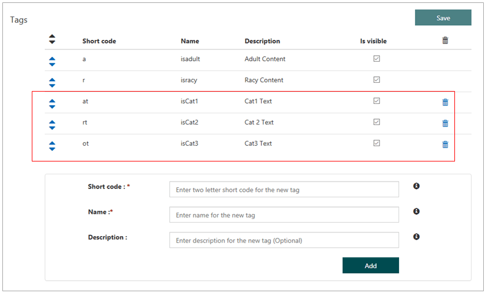
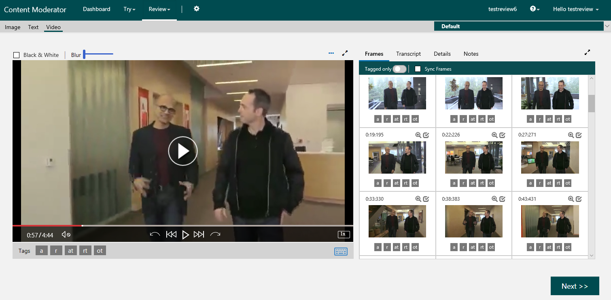
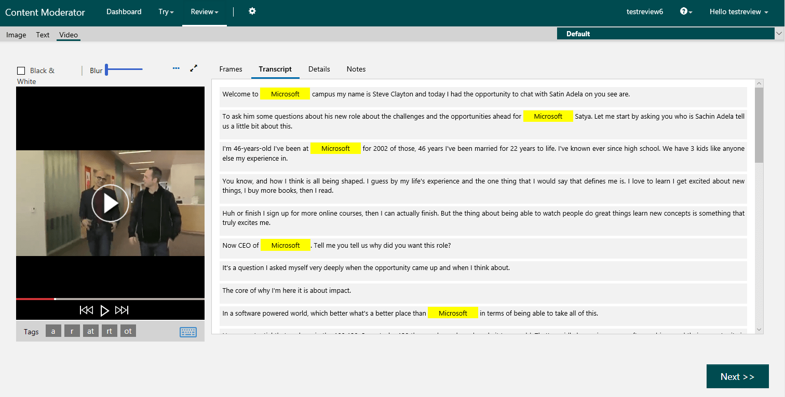

# Tutorial: Video and transcript moderation

Content Moderator's video APIs allow you to moderate videos and create video reviews in the human review tool. 

This detailed tutorial helps to understand how to build a complete video and transcript moderation solution with machine-assisted moderation and human-in-the-loop review creation.

Download the [C# console application](https://github.com/MicrosoftContentModerator/VideoReviewConsoleApp) for this tutorial. The console application uses the SDK and related packages to perform the following tasks:

- Compress the input video(s) for faster processing
- Moderate the video to get shots and frames with insights
- Use the frame timestamps to create thumbnails (images)
- Submit timestamps and thumbnails to create video reviews
- Convert the video speech to text (transcript) with the Media Indexer API
- Moderate the transcript with the text moderation service
- Add the moderated transcript to the video review

## Sample program outputs

Before going further, let's look at the follwing sample outputs from the program:

- [Console output](#program-output)
- [Video review](#video-review-default-view)
- [Transcript view](#video-review-transcript-view)

## Prerequisites

1. Sign up for the [Content Moderator review tool](https://contentmoderator.cognitive.microsoft.com/) web site and [create custom tags](Review-Tool-User-Guide/tags.md) that the C# console application assigns from within the code. The following screen shows the custom tags.

  

1. To run the sample application, you need an Azure account and an Azure Media Services account. Additionally, you need access to the Content Moderator private preview. Finally, you need Azure Active Directory authentication credentials. For details on obtaining this information, see [the Video Moderation API quickstart](video-moderation-api.md).

1. Edit the file `App.config` and add the Active Directory tenant name, service endpoints, and subscription keys indicated by `#####`. You need the following information:

|Key|Description|
|-|-|
|`AzureMediaServiceRestApiEndpoint`|Endpoint for the Azure Media Services (AMS) API|
|`ClientSecret`|Subscription key for Azure Media Services|
|`ClientId`|Client ID for Azure Media Services|
|`AzureAdTenantName`|Active Directory tenant name representing your organization|
|`ContentModeratorReviewApiSubscriptionKey`|Subscription key for the Content Moderator review API|
|`ContentModeratorApiEndpoint`|Endpoint for the Content Moderator API|
|`ContentModeratorTeamId`|Content moderator team ID|

## Getting started

The class `Program` in `Program.cs` is the main entry point to the video moderation application.

### Methods of class Program

|Method|Description|
|-|-|
|`Main`|Parses command line, gathers user input, and starts processing.|
|`ProcessVideo`|Compresses, uploads, moderates, and creates video reviews.|
|`CreateVideoStreamingRequest`|Creates a stream to upload a video|
|`GetUserInputs`|Gathers user input; used when no command-line options are present|
|`Initialize`|Initializes objects needed for the moderation process|

### The Main method

`Main()` is where execution starts, so it's the place to start understanding the video moderation process.

	static void Main(string[] args)
	{
    	if (args.Length == 0)
    	{
        	string videoPath = string.Empty;
        	GetUserInputs(out videoPath);
        	Initialize();
        	AmsConfigurations.logFilePath = Path.Combine(Path.GetDirectoryName(videoPath), "log.txt");
        	try
        	{
            	ProcessVideo(videoPath).Wait();
        	}
        	catch (Exception ex)
        	{
            	Console.WriteLine(ex.Message);
        	}
    	}
    	else
    	{
        	DirectoryInfo directoryInfo = new DirectoryInfo(args[0]);
        	if (args.Length == 2)
            	bool.TryParse(args[1], out generateVtt);
        	Initialize();
        	AmsConfigurations.logFilePath = Path.Combine(args[0], "log.txt");
        	var files = directoryInfo.GetFiles("*.mp4", SearchOption.AllDirectories);
        	foreach (var file in files)
        	{
            	try
            	{
                	ProcessVideo(file.FullName).Wait();
            	}
            	catch (Exception ex)
            	{
                	Console.WriteLine(ex.Message);
            	}
        	}
    	}
	}

`Main()` handles the following command-line arguments:

- The path to a directory containing MPEG-4 video files to be submitted for moderation. All `*.mp4` files in this directory and its subdirectories are submitted for moderation.
- Optionally, a Boolean (true/false) flag indicating whether text transcripts should be generated for the purpose of moderating audio.

If no command-line arguments are present, `Main()` calls `GetUserInputs()`. This method prompts the user to enter the path to a single video file and to specify whether a text transcript should be generated.

> [!NOTE]
> The console application uses the [Azure Media Indexer API](https://docs.microsoft.com/azure/media-services/media-services-process-content-with-indexer2) to generate transcripts from the uploaded video's audio track. The results are provided in WebVTT format. For more information on this format, see [Web Video Text Tracks Format](https://developer.mozilla.org/en-US/docs/Web/API/WebVTT_API).

### Initialize and ProcessVideo methods

Regardless of whether the program's options came from the command line or from interactive user input, `Main()` next calls `Initialize()` to create the following instances:

|Class|Description|
|-|-|
|`AMSComponent`|Compresses video files before submitting them for moderation.|
|`AMSconfigurations`|Interface to the application's configuration data, found in `App.config`.|
|`VideoModerator`| Uploading, encoding, encryption, and moderation using AMS SDK|
|`VideoReviewApi`|Manages video reviews in the Content Moderator service|

These classes (aside from `AMSConfigurations`, which is straightforward) are covered in more detail in upcoming sections of this tutorial.

Finally, the video files are processed one at a time by calling `ProcessVideo()` for each.

	private static async Task ProcessVideo(string videoPath)
	{
    	Stopwatch sw = new Stopwatch();
    	sw.Start();
    	Console.ForegroundColor = ConsoleColor.White;
    	Console.WriteLine("\nVideo compression process started...");

    	var compressedVideoPath = amsComponent.CompressVideo(videoPath);
    	if (string.IsNullOrWhiteSpace(compressedVideoPath))
    	{
        	Console.ForegroundColor = ConsoleColor.Red;
        	Console.WriteLine("Video Compression failed.");
    	}

    	Console.WriteLine("\nVideo compression process completed...");

    	UploadVideoStreamRequest uploadVideoStreamRequest = CreateVideoStreamingRequest(compressedVideoPath);
    	UploadAssetResult uploadResult = new UploadAssetResult();

    	if (generateVtt)
    	{
        	uploadResult.GenerateVTT = generateVtt;
    	}
    	Console.WriteLine("\nVideo moderation process started...");

    	if (!videoModerator.CreateAzureMediaServicesJobToModerateVideo(uploadVideoStreamRequest, uploadResult))
    	{
        	Console.ForegroundColor = ConsoleColor.Red;
        	Console.WriteLine("Video Review process failed.");
    	}

    	Console.WriteLine("\nVideo moderation process completed...");
    	Console.WriteLine("\nVideo review process started...");
    	string reviewId = await videoReviewApi.CreateVideoReviewInContentModerator(uploadResult);
    	Console.WriteLine("\nVideo review successfully completed...");
    	sw.Stop();
    	Console.WriteLine("\nTotal Elapsed Time: {0}", sw.Elapsed);
    	using (var stw = new StreamWriter(AmsConfigurations.logFilePath, true))
    	{
        	stw.WriteLine("Video File Name: " + Path.GetFileName(videoPath));
        	stw.WriteLine($"ReviewId: {reviewId}");
        	stw.WriteLine("Total Elapsed Time: {0}", sw.Elapsed);
    	}
	}

The `ProcessVideo()` method is fairly straightforward. It performs the following operations in the order:

- Compresses the video
- Uploads the video to an Azure Media Services asset
- Creates an AMS job to moderate the video
- Creates a video review in Content Moderator

The following sections consider in more detail some of the individual processes invoked by `ProcessVideo()`. 

## Compressing the video

To minimize network traffic, the application converts video files to H.264 (MPEG-4 AVC) format and scales them to a maximum width of 640 pixels. The H.264 codec is recommended due to its high efficiency (compression rate). The compression is done using the free `ffmpeg` command-line tool, which is included in the `Lib` folder of the Visual Studio solution. The input files may be of any format supported by `ffmpeg`, including most commonly used video file formats and codecs.

> [!NOTE]
> When you start the program using command-line options, you specify a directory containing the video files to be submitted for moderation. All files in this directory having the `.mp4` filename extension are processed. To process other filename extensions, update the `Main()` method in `Program.cs` to include the desired extensions.

The code that compresses a single video file is the `AmsComponent` class in `AMSComponent.cs`. The method responsible for this functionality is `CompressVideo()`, shown here.

	public string CompressVideo(string videoPath)
	{
    	string ffmpegBlobUrl;
    	if (!ValidatePreRequisites())
    	{
        	Console.WriteLine("Configurations check failed. Please cross check the configurations!");
        	throw new Exception();
    	}

    	if (File.Exists(_configObj.FfmpegExecutablePath))
    	{
        	ffmpegBlobUrl = this._configObj.FfmpegExecutablePath;
    	}
    	else
    	{
        	Console.WriteLine("ffmpeg.exe is missing. Please check the Lib folder");
        	throw new Exception();
    	}

    	string videoFilePathCom = videoPath.Split('.')[0] + "_c.mp4";
    	ProcessStartInfo processStartInfo = new ProcessStartInfo();
    	processStartInfo.WindowStyle = ProcessWindowStyle.Hidden;
    	processStartInfo.FileName = ffmpegBlobUrl;
    	processStartInfo.Arguments = "-i \"" + videoPath + "\" -vcodec libx264 -n -crf 32 -preset veryfast -vf scale=640:-1 -c:a aac -aq 1 -ac 2 -threads 0 \"" + videoFilePathCom + "\"";
    	var process = Process.Start(processStartInfo);
    	process.WaitForExit();
    	process.Close();
    	return videoFilePathCom;
	}

The code performs the following steps:

- Checks to make sure the configuration in `App.config` contains all necessary data
- Checks to make sure the `ffmpeg` binary is present
- Builds the output filename by appending `_c.mp4` to the base name of the file (such as `Example.mp4` -> `E>xample_c.mp4`)
- Builds a command-line string to perform the conversion
- Starts an `ffmpeg` process using the command line
- Waits for the video to be processed

> [!NOTE]
> If you know your videos are already compressed using H.264 and have appropriate dimensions, you can rewrite `CompressVideo()` to skip the compression.

The method returns the filename of the compressed output file.

## Uploading and moderating the video

The video must be stored in Azure Media Services before it can be processed by the Content Moderation service. The `Program` class in `Program.cs` has a short method `CreateVideoStreamingRequest()` that returns an object representing the streaming request used to upload the video.

	private static UploadVideoStreamRequest CreateVideoStreamingRequest(string compressedVideoFilePath)
	{
    	return
    	    new UploadVideoStreamRequest
        	{
            	VideoStream = File.ReadAllBytes(compressedVideoFilePath),
            	VideoName = Path.GetFileName(compressedVideoFilePath),
            	EncodingRequest = new EncodingRequest()
            	{
                	EncodingBitrate = AmsEncoding.AdaptiveStreaming
            	},
            	VideoFilePath = compressedVideoFilePath
        	};
	}

The resulting `UploadVideoStreamRequest` object is defined in `UploadVideoStreamRequest.cs` (and its parent, `UploadVideoRequest`, in `UploadVideoRequest.cs`). These classes aren't shown here; they're short and serve only to hold the compressed video data and information about it. Another data-only class, `UploadAssetResult` (`UploadAssetResult.cs`) is used to hold the results of the upload process. Now it's possible to understand these lines in `ProcessVideo()`:

	UploadVideoStreamRequest uploadVideoStreamRequest = CreateVideoStreamingRequest(compressedVideoPath);
	UploadAssetResult uploadResult = new UploadAssetResult();

	if (generateVtt)
	{
    	uploadResult.GenerateVTT = generateVtt;
	}
	Console.WriteLine("\nVideo moderation process started...");

	if (!videoModerator.CreateAzureMediaServicesJobToModerateVideo(uploadVideoStreamRequest, uploadResult))
	{
	    Console.ForegroundColor = ConsoleColor.Red;
    	Console.WriteLine("Video Review process failed.");
	}

These lines perform the following tasks:

- Create a `UploadVideoStreamRequest` to upload the compressed video
- Set the request's `GenerateVTT` flag if the user has requested a text transcript
- Calls `CreateAzureMediaServicesJobToModerateVideo()` to perform the upload and receive the result

## Deep dive into video moderation

The method `CreateAzureMediaServicesJobToModerateVideo()` is in `VideoModerator.cs`, which contains the bulk of the code that interacts with Azure Media Services. The method's source code is shown in the following extract.

	public bool CreateAzureMediaServicesJobToModerateVideo(UploadVideoStreamRequest uploadVideoRequest, UploadAssetResult uploadResult)
	{
    	asset = CreateAsset(uploadVideoRequest);
    	uploadResult.VideoName = uploadVideoRequest.VideoName;
    	// Encoding the asset , Moderating the asset, Generating transcript in parallel
    	IAsset encodedAsset = null;
    	//Creates the job for the tasks.
    	IJob job = this._mediaContext.Jobs.Create("AMS Review Job");

    	//Adding encoding task to job.
    	ConfigureEncodeAssetTask(uploadVideoRequest.EncodingRequest, job);

    	ConfigureContentModerationTask(job);

    	//adding transcript task to job.
    	if (uploadResult.GenerateVTT)
    	{
        	ConfigureTranscriptTask(job);
    	}

    	Stopwatch timer = new Stopwatch();
    	timer.Start();
    	//submit and execute job.
    	job.Submit();
    	job.GetExecutionProgressTask(new CancellationTokenSource().Token).Wait();
    	timer.Stop();
    	using (var sw = new StreamWriter(AmsConfigurations.logFilePath, true))
    	{
        	sw.WriteLine("AMS Job Elapsed Time: {0}", timer.Elapsed);
    	}

    	if (job.State == JobState.Error)
    	{
        	throw new Exception("Video moderation has failed due to AMS Job error.");
    	}

    	UploadAssetResult result = uploadResult;
    	encodedAsset = job.OutputMediaAssets[0];
    	result.ModeratedJson = GetCmDetail(job.OutputMediaAssets[1]);
    	// Check for valid Moderated JSON
    	var jsonModerateObject = JsonConvert.DeserializeObject<VideoModerationResult>(result.ModeratedJson);

    	if (jsonModerateObject == null)
    	{
        	return false;
    	}
    	if (uploadResult.GenerateVTT)
    	{
        	GenerateTranscript(job.OutputMediaAssets.Last());
    	}

    	uploadResult.StreamingUrlDetails = PublishAsset(encodedAsset);
    	string downloadUrl = GenerateDownloadUrl(asset, uploadVideoRequest.VideoName);
    	uploadResult.StreamingUrlDetails.DownloadUri = downloadUrl;
    	uploadResult.VideoName = uploadVideoRequest.VideoName;
    	uploadResult.VideoFilePath = uploadVideoRequest.VideoFilePath;
    	return true;
	}

This code performs the following tasks:

- Creates an AMS job for the processing to be done
- Adds tasks for encoding the video file, moderating it, and generating a text transcript
- Submits the job, uploading the file and beginning processing
- Retrieves the moderation results, the text transcript (if requested), and other information

## Sample video moderation response

The result of the video moderation job (See [video moderation quickstart](video-moderation-api.md) is a JSON data structure containing the moderation results. These results include a breakdown of the fragments (shots) within the video, each containing events (clips) with key frames that have been flagged for review. Each key frame is scored by the likelihood that it contains adult or racy content. The following example shows a JSON response:

	{
		"version": 2,
		"timescale": 90000,
		"offset": 0,
		"framerate": 50,
		"width": 1280,
		"height": 720,
		"totalDuration": 18696321,
		"fragments": [
		{
			"start": 0,
			"duration": 18000
		},
		{
			"start": 18000,
			"duration": 3600,
			"interval": 3600,
			"events": [
    		[
      		{
        		"reviewRecommended": false,
        		"adultScore": 0.00001,
        		"racyScore": 0.03077,
        		"index": 5,
        		"timestamp": 18000,
        		"shotIndex": 0
      		}
    		]
		]
		},
		{
			"start": 18386372,
			"duration": 119149,
			"interval": 119149,
			"events": [
    		[
      		{
        		"reviewRecommended": true,
        		"adultScore": 0.00000,
        		"racyScore": 0.91902,
        		"index": 5085,
        		"timestamp": 18386372,
        		"shotIndex": 62
      		}
		]
		]
		}
	]
	}

A transcription of the audio from the video is also produced when the `GenerateVTT` flag is set.

> [!NOTE]
> The console application uses the [Azure Media Indexer API](https://docs.microsoft.com/azure/media-services/media-services-process-content-with-indexer2) to generate transcripts from the uploaded video's audio track. The results are provided in WebVTT format. For more information on this format, see [Web Video Text Tracks Format](https://developer.mozilla.org/en-US/docs/Web/API/WebVTT_API).

## Creating the human-in-the-loop review

The moderation process returns a list of key frames from the video, along with a transcript of its audio tracks. The next step is to create a review in the Content Moderator review tool for human moderators. Going back to the `ProcessVideo()` method in `Program.cs`, you see the call to the `CreateVideoReviewInContentModerator()` method. This method is in the `videoReviewApi` class, which is in `VideoReviewAPI.cs`, and is shown here.

	public async Task<string> CreateVideoReviewInContentModerator(UploadAssetResult uploadAssetResult)
	{
	
    	string reviewId = string.Empty;
    	List<ProcessedFrameDetails> frameEntityList = framegenerator.CreateVideoFrames(uploadAssetResult);
    	string path = uploadAssetResult.GenerateVTT == true ? this._amsConfig.FfmpegFramesOutputPath + Path.GetFileNameWithoutExtension	(uploadAssetResult.VideoName) + "_aud_SpReco.vtt" : "";
    	TranscriptScreenTextResult screenTextResult = new TranscriptScreenTextResult();
    	
	if (File.Exists(path))
    	{
        	screenTextResult = await GenerateTextScreenProfanity(reviewId, path, frameEntityList);
        	uploadAssetResult.Category1TextScore = screenTextResult.Category1Score;
        	uploadAssetResult.Category2TextScore = screenTextResult.Category2Score;
        	uploadAssetResult.Category3TextScore = screenTextResult.Category3Score;
        	uploadAssetResult.Category1TextTag = screenTextResult.Category1Tag;
        	uploadAssetResult.Category2TextTag = screenTextResult.Category2Tag;
        	uploadAssetResult.Category3TextTag = screenTextResult.Category3Tag;
    	}
    	
		var reviewVideoRequestJson = CreateReviewRequestObject(uploadAssetResult, frameEntityList);
    	if (string.IsNullOrWhiteSpace(reviewVideoRequestJson))
    	{
        	throw new Exception("Video review process failed in CreateVideoReviewInContentModerator");
    	}
    	
		reviewId = JsonConvert.DeserializeObject<List<string>>(ExecuteCreateReviewApi(reviewVideoRequestJson).Result).FirstOrDefault();
    	frameEntityList = framegenerator.GenerateFrameImages(frameEntityList, uploadAssetResult, reviewId);
    	await CreateAndPublishReviewInContentModerator(uploadAssetResult, frameEntityList, reviewId, path, screenTextResult);
    	return reviewId;
	
	}

`CreateVideoReviewInContentModerator()` calls several other methods to perform the following tasks:

> [!NOTE]
> The console application uses the [FFmpeg](https://ffmpeg.org/) library for generating thumbnails. These thumbnails (images) correspond to the frame timestamps in the [video moderation output](#sample-video-moderation-response).

|Task|Methods|File|
|-|-|-|
|Extract the key frames from the video and creates thumbnail images of them|`CreateVideoFrames()` `GenerateFrameImages()`|`FrameGeneratorServices.cs`|
|Scan the text transcript, if available, to locate adult or racy audio|`GenerateTextScreenProfanity()`| `VideoReviewAPI.cs`|
|Prepare and submits a video review request for human inspection|`CreateReviewRequestObject()`  `ExecuteCreateReviewApi()` `CreateAndPublishReviewInContentModerator()`|`VideoReviewAPI.cs`|

## Video review default view

The following screen shows the results of the previous steps.

## Transcript generation

Until now, the code presented in this tutorial has focused on the visual content. Review of speech content is a separate and optional process that, as mentioned, uses a transcript generated from the audio. It's time now to take a look at how text transcripts are created and used in the review process. The task of generating the transcript falls to the [Azure Media Indexer](https://docs.microsoft.com/azure/media-services/media-services-index-content) service.

The application performs the following tasks:

|Task|Methods|File|
|-|-|-|
|Determine whether text transcripts are to be generated|`Main()` `GetUserInputs()`|`Program.cs`|
|If so, submit a transcription job as part of moderation|`ConfigureTranscriptTask()`|`VideoModerator.cs`|
|Get a local copy of the transcript|`GenerateTranscript()`|`VideoModerator.cs`|
|Flag frames of the video that contain inappropriate audio|`GenerateTextScreenProfanity()` `TextScreen()`|`VideoReviewAPI.cs`|
|Add the results to the review|`UploadScreenTextResult()` `ExecuteAddTranscriptSupportFile()`|`VideoReviewAPI.cs`|

### Task configuration

Let's jump right into submitting the transcription job. `CreateAzureMediaServicesJobToModerateVideo()` (already described) calls `ConfigureTranscriptTask()`.

	private void ConfigureTranscriptTask(IJob job)
    {
    	string mediaProcessorName = _amsConfigurations.MediaIndexer2MediaProcessor;
        IMediaProcessor processor = _mediaContext.MediaProcessors.GetLatestMediaProcessorByName(mediaProcessorName);

        string configuration = File.ReadAllText(_amsConfigurations.MediaIndexerConfigurationJson);
        ITask task = job.Tasks.AddNew("AudioIndexing Task", processor, configuration, TaskOptions.None);
        task.InputAssets.Add(asset);
        task.OutputAssets.AddNew("AudioIndexing Output Asset", AssetCreationOptions.None);
    }

The configuration for the transcript task is read from the file `MediaIndexerConfig.json` in the solution's `Lib` folder. AMS assets are created for the configuration file and for the output of the transcription process. When the AMS job runs, this task creates a text transcript from the video file's audio track.

> [!NOTE]
> The sample application recognizes speech in US English only.

### Transcript generation

The transcript is published as an AMS asset. To scan the transcript for objectionable content, the application downloads the asset from Azure Media Services. `CreateAzureMediaServicesJobToModerateVideo()` calls `GenerateTranscript()`, shown here, to retrieve the file.

	public bool GenerateTranscript(IAsset asset)
	{
    	try
    	{
        	var outputFolder = this._amsConfigurations.FfmpegFramesOutputPath;
        	IAsset outputAsset = asset;
        	IAccessPolicy policy = null;
        	ILocator locator = null;
        	policy = _mediaContext.AccessPolicies.Create("My 30 days readonly policy", TimeSpan.FromDays(360), AccessPermissions.Read);
        	locator = _mediaContext.Locators.CreateLocator(LocatorType.Sas, outputAsset, policy, DateTime.UtcNow.AddMinutes(-5));
        	DownloadAssetToLocal(outputAsset, outputFolder);
        	locator.Delete();
        	return true;
    	}
    	catch
    	{   //TODO:  Logging
        	Console.WriteLine("Exception occured while generating index for video.");
        	throw;
    	}
	}

After some necessary AMS setup, the actual download is performed by calling `DownloadAssetToLocal()`, a generic function that copies an AMS asset to a local file.

## Transcript moderation

With the transcript close at hand, it is scanned and used in the review. Creating the review is the purview of `CreateVideoReviewInContentModerator()`, that calls `GenerateTextScreenProfanity()` to do the job. In turn, this method calls `TextScreen()`, that contains most of the functionality. 

`TextScreen()` performs the following tasks:

- Parse the transcript for time tamps and captions
- Submit each caption for text moderation
- Flag any frames that may have objectionable speech content

Let's examine each these tasks in more detail:

### Initialize the code

First, initialize all variables and collections.

	private async Task<TranscriptScreenTextResult> TextScreen(string filepath, List<ProcessedFrameDetails> frameEntityList)
	{
		List<TranscriptProfanity> profanityList = new List<TranscriptProfanity>();
        string responseContent = string.Empty;
        HttpResponseMessage response;
        bool category1Tag = false;
        bool category2Tag = false;
        bool category3Tag = false;
        double category1Score = 0;
        double category2Score = 0;
        double category3Score = 0;
        List<string> vttLines = File.ReadAllLines(filepath).Where(line => !line.Contains("NOTE Confidence:") && line.Length > 0).ToList();
        StringBuilder sb = new StringBuilder();
        List<CaptionScreentextResult> csrList = new List<CaptionScreentextResult>();
        CaptionScreentextResult captionScreentextResult = new CaptionScreentextResult() { Captions = new List<string>() };

		// Code from the next sections in the tutorial
	

### Parse the transcript for captions

Next, parse the VTT formatted transcript for captions and timestamps. The review tool displays these captions in the Transcript Tab on the video review screen. The timestamps are used to sync the captions with the corresponding video frames.

		// Code from the previous section(s) in the tutorial

		//
    	// Parse the transcript
    	//
    	foreach (var line in vttLines.Skip(1))
        {
                if (line.Contains("-->"))
                {
                    if (sb.Length > 0)
                    {
                        captionScreentextResult.Captions.Add(sb.ToString());
                        sb.Clear();
                    }
                    if (captionScreentextResult.Captions.Count > 0)
                    {
                        csrList.Add(captionScreentextResult);
                        captionScreentextResult = new CaptionScreentextResult() { Captions = new List<string>() };
                    }
                    string[] times = line.Split(new string[] { "-->" }, StringSplitOptions.RemoveEmptyEntries);
                    string startTimeString = times[0].Trim();
                    string endTimeString = times[1].Trim();
                    int startTime = (int)TimeSpan.ParseExact(startTimeString, @"hh\:mm\:ss\.fff", CultureInfo.InvariantCulture).TotalMilliseconds;
                    int endTime = (int)TimeSpan.ParseExact(endTimeString, @"hh\:mm\:ss\.fff", CultureInfo.InvariantCulture).TotalMilliseconds;
                    captionScreentextResult.StartTime = startTime;
                    captionScreentextResult.EndTime = endTime;
                }
                else
                {
                    sb.Append(line);
                }
                if (sb.Length + line.Length > 1024)
                {
                    captionScreentextResult.Captions.Add(sb.ToString());
                    sb.Clear();
                }
            }
            if (sb.Length > 0)
            {
                captionScreentextResult.Captions.Add(sb.ToString());
            }
            if (captionScreentextResult.Captions.Count > 0)
            {
                csrList.Add(captionScreentextResult);
            }

			// Code from the following section in the quickstart

### Moderate captions with the text moderation service

Next, we scan the parsed text captions with Content Moderator's text API.

> [!NOTE]
> Your Content Moderator service key has a requests per second (RPS)
> rate limit. If you exceed the limit, the SDK throws an exception with a 429 error code. 
>
> A free tier key has a one RPS rate limit.

    //
    // Moderate the captions or cues
    //
    int waitTime = 1000;
    foreach (var csr in csrList)
    {
                bool captionAdultTextTag = false;
                bool captionRacyTextTag = false;
                bool captionOffensiveTextTag = false;
                bool retry = true;

                foreach (var caption in csr.Captions)
                {
                    while (retry)
                    {
                        try
                        {
                            System.Threading.Thread.Sleep(waitTime);
                            var lang = await CMClient.TextModeration.DetectLanguageAsync("text/plain", caption);
                            var oRes = await CMClient.TextModeration.ScreenTextWithHttpMessagesAsync(lang.DetectedLanguageProperty, "text/plain", caption, null, null, null, true);
                            response = oRes.Response;
                            responseContent = await response.Content.ReadAsStringAsync();
                            retry = false;
                        }
                        catch (Exception e)
                        {
                            if (e.Message.Contains("429"))
                            {
                                Console.WriteLine($"Moderation API call failed. Message: {e.Message}");
                                waitTime = (int)(waitTime * 1.5);
                                Console.WriteLine($"wait time: {waitTime}");
                            }
                            else
                            {
                                retry = false;
                                Console.WriteLine($"Moderation API call failed. Message: {e.Message}");
                            }
                        }
                    }
                    var jsonTextScreen = JsonConvert.DeserializeObject<TextScreen>(responseContent);
                    if (jsonTextScreen != null)
                    {
                        TranscriptProfanity transcriptProfanity = new TranscriptProfanity();
                        transcriptProfanity.TimeStamp = "";
                        List<Terms> transcriptTerm = new List<Terms>();
                        if (jsonTextScreen.Terms != null)
                        {
                            foreach (var term in jsonTextScreen.Terms)
                            {
                                var profanityobject = new Terms
                                {
                                    Term = term.Term,
                                    Index = term.Index
                                };
                                transcriptTerm.Add(profanityobject);
                            }
                            transcriptProfanity.Terms = transcriptTerm;
                            profanityList.Add(transcriptProfanity);
                        }
                        if (jsonTextScreen.Classification.Category1.Score > _amsConfig.Category1TextThreshold) captionAdultTextTag = true;
                        if (jsonTextScreen.Classification.Category2.Score > _amsConfig.Category2TextThreshold) captionRacyTextTag = true;
                        if (jsonTextScreen.Classification.Category3.Score > _amsConfig.Category3TextThreshold) captionOffensiveTextTag = true;
                        if (jsonTextScreen.Classification.Category1.Score > _amsConfig.Category1TextThreshold) category1Tag = true;
                        if (jsonTextScreen.Classification.Category2.Score > _amsConfig.Category2TextThreshold) category2Tag = true;
                        if (jsonTextScreen.Classification.Category3.Score > _amsConfig.Category3TextThreshold) category3Tag = true;
                        category1Score = jsonTextScreen.Classification.Category1.Score > category1Score ? jsonTextScreen.Classification.Category1.Score : category1Score;
                        category2Score = jsonTextScreen.Classification.Category2.Score > category2Score ? jsonTextScreen.Classification.Category2.Score : category2Score;
                        category3Score = jsonTextScreen.Classification.Category3.Score > category3Score ? jsonTextScreen.Classification.Category3.Score : category3Score;
                    }
                    foreach (var frame in frameEntityList.Where(x => x.TimeStamp >= csr.StartTime && x.TimeStamp <= csr.EndTime))
                    {
                        frame.IsAdultTextContent = captionAdultTextTag;
                        frame.IsRacyTextContent = captionRacyTextTag;
                        frame.IsOffensiveTextContent = captionOffensiveTextTag;
                    }
                }
            }
            TranscriptScreenTextResult screenTextResult = new TranscriptScreenTextResult()
            {
                TranscriptProfanity = profanityList,
                Category1Tag = category1Tag,
                Category2Tag = category2Tag,
                Category3Tag = category3Tag,
                Category1Score = category1Score,
                Category2Score = category2Score,
                Category3Score = category3Score
            };
            return screenTextResult;
	}

### Breaking down the text moderation step

`TextScreen()` is a substantial method, so let's break it down.

1. First, the method reads the transcript file line by line. It ignores blank lines and lines containing a `NOTE` with a confidence score. It extracts the time stamps and text items from the *cues* in the file. A cue represents text from the audio track and includes start and end times. A cue begins with the time stamp line with the string `-->`. It is followed by one or more lines of text.

1. Instances of `CaptionScreentextResult` (defined in `TranscriptProfanity.cs`) are used to hold the information parsed from each cue.  When a new time stamp line is detected, or a maximum text length of 1024 characters is reached, a new `CaptionScreentextResult` is added to the `csrList`. 

1. The method next submits each cue to the Text Moderation API. It calls both `ContentModeratorClient.TextModeration.DetectLanguageAsync()` and `ContentModeratorClient.TextModeration.ScreenTextWithHttpMessagesAsync()`, which are defined in the `Microsoft.Azure.CognitiveServices.ContentModerator` assembly. To avoid being rate-limited, the method pauses for a second before submitting each cue.

1. After receiving results from the Text Moderation service, the method then analyzes them to see whether they meet confidence thresholds. These values are established in `App.config` as `OffensiveTextThreshold`, `RacyTextThreshold`, and `AdultTextThreshold`. Finally, the objectionable terms themselves are also stored. All frames within the cue's time range are flagged as containing offensive, racy, and/or adult text.

1. `TextScreen()` returns a `TranscriptScreenTextResult` instance that contains the text moderation result from the video as a whole. This object includes flags and scores for the various types of objectionable content, along with a list of all objectionable terms. The caller, `CreateVideoReviewInContentModerator()`, calls `UploadScreenTextResult()` to attach this information to the review so it is available to human reviewers.
 
## Video review transcript view

The following screen shows the result of the transcript generation and moderation steps.

## Program output

The following command-line output from the program shows the various tasks as they are completed. Additionally, the moderation result (in JSON format) and the speech transcript are available in the same directory as the original video files.

	Microsoft.ContentModerator.AMSComponentClient
	Enter the fully qualified local path for Uploading the video :
	"Your File Name.MP4"
	Generate Video Transcript? [y/n] : y
	
	Video compression process started...
	Video compression process completed...
	
	Video moderation process started...
	Video moderation process completed...
	
	Video review process started...
	Video Frames Creation inprogress...
	Frames(83) created successfully.
	Review Created Successfully and the review Id 201801va8ec2108d6e043229ba7a9e6373edec5
	Video review successfully completed...
	
	Total Elapsed Time: 00:05:56.8420355

## Next steps

[Download the Visual Studio solution](https://github.com/MicrosoftContentModerator/VideoReviewConsoleApp) and sample files and required libraries for this tutorial, and get started on your integration.
