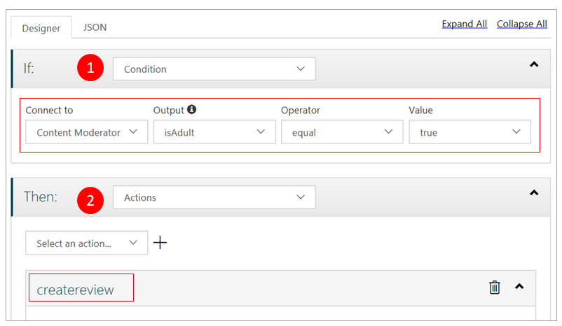
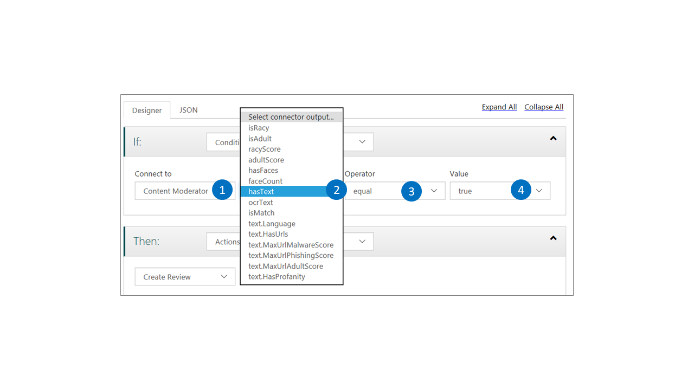

# Moderation workflows

Content Moderator includes tools and APIs to manage workflows. You use workflows with the [Review API's Job operations](review-api.md) to automate human-in-the-loop review creation based on your content policies and thresholds.

The Review API offers the following ways to include human oversight in your content moderation process:

1. The **Job** operations for starting machine-assisted moderation and human review creation as one step.
1. The **Review** operations for human review creation, outside of the moderation step.
1. The **Workflow** operations for managing workflows that automate scanning with thresholds for review creation.

This article covers the **Workflow** operations. Read the [Jobs and Reviews](review-api.md) overview to learn about content moderation jobs and reviews.

Checking out the **default** workflow is the best way to get started on understanding workflows in Content Moderator.

## Your first workflow

Your first workflow comes bundled with your [review tool team](https://contentmoderator.cognitive.microsoft.com/). Sign up if you have not done so already.

Navigate to the [review tool's Workflows](Review-Tool-User-Guide/Workflows.md) screen under the Settings tab. You see a **default** workflow as shown in the following image:

### Open the default workflow

Use the **edit** option to open the workflow editing page as shown in the following image:

### The designer view

You see the **Designer** tab for the workflow. The designer view shows the following steps:

1. The **condition** for the workflow to be evaluated. In this case, the workflow calls the Content Moderator's image API and checks whether the `isAdult` output equals `true`.
1. The **action** to be performed if the condition is met. In this case, the workflow creates a review in the review tool if the `isAdult` output is `true`.

### The JSON view

Select the **JSON** tab to see the JSON definition of the workflow.

	{
		"Type": "Logic",
		If": {
    		"ConnectorName": "moderator",
    		"OutputName": "isAdult",
    		"Operator": "eq",
    		"Value": "true",
    		"Type": "Condition"
		},
		"Then": {
		"Perform": [
		{
        	"Name": "createreview",
        	"CallbackEndpoint": null,
        	"Tags": []
      	}
		],
		"Type": "Actions"
		}
	}

### Key learning

The workflows in Content Moderator are easy to configure and flexible. If the built-in designer does not meet your requirements, write the workflow definition in the **JSON** format. Then use the JSON definition with the [Workflow API](https://westus.dev.cognitive.microsoft.com/docs/services/580519463f9b070e5c591178/operations/5813b46b3f9b0711b43c4c59) to create and manage the workflow from your application.

## Define a custom workflow

Content Moderator's workflow capabilities allow defining and using custom workflows. Use the [review tool workflows how-to](Review-Tool-User-Guide/Workflows.md) article to define a custom workflow. This workflow uses Content Moderator's OCR capability to extract text from a sample image. It then creates a review in the review tool.

### The sample image

Save the [sample image](https://moderatorsampleimages.blob.core.windows.net/samples/sample5.png) to your local drive. You need this image for your exercise.

### The designer view

Select the **Designer** tab and the [workflow creation tutorial](Review-Tool-User-Guide/Workflows.md) to define a custom workflow. The following image shows the designer's **Condition** view. Refer to the tutorial to see the rest of the steps.

### The JSON view

Select the **JSON** tab to see the following JSON definition of your custom workflow. Notice how the **If-Then** statements in the JSON definition correspond to the steps you defined using the designer view.

	{
		"Type": "Logic",
		"If": {
    		"ConnectorName": "moderator",
    		"OutputName": "hasText",
    		"Operator": "eq",
    		"Value": "true",
    		"Type": "Condition"
		},
		"Then": {
    	"Perform": [
      	{
        	"Name": "createreview",
        	"CallbackEndpoint": null,
        	"Tags": [
          	{
            	"Tag": "a",
            	"IfCondition": {
              		"ConnectorName": "moderator",
              		"OutputName": "hasText",
              		"Operator": "eq",
              		"Value": "true",
              		"Type": "Condition"
            	}
          	}
        	]
      	}
    	],
    	"Type": "Actions"
		}
	}

### Workflow result

After you test the workflow from the workflows screen, the following review is created. Navigate to the **Image** tab under **Review** to see your review.
The workflow created the review because the primary condition tested positive for the presence of text. The review also highlighted the **`a`** tag in the image review.

## Advanced workflow with combination

### The sample image

Use the same [sample image](https://moderatorsampleimages.blob.core.windows.net/samples/sample5.png) that was used in the preceding section.

However, this time around, change your primary condition into a combination of two checks. In addition to checking for text, check whether the text has any profanity. The workflow creates a review if it finds text **and** detects profanity in it.

### The designer view

To change the **Condition** to a **Combination**, modify the workflow. The following image shows the new view you see in the designer.

### The JSON view

Select the **JSON** tab to see the following JSON definition of your modified custom workflow. Notice how the **If-Then** statements in the JSON definition correspond to the new steps you added to the workflow.

	{
		"Type": "Logic",
		"If": {
    	"Left": {
      		"ConnectorName": "moderator",
      		"OutputName": "hasText",
      		"Operator": "eq",
      		"Value": "true",
      		"Type": "Condition"
    		},
    	"Right": {
      		"ConnectorName": "moderator",
      		"OutputName": "text.HasProfanity",
      		"Operator": "eq",
      		"Value": "true",
      		"Type": "Condition",
      		"AlternateInput": "moderator.ocrText"
    		},
    	"Combine": "AND",
    	"Type": "Combine"
		},
		"Then": {
    	"Perform": [
      	{
        	"Name": "createreview",
        	"CallbackEndpoint": null,
        	"Tags": [
          	{
            	"Tag": "a",
            	"IfCondition": {
              		"ConnectorName": "moderator",
              		"OutputName": "hasText",
              		"Operator": "eq",
              		"Value": "true",
              		"Type": "Condition"
            	}
          	}
        	]
      	}
    	],
    	"Type": "Actions"
		}
	}

	
### Workflow result

After you test the workflow again, you find that no review is created. To confirm the absence of any review, navigate to the **Image** tab under **Review**.
The workflow did not create the review because it failed to detect profanity in the extracted text.

## The Workflow API

The [Workflow operations](https://westus.dev.cognitive.microsoft.com/docs/services/580519463f9b070e5c591178/operations/5813b46b3f9b0711b43c4c59) provide the programming interface to the workflow capabilities. You create workflows, get workflow details, and update workflow definitions using the Workflow API.

### Get [All] workflow details

The **Workflow-Get** operation accepts the following inputs:

- **team**: The team ID that you created when you set up your [review tool account](https://contentmoderator.cognitive.microsoft.com/). 
- **workflowname**: The name of your workflow. Use `default` to begin with.
- **Ocp-Apim-Subscription-Key**: Located on the **Settings** tab. For more information, see [Overview](overview.md).

If the operation succeeds, the **Response status** is `200 OK` and the **Response content** box displays the workflow definition in the JSON format.
To learn more, read the [Workflow API console quickstart](try-review-api-job.md).

### Create or update workflow

The creation and update operation allows creating workflow from the API.

The **Workflow-Create or Update** operation accepts the following inputs:

- **team**: The team ID that you created when you set up your [review tool account](https://contentmoderator.cognitive.microsoft.com/). 
- **workflowname**: The name of your workflow. Use `default` to begin with.
- **Ocp-Apim-Subscription-Key**: Located on the **Settings** tab. For more information, see [Overview](overview.md).

If the operation succeeds, the **Response status** is `200 OK` and the **Response content** box displays `true`. 
To learn more, [test drive the `Create` operation](try-review-api-job.md).

## Next steps

To learn how to create custom workflows, check out the [review tool's workflow tutorial](Review-Tool-User-Guide/Workflows.md). 

Test drive the [Workflow API console](try-review-api-job.md) and use the REST API code samples. 

Finally, use your custom workflows with the **Job** operations as shon in [Job API console](try-review-api-job.md) and the [Jobs .NET quickstart](moderation-jobs-quickstart-dotnet.md).
