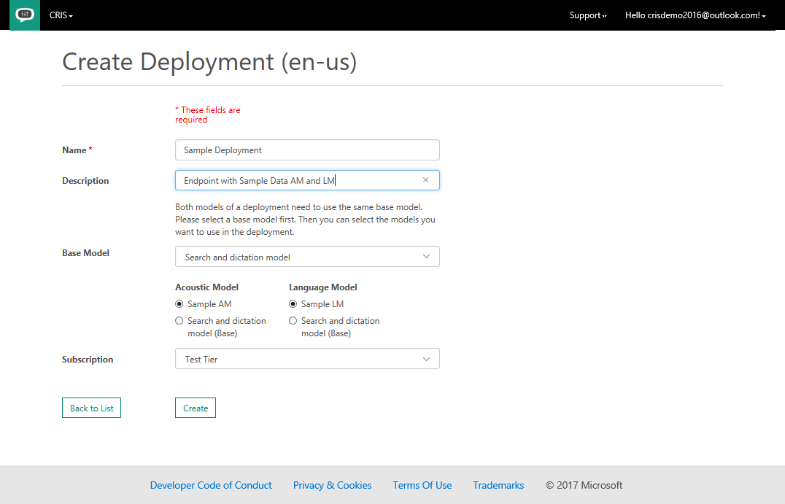
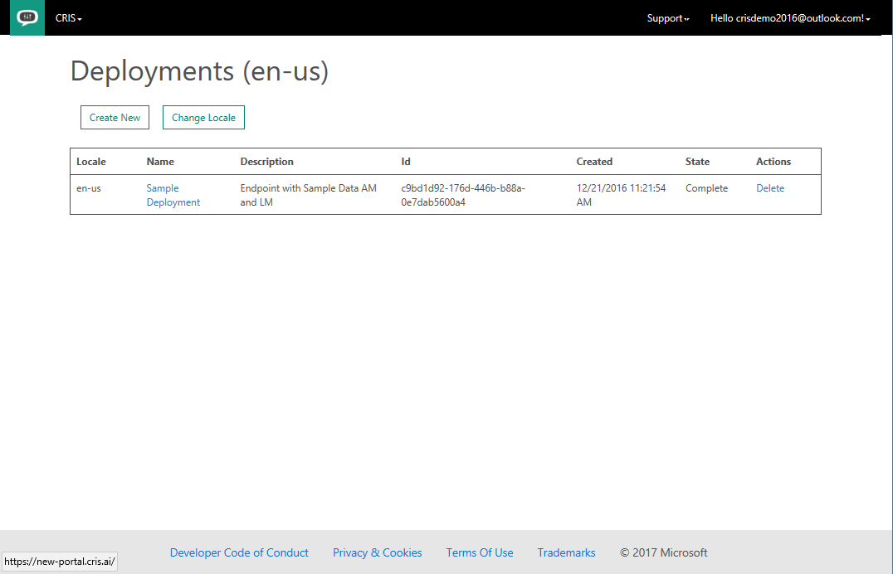
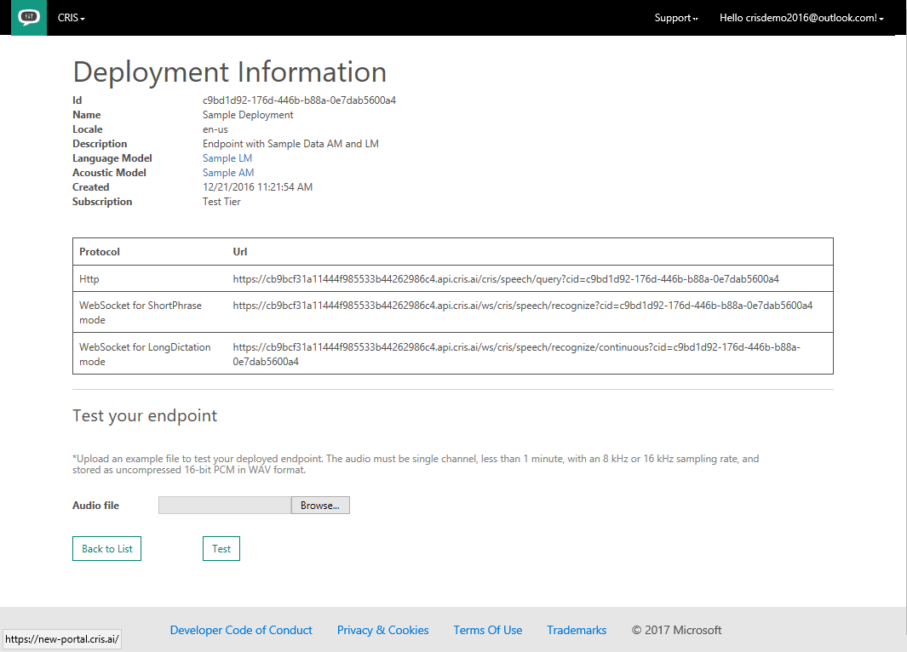

## Creating a custom speech-to-text endpoint
When you have created custom acoustic models and/or language models, they can be deployed in a custom speech-to-text endpoint. To create a new custom endpoint, click “Deployments” from the “Menu” menu on the top of the page. This takes you to a table called “Deployments” of current custom endpoints. If you have not yet created any endpoints, the table will be empty. The current locale is reflected in the table title. If you would like to create a deployment for a different language, click on “Change Locale”. Additional information on supported languages can be found in the section on [changing locale](HowToChangeLocale.md).

To create a new endpoint, click the “Create New” link under the table title. On the "Create Deployment"" screen, enter a "Name" and "Description" of your custom deployment. From the "Acoustic Model" drop-down, select the desired acoustic model, and from the "Language Model" drop-down, select the desired language model. The choices for acoustic and language models always include the base Microsoft models. The selection of the base model limits the combinations. You cannot mix conversational base models with search and dictate base models.

When you have selected your acoustic and language models, click the “Create” button. This will return you to the table of deployments and you will see an entry in the table corresponding to your new endpoint. The endpoint’s status reflects its current state while it is being created. It can take up to 30 minutes to instantiate a new endpoint with your custom models. When the status of the deployment is “Complete”, the endpoint is ready for use.

You’ll notice that when the deployment is ready, the Name of the deployment is now a clickable link. Clicking that link shows you the URLs of your custom endpoint for use with either an HTTP request, or using the Microsoft Cognitive Services Speech Client Library which uses Web Sockets.

### Related Links:
* [How to use a custom speech-to-text endpoint](HowToUseACustomEndpoint.md)
* [How to create a custom acoustic model](HowToCreateAnAcousticModel.md)
* [How to create a custom language model](HowToCreateALanguageModel.md)
