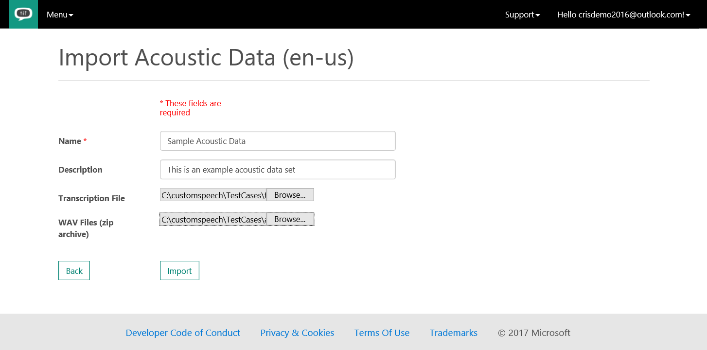
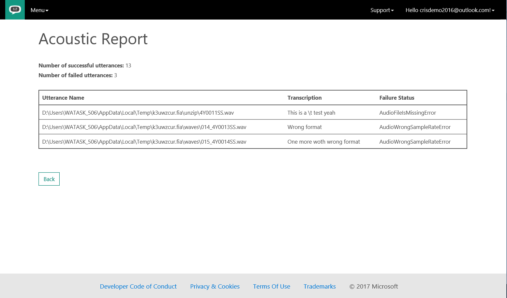
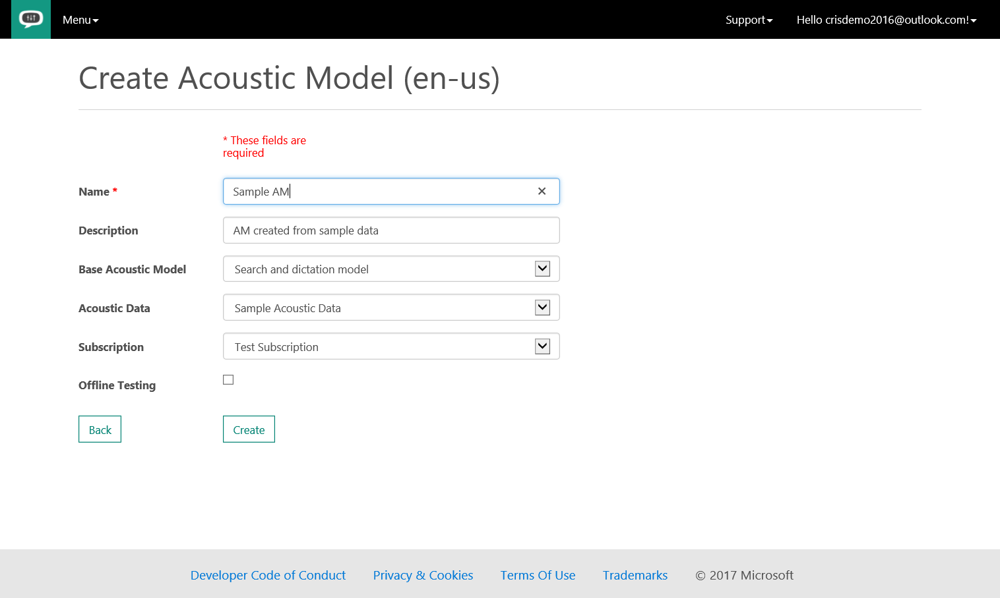
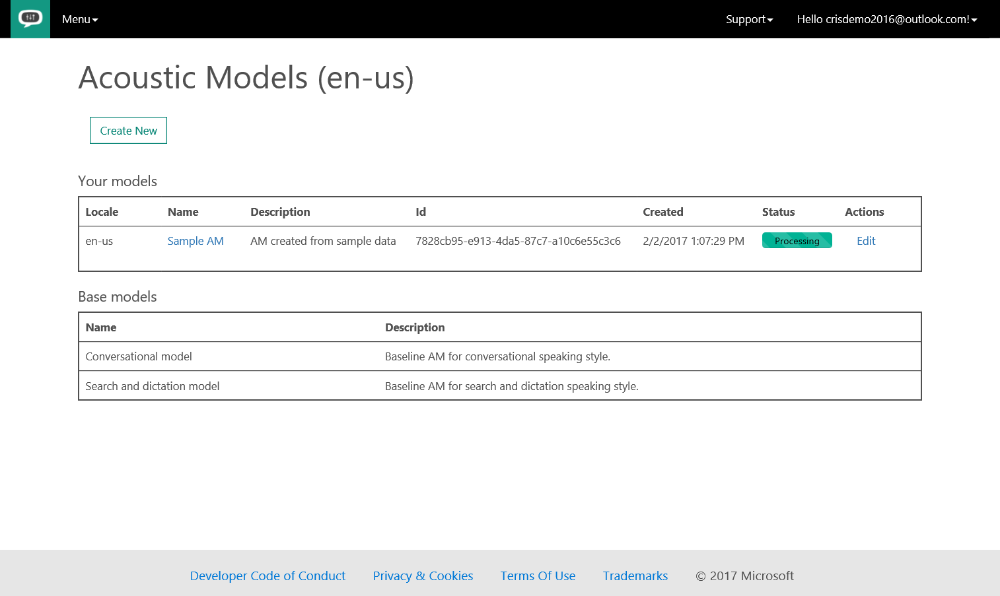

# Tutorial: Create a custom acoustic model

[!INCLUDE [Deprecation note](../../../../includes/cognitive-services-custom-speech-deprecation-note.md)]

In this tutorial, you create a custom acoustic model for speech data that you expect your application to recognize. Creating a custom acoustic model is helpful if your application is designed for use in a particular environment, such as a noisy factory, or by a particular user population.

In this tutorial, you learn how to:
> [!div class="checklist"]
> * Prepare the data
> * Import the acoustic data set
> * Create the custom acoustic model

If you don’t have a Cognitive Services account, create a [free account](https://cris.ai) before you begin.

## Prerequisites

Ensure that your Cognitive Services account is connected to a subscription by opening the [Cognitive Services Subscriptions](https://cris.ai/Subscriptions) page.

If no subscriptions are listed, you can either have Cognitive Services create an account for you by clicking the **Get free subscription** button. Or you can connect to a Custom Search Service subscription created in the Azure portal by clicking the **Connect existing subscription** button.

For information on creating a Custom Search Service subscription in the Azure portal, see [Create a Cognitive Services APIs account in the Azure portal](../../cognitive-services-apis-create-account.md).

## Prepare the data

To customize the acoustic model to a particular domain, a collection of speech data is required. This collection consists of a set of audio files of speech data, and a text file of transcriptions of each audio file. The audio data should be representative of the scenario in which you would like to use the recognizer.

For example:

*   If you would like to better recognize speech in a noisy factory environment, the audio files should consist of people speaking in a noisy factory.
<a name="Preparing data to customize the acoustic model"></a>
*   If you are interested in optimizing performance for a single speaker, for example, you would like to transcribe all of FDR’s Fireside Chats, then the audio files should consist of many examples of that speaker only.

An acoustic data set for customizing the acoustic model consists of two parts: (1) a set of audio files containing the speech data and (2) a file containing the transcriptions of all audio files.

### Audio data recommendations

*   All audio files in the data set should be stored in the WAV (RIFF) audio format.
*   The audio must have a sampling rate of 8 kHz or 16 kHz and the sample values should be stored as uncompressed PCM 16-bit signed integers (shorts).
*   Only single channel (mono) audio files are supported.
*   The audio files must be between 100 ms and 1 minute in length. Each audio file should ideally start and end with at least 100ms of silence, and somewhere between 500ms and 1 second is common.
*   If you have background noise in your data, it is recommended to also have some examples with longer segments of silence, for example, a few seconds, in your data, before and/or after the speech content.
*   Each audio file should consist of a single utterance, for example, a single sentence for dictation, a single query, or a single turn of a dialog system.
*   Each audio file to in the data set should have a unique filename and the extension “wav”.
*   The set of audio files should be placed in a single folder without subdirectories and the entire set of audio files should be packaged as a single ZIP file archive.

> [!NOTE]
> Data imports via the web portal are currently limited to 2 GB, so this is the maximum size of an acoustic data set. This corresponds to approximately 17 hours of audio recorded at 16 kHz or 34 hours of audio recorded at 8 kHz. The main requirements for the audio data are summarized in the following table.
>

| Property | Value |
|----------	|----------|
| File Format | RIFF (WAV) |
| Sampling Rate | 8000 Hz or 16000 Hz |
| Channels | 1 (mono) |
| Sample Format | PCM, 16-bit integers |
| File Duration | 0.1 seconds < duration < 60 seconds |
| Silence Collar | > 0.1 seconds |
| Archive Format | Zip |
| Maximum Archive Size | 2 GB |

### Transcriptions

The transcriptions for all WAV files should be contained in a single plain-text file. Each line of the transcription file should have the name of one of the audio files, followed by the corresponding transcription. The file name and transcription should be separated by a tab (\t).

  For example:
```
  speech01.wav  speech recognition is awesome

  speech02.wav  the quick brown fox jumped all over the place

  speech03.wav  the lazy dog was not amused
```

The transcriptions will be text-normalized so they can be processed by the system. However, there are some important normalizations that must be done by the user _prior_ to uploading the data to the Custom Speech Service. Consult the section on [transcription guidelines](cognitive-services-custom-speech-transcription-guidelines.md) for the appropriate language when preparing your transcriptions.

The following steps are done using the [Custom Speech Service Portal](https://cris.ai). 

## Import the acoustic data set

Once the audio files and transcriptions have been prepared, they are ready to be imported to the service web portal.

To do so, first ensure you are signed into the [Custom Speech Service Portal](https://cris.ai). Then click the “Custom Speech” drop-down menu on the top ribbon and select “Adaptation Data”. If this is your first time uploading data to the Custom Speech Service, you will see an empty table called “Datasets”. 

Click the “Import” button in the "Acoustic Datasets" row, and the site displays a page for uploading a new data set.



Enter a _Name_ and _Description_ in the appropriate text boxes. These are useful for keeping track of various data sets you upload. Next, click “Choose File" for the “Transcription File” and “WAV files” and select your plaint-text transcription file and zip archive of WAV files, respectively. When this is complete, click “Import” to upload your data. Your data will then be uploaded. For larger data sets, this may take several minutes.

When the upload is complete, you will return to the "Acoustic Datasets" table and will see an entry that corresponds to your acoustic data set. Notice that it has been assigned a unique id (GUID). The data will also have a status that reflects its current state. Its status will be “Waiting” while it is being queued for processing, “Processing” while it is going through validation, and “Complete” when the data is ready for use.

Data validation includes a series of checks on the audio files to verify the file format, length, and sampling rate, and on the transcription files to verify the file format and perform some text normalization.

When the status is “Complete”, you can click “Details” to see the acoustic data verification report. The number of utterances that passed and failed verification will be shown, along with details about the failed utterances. In the example below, two WAV files failed verification because of improper audio format (in this data set, one had an incorrect sampling rate and one was the incorrect file format).



At some point, if you would like to change the Name or Description of the data set, you can click the “Edit” link and change these entries. Note that you cannot modify the audio files or transcriptions.

## Create a custom acoustic model

Once the status of your acoustic data set is “Complete”, it can be used to create a custom acoustic model. To do so, click “Acoustic Models” in the “Custom Speech” drop-down menu. You will see a table called "Your models” that lists all of your custom acoustic models. This table will be empty if this is your first use. The current locale is shown in the table title. Currently, acoustic models can be created for US English only.

To create a new model, click “Create New” under the table title. As before, enter a name and description to help you identify this model. For example, the "Description"" field can be used to record which starting model and acoustic data set were used to create the model. Next, select a “Base Acoustic Model” from the drop-down menu. The base model is the model that is the starting point for your customization. There are two base acoustic models to choose from. The _Microsoft Search and Dictation AM_ is appropriate for speech directed at an application, such as commands, search queries, or dictation. The _Microsoft Conversational model_ is appropriate for recognizing speech spoken in a conversational style. This type of speech is typically directed at another person and occurs in call center or meetings. Note that latency for partial results in Conversational models is higher than in Search and Dictation models.

Next, select the acoustic data you wish to use to perform the customization using the drop-down menu.



You can optionally choose to perform offline testing of your new model when the processing is complete. This will run a speech-to-text evaluation on a specified acoustic data set using the customized acoustic model and report the results. To perform this testing, select the “Accuracy Testing” check box. Then select a language model from the drop-down menu. If you have not created any custom language models, only the base language models will be in the drop-down list. See the [description](cognitive-services-custom-speech-create-language-model.md) of the base language models in the guide and select the one that is most appropriate.

Finally, select the acoustic data set you would like to use to evaluate the custom model. If you perform accuracy testing, it is important to select an acoustic data that is different from the one used for the model creation to get a realistic sense of the model’s performance. Also note that offline testing is limited to 1000 utterances. If the acoustic dataset for testing is larger than that, only the first 1000 utterances will be evaluated.

When you are ready to start running the customization process, press “Create”.

You will now see a new entry in the acoustic models table corresponding to this new model. The status of the process is reflected in the table. The status states are “Waiting”, “Processing” and “Complete”.



## Next steps

In this tutorial, you've developed a custom acoustic model for use with audio files and transcripts. To create a custom language file for use with text files, continue to the tutorial on creating a custom language model.

> [!div class="nextstepaction"]
> [Create a custom language model](cognitive-services-custom-speech-create-language-model.md)
