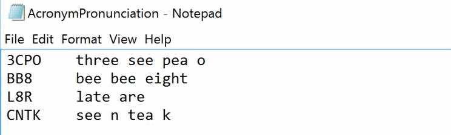

# Enable custom pronunciation
Custom pronunciation enables users to define the phonetic form and display of a word or term. It is particularly useful for handling customized terms, such as product names or acronyms. All you need is a pronunciation file (a simple .txt file).

Here's how it works. In a single .txt file, you can enter several custom pronunciation entries. The structure is as follows:

```
Display form <Tab> Spoken form <Newline>
```

*Examples*:

| Display form | Spoken form |
|----------|-------|
| C3PO | see three pea o |
| BB8 | bee bee eight |
| L8R | late are |
| CNTK | see n tea k|

## Requirements for the spoken form
The spoken form must be lowercase, which can be forced during the import. In addition, you must provide checks in the data importer. No tab in either the spoken form or the display form is permitted. There might, however, be more forbidden characters in the display form (for example, ~ and ^).

Each .txt file can have several entries. For example, see the following screenshot:



The spoken form is the phonetic sequence of the display form. It is composed of letters, words, or syllables. Currently, there is no further guidance or set of standards to help you formulate the spoken form. 

## Requirements for the display form
A display form can only be a custom word, term, acronym, or compound words that combine existing words. You can also enter alternative pronunciations for common words. 

>[!NOTE]
Be careful not to misuse this feature by badly reformulating common words, or by making mistakes in the spoken form. It is better to run the decoder to see if some unusual words (such as abbreviations, technical words, and foreign words) are not correctly decoded. If they are, add them to the custom pronunciation file.

## Requirements for the file size
The size of the .txt file containing the pronunciation entries is limited to 1 MB. Typically, you won't need to upload large amounts of data through this file. Most custom pronunciation files are likely to be just a few KBs in size, and some may be even smaller than that.

## Next steps
* Try to create your [custom acoustic model](cognitive-services-custom-speech-create-acoustic-model.md) to improve recognition accuracy.
* [Create a custom speech-to-text endpoint](cognitive-services-custom-speech-create-endpoint.md), which you can use from an app.
