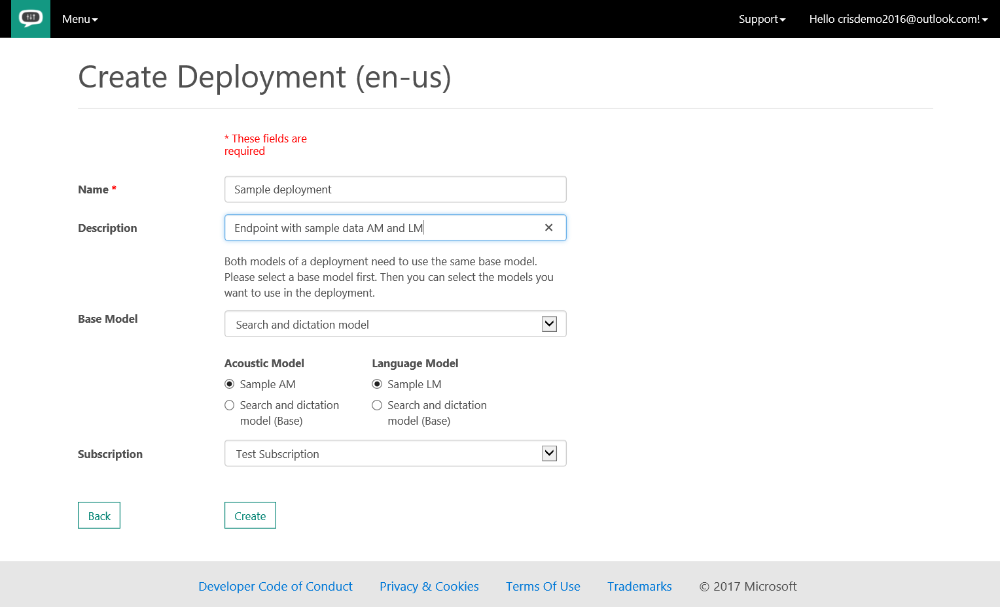
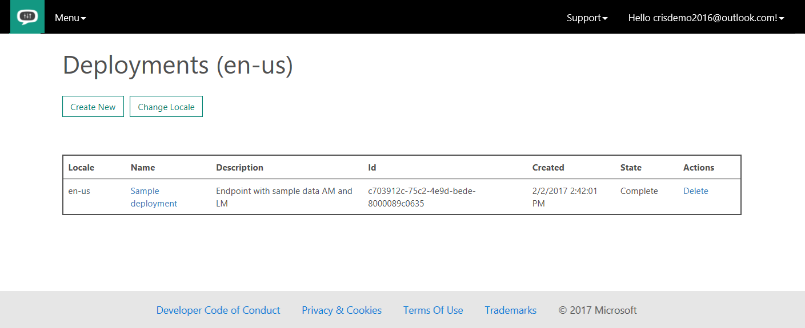
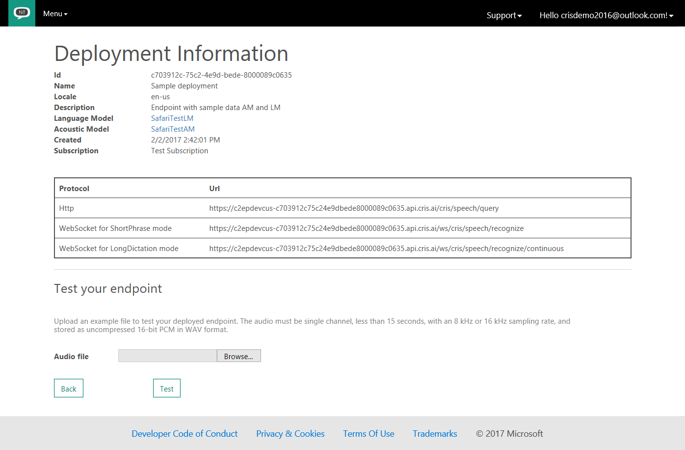

# Create a custom speech-to-text endpoint

[!INCLUDE [Deprecation note](../../../../includes/cognitive-services-custom-speech-deprecation-note.md)]

After you have created custom acoustic models or language models, you can deploy them in a custom speech-to-text endpoint. 

## Create an endpoint
To create a new custom endpoint, select **Deployments** on the **Custom Speech** menu at the top of the page. This action takes you to the **Deployments** page, which contains a table of current custom endpoints. If you have not yet created any endpoints, the table is empty. The current locale is reflected in the table title. 

To create a deployment for a different language, select **Change Locale**. For more information about supported languages, see [Supported locales in Custom Speech Service](cognitive-services-custom-speech-change-locale.md).

To create a new endpoint, select **Create New**. In the **Create Deployment** pane, enter information in the **Name** and **Description** boxes of your custom deployment.

In the **Subscription** combo box, select the subscription that you want to use. If it is an S2 subscription, you can select scale units and content logging. For more information about scale units and logging, see [Custom Speech Service meters and quotas](../cognitive-services-custom-speech-meters.md).

The following table shows how scale units map to available concurrent requests:

| Scale unit | Number of concurrent requests |
| ------ | ----- |
| 0 | 1 |
| 1 | 5 |
| 2 | 10 |
| 3 | 15 |
| n | 5 * n |

You can also select whether content logging is switched on or off. That is, you're selecting whether the endpoint traffic is stored for Microsoft internal use. If it is not selected, storing the traffic will be suppressed. Suppressing content logging results in additional cost. Consult the [pricing information page](https://azure.microsoft.com/pricing/details/cognitive-services/custom-speech-service/) for details.

> [!NOTE]
> Content Logging is called "No Trace" on pricing page.
>

In addition, Microsoft provides a rough estimate of costs so that you are aware of the impact on the costs of scale units and content logging. This estimate is a rough estimate and might differ from your actual costs.

> [!NOTE]
> These settings are not available with F0 (free tier) subscriptions.
>

In the **Acoustic Model** list, select the acoustic model that you want, and in the **Language Model** list, select the language model that you want. The choices for acoustic and language models always include the base Microsoft models. The selection of the base model limits the combinations. You cannot mix conversational base models with search and dictate base models.

> [!NOTE]
> Be sure to accept the terms of use and pricing information by selecting the check box.
>

After you have selected your acoustic and language models, select **Create**. This action returns you to the **Deployments** page. The table now includes an entry that corresponds to your new endpoint. The endpoint’s status reflects its current state while it is being created. It can take up to 30 minutes to instantiate a new endpoint with your custom models. When the status of the deployment is *Complete*, the endpoint is ready for use.

When the deployment is ready, the deployment name becomes a link. Selecting the link displays the **Deployment Information** page, which displays the URLs of your custom endpoint to use with either an HTTP request or the Microsoft Cognitive Services Speech Client Library, which uses web sockets.

## Next steps

For more tutorials, see:
* [Use a custom speech-to-text endpoint](cognitive-services-custom-speech-use-endpoint.md)
* [Create a custom acoustic model](cognitive-services-custom-speech-create-acoustic-model.md)
* [Create a custom language model](cognitive-services-custom-speech-create-language-model.md)
