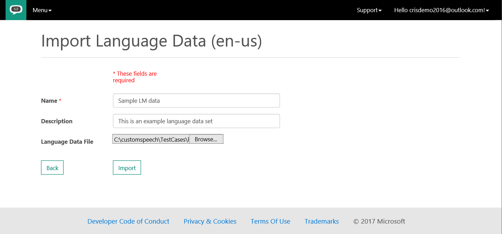
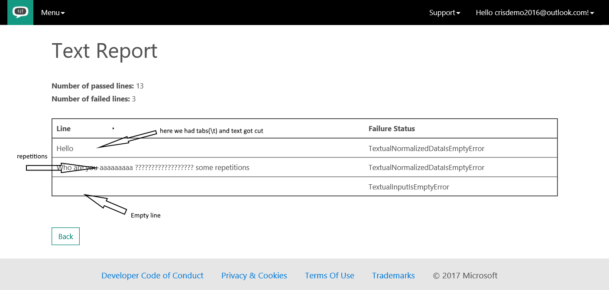
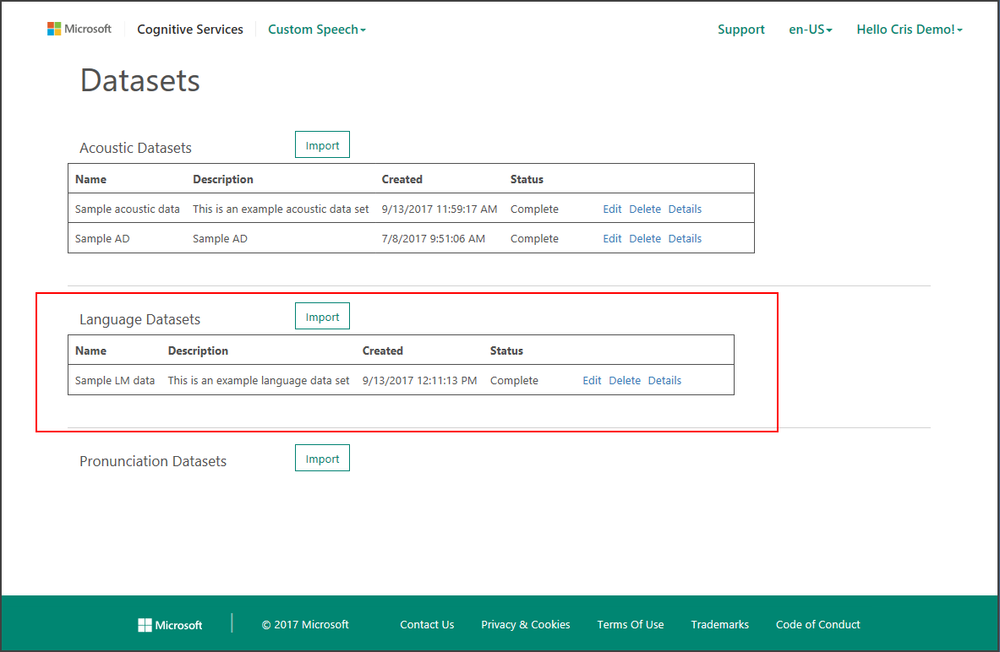
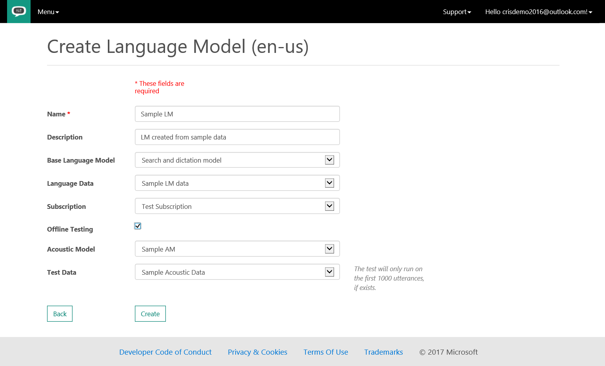

# Tutorial: Create a custom language model

[!INCLUDE [Deprecation note](../../../../includes/cognitive-services-custom-speech-deprecation-note.md)]

In this tutorial, you create a custom language model for text queries or utterances you expect users to say or type in an application. You can then use this custom language model in conjunction with existing state-of-the-art speech models from Microsoft to add voice interaction to your application.

In this tutorial, you learn how to:
> [!div class="checklist"]
> * Prepare the data
> * Import the language data set
> * Create the custom language model

If you don't have a Cognitive Services account, create a [free account](https://cris.ai) before you begin.

## Prerequisites

Ensure that your Cognitive Services account is connected to a subscription by opening the [Cognitive Services Subscriptions](https://cris.ai/Subscriptions) page.

If no subscriptions are listed, you can either have Cognitive Services create an account for you by clicking the **Get free subscription** button. Or you can connect to a Custom Search Service subscription created in the Azure portal by clicking the **Connect existing subscription** button.

For information on creating a Custom Search Service subscription in the Azure portal, see [Create a Cognitive Services APIs account in the Azure portal](../../cognitive-services-apis-create-account.md).

## Prepare the data

In order to create a custom language model for your application, you need to provide a list of example utterances to the system, for example:

*   "He has had urticaria for the past week."
*   "The patient had a well-healed herniorrhaphy scar."

The sentences do not need to be complete sentences or grammatically correct, and should accurately reflect the spoken input you expect the system to encounter in deployment. These examples should reflect both the style and content of the task the users will perform with your application.

The language model data should be written in plain-text file using either the US-ASCII or UTF-8, depending on the locale. For en-US, both encodings are supported. For zh-CN, only UTF-8 is supported (BOM is optional). The text file should contain one example (sentence, utterance, or query) per line.

If you wish some sentences to have a higher weight (importance), you can add it several times to your data. A good number of repetitions is between 10 - 100. If you normalize it to 100, you can weight sentence relative to this easily.

The main requirements for the language data are summarized in the following table.

| Property | Value |
|----------|-------|
| Text Encoding | en-US: US-ACSII or UTF-8 or zh-CN: UTF-8|
| # of Utterances per line | 1 |
| Maximum File Size | 200 MB |
| Remarks | avoid repeating characters more often than 4 times, for example 'aaaaa'|
| Remarks | no special characters like '\t' or any other UTF-8 character above U+00A1 in [Unicode characters table](http://www.utf8-chartable.de/)|
| Remarks | URIs will also be rejected since there is no unique way to pronounce a URI|

When the text is imported, it is text-normalized so it can be processed by the system. However, there are some important normalizations that must be done by the user _prior_ to uploading the data. See the [Transcription guidelines](cognitive-services-custom-speech-transcription-guidelines.md) to determine appropriate language when preparing your language data.

## Import the language data set

Click the “Import” button in the "Acoustic Datasets" row, and the site displays a page for uploading a new data set.

When you are ready to import your language data set, log into the [Custom Speech Service Portal](https://cris.ai).  Then click the “Custom Speech” drop-down menu on the top ribbon and select “Adaptation Data”. If this is your first time uploading data to the Custom Speech Service, you will see an empty table called “Datasets”.

To import a new data set, click the “Import” button in the "Language Datasets" row, and the site displays a page for uploading a new data set. Enter a Name and Description to help you identify the data set in the future. Next, use the “Choose File” button to locate the text file of language data. After that, click “Import” and the data set will be uploaded. Depending on the size of the data set, this may take several minutes.

When the import is complete, you will return to the language data table and will see an entry that corresponds to your language data set. Notice that it has been assigned a unique id (GUID). The data will also have a status that reflects its current state. Its status will be “Waiting” while it is being queued for processing, “Processing” while it is going through validation, and “Complete” when the data is ready for use. Data validation performs a series of checks on the text in the file and some text normalization of the data.

When the status is “Complete”, you can click “View Report” to see the language data verification report. The number of utterances that passed and failed verification are shown, along with details about the failed utterances. In the example below, two examples failed verification because of improper characters (in this data set, the first had two emoticons and the second had several characters outside of the ASCII printable character set).

When the status of the language data set is “Complete”, it can be used to create a custom language model.

## Create a custom language model

Once your language data is ready, click “Language Models” from the “Menu” drop-down menu to start the process of custom language model creation. This page contains a table called “Language Models” with your current custom language models. If you have not yet created any custom language models, the table will be empty. The current locale is reflected in the table title. If you would like to create a language model for a different language, click on “Change Locale”. Additional information on supported languages can be found in the section on [Changing Locale](cognitive-services-custom-speech-change-locale.md). To create a new model, click the “Create New” link below the table title.

On the "Create Language Model" page, enter a "Name" and "Description" to help you keep track of pertinent information about this model, such as the data set used. Next, select the “Base Language Model” from the drop-down menu. This model will be the starting point for your customization. There are two base language models to choose from. The _Microsoft Search and Dictation LM_ is appropriate for speech directed at an application, such as commands, search queries, or dictation. The _Microsoft Conversational LM_ is appropriate for recognizing speech spoken in a conversational style. This type of speech is typically directed at another person and occurs in call centers or meetings.

After you have specified the base language model, select the language data set you wish to use for the customization using the “Language Data” drop-down menu

As with the acoustic model creation, you can optionally choose to perform offline testing of your new model when the processing is complete. Because this is an evaluation of the speech-to-text performance, offline testing requires an acoustic data set.

To perform offline testing of your language model, select the check box next to “Offline Testing”. Then select an acoustic model from the drop-down menu. If you have not created any custom acoustic models, the Microsoft base acoustic models will be the only model in the menu. In case you have picked a conversational LM base model, you need to use a conversational AM here. In case you use a search and dictate LM model, you have to select a search and dictate AM model.

Finally, select the acoustic data set you would like to use to perform the evaluation.

When you are ready to start processing, press “Create”. This will return you to the table of language models. There will be a new entry in the table corresponding to this model. The status reflects the model’s state and will go through several states including “Waiting”, “Processing”, and “Complete”.

When the model has reached the “Complete” state, it can be deployed to an endpoint. Clicking on “View Result” will show the results of offline testing, if performed.

If you would like to change the "Name" or "Description" of the model at some point, you can use the “Edit” link in the appropriate row of the language models table.

## Next steps

In this tutorial, you've developed a custom language model for use with text. To create a custom acoustic model for use with audio files and transcriptions, continue to the tutorial on creating an acoustic model.

> [!div class="nextstepaction"]
> [Create a custom acoustic model](cognitive-services-custom-speech-create-acoustic-model.md)
