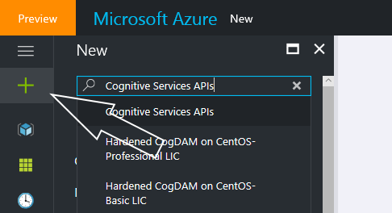
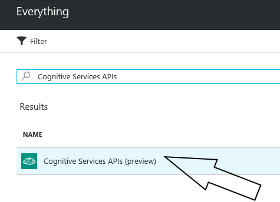
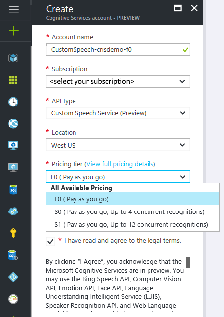
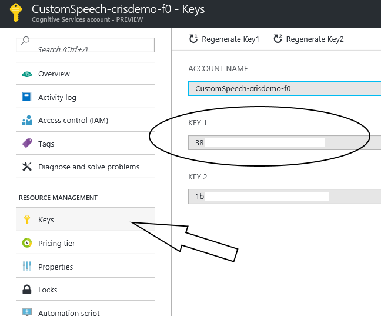
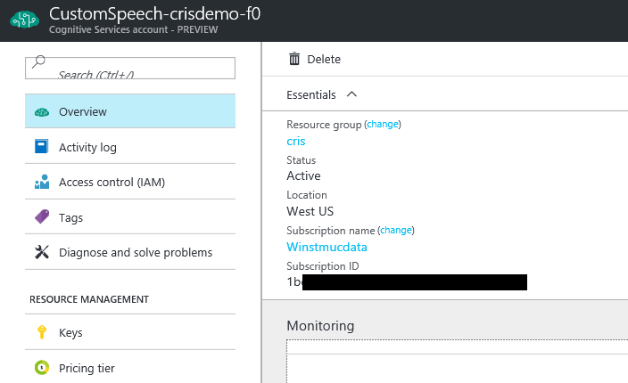
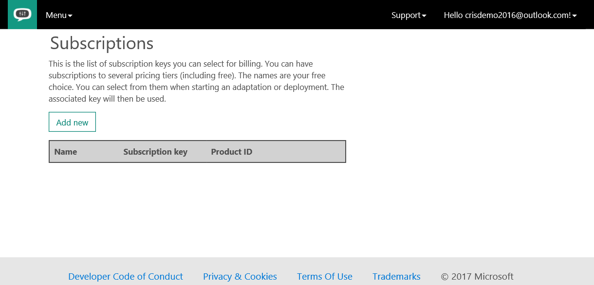
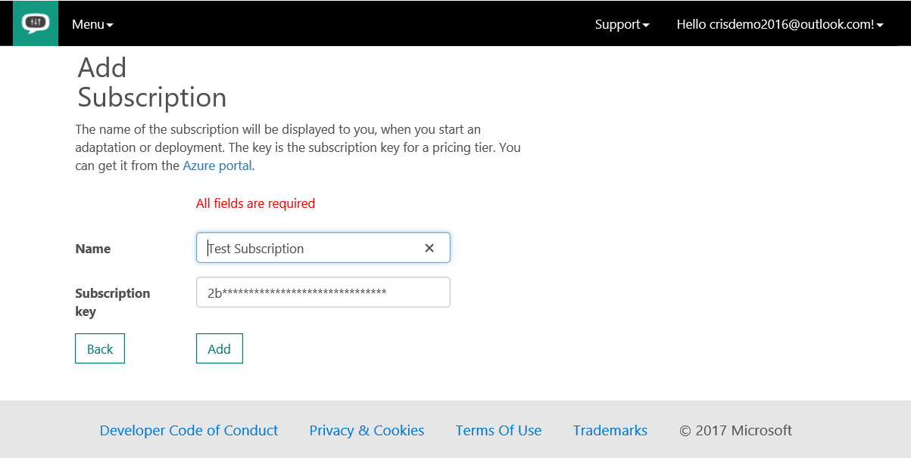

# Obtain subscription keys

[!INCLUDE [Deprecation note](../../../../includes/cognitive-services-custom-speech-deprecation-note.md)]

To get started using the Azure Custom Speech Service, you first need to link your user account to an Azure subscription. Subscriptions to free and paid tiers are available. For information about the tiers, see the [pricing page](https://www.microsoft.com/cognitive-services/en-us/pricing).

## Get a subscription key
1. You can get a subscription key from the Azure portal in one of two ways:

    * Go to the [Azure portal](https://ms.portal.azure.com), and add a new Cognitive Services API by searching for _Cognitive Services_ and then selecting **Cognitive Services APIs**.

      

    * Or go directly to the [Cognitive Services APIs](https://ms.portal.azure.com/#create/Microsoft.CognitiveServices).

        

    
1. Fill in the following required fields:

      a. **Account name**. Use a name that works for you. Remember this name so that you can find your Cognitive Services subscription in the resources list.

      b. **Subscription**. Select one from your Azure subscriptions.

      c. **API type**. Select **Custom Speech Service (Preview)**.

      d. **Location**. It's currently **West US**.

      e. **Pricing tier**. Select the tier that works for you. **F0** is the free tier. The quotas that are allowed are explained on the [pricing page](https://www.microsoft.com/cognitive-services/en-us/pricing).

      

1. You should find either a view on your dashboard or a service with the provided account name in your resources list. When you select it, you can see an overview of your service. In the list on the left, under **Resource Management**, select **Keys**. Copy **KEY 1**.

      This subscription key is required in the next steps.

      

      > [!NOTE]
      > Do not copy the **Subscription ID** from the overview page. You need the subscription key in the next step.
      >

      

1. To enter your subscription key, on the ribbon at the upper right, select your user account. On the drop-down menu, select **Subscriptions**.

      

    A table of subscriptions appears, which is empty the first time it opens.

    

1. Select **Add new**. Enter a name for the subscription and the subscription key. It can be either **KEY 1** (primary key) or **KEY 2** (secondary key) from your subscription.

      

To upload data, train a model, or do a deployment, you need to link your Custom Speech Service activities to an Azure subscription. It can be either a free tier or a paid tier subscription. For more information, see the [pricing page](https://www.microsoft.com/cognitive-services/en-us/pricing).

## Get a subscription ID
To get a subscription ID, go to the Azure portal. Search for *Cognitive Services* and *Custom Speech Service*, and follow the instructions.

> [!NOTE]
> The subscription key is required later in this process.
>

## Next steps
* Start to create your [custom acoustic model](cognitive-services-custom-speech-create-acoustic-model.md).
* Start to create your [custom language model](cognitive-services-custom-speech-create-language-model.md).
