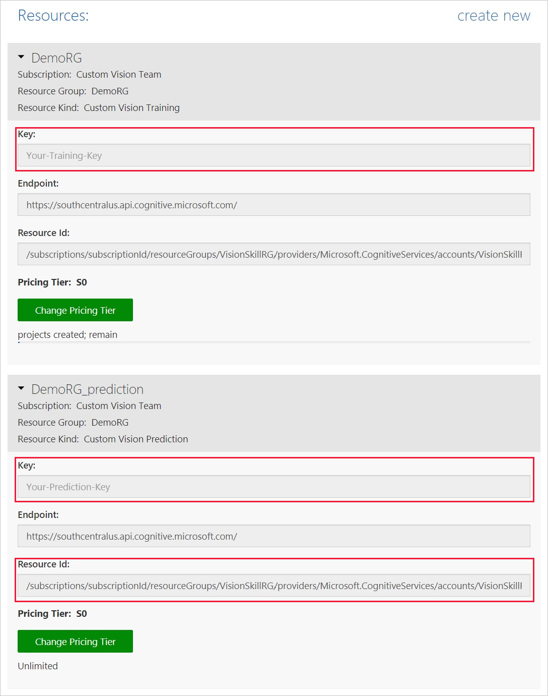

# Tutorial: Use the Custom Vision Service from a C# application

Learn how to use the Custom Vision Service from a C# application. After it's created, you can add tags, upload images, train the project, obtain the project's default prediction endpoint URL, and use the endpoint to programmatically test an image. Use this open-source example as a template for building your own app for Windows by using the Custom Vision Service API.

## Prerequisites

* Any edition of Visual Studio 2017 for Windows.

## Get the Custom Vision SDK and samples
To build this example, you need the Custom Vision SDK NuGet Packages:

* [Microsoft.Azure.CognitiveServices.Vision.CustomVision.Training](https://www.nuget.org/packages/Microsoft.Azure.CognitiveServices.Vision.CustomVision.Training/)
* [Microsoft.Azure.CognitiveServices.Vision.CustomVision.Prediction](https://www.nuget.org/packages/Microsoft.Azure.CognitiveServices.Vision.CustomVision.Prediction/)

You can download the images along with the [C# Samples](https://github.com/Azure-Samples/cognitive-services-dotnet-sdk-samples/tree/master/CustomVision).

## Get the training and prediction keys

To get the keys used in this example, visit the [Custom Vision web page](https://customvision.ai) and select the __gear icon__ in the upper right. In the __Accounts__ section, copy the values from the __Training Key__ and __Prediction Key__ fields.



## Understand the code

In Visual Studio, open the project located in the `Samples/CustomVision.Sample/` directory of the SDK project.

This application uses the training key you retrieved earlier to create a new project named __My New Project__. It then uploads images to train and test a classifier. The classifier identifies whether a tree is a __Hemlock__ or a __Japanese Cherry__.

The following code snippets implement the primary functionality of this example:

* __Create a new Custom Vision Service project__:

    ```csharp
     // Create a new project
    Console.WriteLine("Creating new project:");
    var project = trainingApi.CreateProject("My New Project");
    ```

* __Create tags in a project__:

    ```csharp
    // Make two tags in the new project
    var hemlockTag = trainingApi.CreateTag(project.Id, "Hemlock");
    var japaneseCherryTag = trainingApi.CreateTag(project.Id, "Japanese Cherry");
    ```

* __Upload and tag images__:

    ```csharp
    // Add some images to the tags
    Console.WriteLine("\tUploading images");
    LoadImagesFromDisk();

    // Images can be uploaded one at a time
    foreach (var image in hemlockImages)
    {
        using (var stream = new MemoryStream(File.ReadAllBytes(image)))
        {
            trainingApi.CreateImagesFromData(project.Id, stream, new List<string>() { hemlockTag.Id.ToString() });
        }
    }

    // Or uploaded in a single batch 
    var imageFiles = japaneseCherryImages.Select(img => new ImageFileCreateEntry(Path.GetFileName(img), File.ReadAllBytes(img))).ToList();
    trainingApi.CreateImagesFromFiles(project.Id, new ImageFileCreateBatch(imageFiles, new List<Guid>() { japaneseCherryTag.Id }));
    ```

* __Train the classifier__:

    ```csharp
    // Now there are images with tags start training the project
    Console.WriteLine("\tTraining");
    var iteration = trainingApi.TrainProject(project.Id);

    // The returned iteration will be in progress, and can be queried periodically to see when it has completed
    while (iteration.Status == "Completed")
    {
        Thread.Sleep(1000);

        // Re-query the iteration to get it's updated status
        iteration = trainingApi.GetIteration(project.Id, iteration.Id);
    }
    ```

* __Set a default iteration for the prediction endpoint__:

    ```csharp
    // The iteration is now trained. Make it the default project endpoint
    iteration.IsDefault = true;
    trainingApi.UpdateIteration(project.Id, iteration.Id, iteration);
    Console.WriteLine("Done!\n");
    ```

* __Create a prediction endpoint__:
 
    ```csharp
    // Create a prediction endpoint, passing in obtained prediction key
    PredictionEndpoint endpoint = new PredictionEndpoint() { ApiKey = predictionKey };
    ```
 
* __Send an image to the prediction endpoint__:

    ```csharp
    // Make a prediction against the new project
    Console.WriteLine("Making a prediction:");
    var result = endpoint.PredictImage(project.Id, testImage);

    // Loop over each prediction and write out the results
    foreach (var c in result.Predictions)
    {
        Console.WriteLine($"\t{c.TagName}: {c.Probability:P1}");
    }
    ```

## Run the application

1. Make the following changes to add the training and prediction keys to the application:

    * Add your __training key__ to the following line:

        ```csharp
        string trainingKey = "<your key here>";
        ```

    * Add your __prediction key__ to the following line:

        ```csharp
        string predictionKey = "<your key here>";
        ```

2. Run the application. As the application runs, the following output is written to the console:

    ```
    Creating new project:
            Uploading images
            Training
    Done!

    Making a prediction:
            Hemlock: 95.0%
            Japanese Cherry: 0.0%
    ```

3. Press any key to exit the application.
