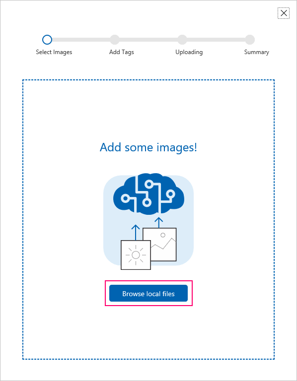

# Overview

To use the Custom Vision Service you must first build a classifier. 

## Prerequisites

To build a classifier, you must first have:

- A valid MSA, so you can sign into customvision.ai and get started. Note that you will be able to access your subscription keys once you have created your first project.
- A series of images to train your classifier (minimum of 30 images per tag).
- A few images to test your classifier after the classifier is trained.

## Getting Started: Build a Classifier

Custom Vision Service can be found by clicking here: [https://customvision.ai](https://customvision.ai)

After you log into Custom Vision Service, you will be presented with a list of projects.

1. Click **New Project** to create your first project.

2. If this is your first project, you are asked to agree to the Terms of Service. Check the check box, then click the **I agree** button.

The New Project dialog box appears.

3. Enter a name for this project, a description of the project, and select one domain.

There are several domains available, and each one optimizes the classifier for a specific type of images:

|Domain|Purpose|
|---|---|
|Generic|If none of the other domains are appropriate, or you are unsure of which domain to choose, select the Generic domain.|
|Food|Optimized for photographs of dishes as you would see on a restaurant menu. If you want to classify photographs of individual fruits or vegetables, use the Generic domain for that purpose.|
|Landmarks|Optimized for recognizable landmarks, both natural and artificial. This domain works best when the landmark is clearly visible in the photograph, even if the landmark is slightly obstructed by a group of people posing in front of it.|
|Retail|Optimized for images found in a shopping catalog or shopping website. If you want high precision classifying between dresses, pants, and shirts, use this domain.|
|Adult|Optimized to better define between adult content and non-adult content. For example, if you want to block images of people in bathing suits, this domain allows you to build a custom classifier to do that.|

You can change the domain later if you wish.

4. Add images to train your classifier.

Add some images to train your classifier. Let's say you want a classifier to distinguish between dogs and ponies. You would upload and tag at least 30 images of dogs and 30 images of ponies. Try to upload a variety of images with different camera angles, lighting, background, types, styles, groups, sizes, etc. We recommend variety in your photos to ensure your classifier is not biased in any way and can generalize well.

**Note:** Custom Vision Service accepts training images in JPG/JPEG, PNG, and BMP format, up to 6 MB per image (prediction images can be up to 4 MB per image). Images are recommended to be 256 pixels on the shortest edge. Any images shorter than 256 pixels on the shortest edge will be scaled up by Custom Vision Service.

a. Click **Add images**.

   

b. Browse to the location of your training images.

   **Note:** You can use the REST API to load training images from URLs. The web app can only upload training images from your local computer.

   

c. Select the images for your first tag.

d. Click `Open` to open the selected images.

e. Assign tags: Type in the tag you want to assign, then press the **+** button to assign the tag. You can add more than one tag at a time to the images.

   

f. When you are done adding tags, click **Upload [number] files**. The upload could take some time if you have a large number of images or a slow Internet connection.

g. After the files have uploaded, click **Done**.

   

h. To load more images with a different set of tags, return to step a.

5. Train your classifier

After your images are uploaded, you are ready to train your classifier. All you have to do is click the **Train** button.

It should only take a few minutes to train your classifier.

6. Evaluate your classifier

The precision and recall indicators tell you how good your classifier is, based on automatic testing. Note that Custom Vision Service uses the images you submitted for training to calculate these numbers, using a process called [k-fold cross validation](https://en.wikipedia.org/wiki/Cross-validation_(statistics)).

**Note:** Each time you hit the "Train" button, you create a new iteration of your classifier. You can view all your old iterations in the Performance tab, and you can delete any that may be obsolete. When you delete an iteration, you end up deleting any images uniquely associated with it.

The classifier uses all the images to create a model that identifies each tag. To test the quality of the model, the classifier then tries each image on its model to see what the model finds.

The qualities of the classifier results are displayed

|Term|Definition|
|---|---|
|Precision|When you classify an image, how likely is your classifier to correctly classify the image? Out of all images used to train the classifier (dogs and ponies), what percent did the model get correct? 99 correct tags out of 100 images gives a Precision of 99%.|
|Recall|Out of all images that should have been classified correctly, how many did your classifier identify correctly? A Recall of 100% would mean, if there were 38 dog images in the images used to train the classifier, 38 dogs were found by the classifier.|

## Next steps

[Custom Vision API C# tutorial](csharp-tutorial.md)