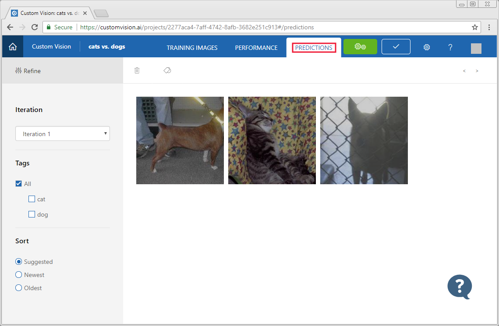
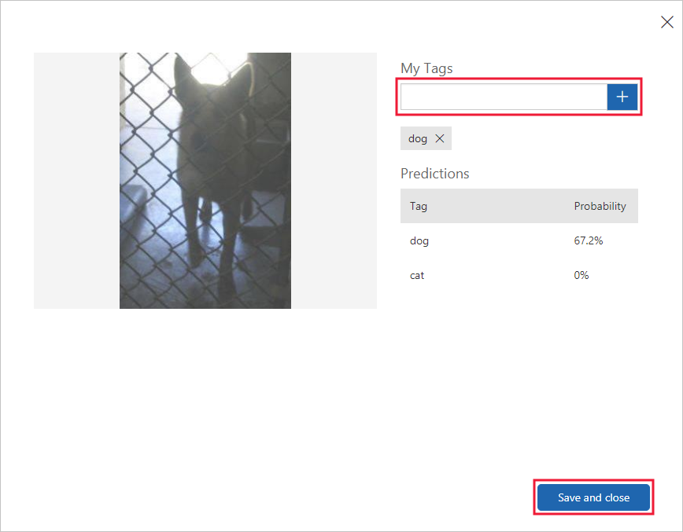
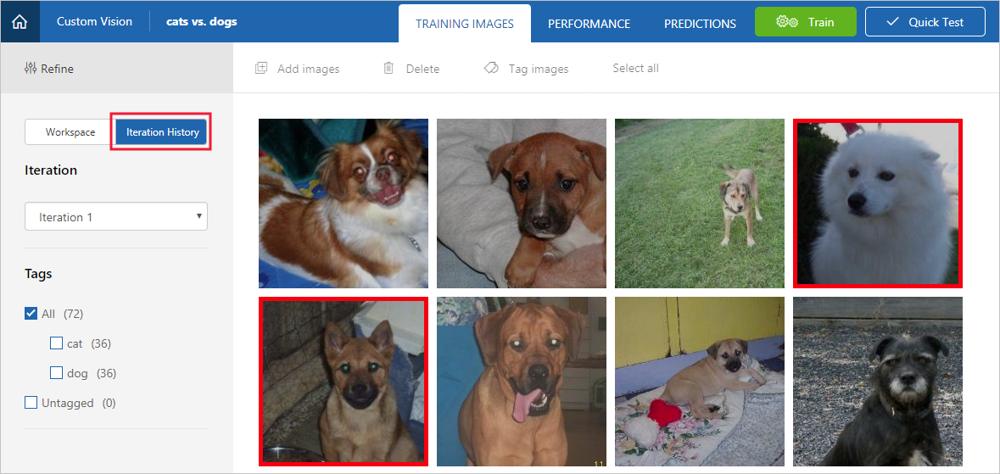

# How to improve your classifier

Learn how to improve the quality of your Custom Vision Service classifier. The quality of your classifier is dependent on the quality of the labeled data you provide to it. 

## Train more varied images

Providing tagged images with different angles, backgrounds, object size, groups of photos and other variants improves the classifier. Photos in context are better than photos in front of neutral backgrounds. Include images that are representative of what will be submitted to the classifier during normal use.

For more information on adding images, see the [Build a classifier](getting-started-build-a-classifier.md) document.

> [!IMPORTANT]
> Remember to train the classifier after you have added images.

## Use images submitted for prediction

The Custom Vision Service stores images submitted to the prediction endpoint. To use these images to improve the classifier, use the following steps:

1. To view images submitted to the classifier, open the [Custom Vision web page](https://customvision.ai) and select the __Predictions__ tab.

    

    > [!TIP]
    > The default view shows images from the current iteration. You can use the __Iteration__ drop down field to view images submitted during previous iterations.

2. Hover over an image to see the tags that were predicted by the classifier.

    > [!TIP]
    > Images are ranked, so that the images that can bring the most gains to the classifier are at the top. To select a different sorting, use the __Sort__ section.

    To add an image to your training data, select the image, select the tag, and then select __Save and close__. The image is removed from __Predictions__ and added to the training images. You can view it by selecting the __Training Images__ tab.

    

3. Use the __Train__ button to retrain the classifier.

## Visually inspect predictions

To inspect image predictions, select the __Training Images__ tab and then select __Iteration History__. Images that are outlined with a red box were predicted incorrectly.

Sometimes visual inspection can identify patterns that you can then correct by adding additional training data. For example, a classifier for roses vs. daises may incorrectly label all white roses as daises. You may be able to correct this problem by adding and providing training data that contains tagged images of white roses.

## Unexpected classification

Sometimes the classifier learns characteristics that your images have in common. For example, you want to create a classifier for roses vs. tulips. You supply images of tulips in fields, and of roses in a red vase in front of a blue wall. Given this data, the classifier may train for field vs. wall + vase instead of roses vs. tulips.

To correct this problem, use the guidance on training with more varied images: provide images with different angles, backgrounds, object size, groups, and other variants.

## Negative image handling

The Custom Vision Service supports some automatic negative image handling. If you are building a cat vs. dog classifier and you submit an image of a shoe for prediction, the classifier should score that image as close to 0% for both cat and dog. 

> [!WARNING]
> The automatic approach works for clearly negative images. It may not work well in cases where the negative images are just a variation of the images used in training. 
>
> For example, if you have a husky vs. corgi classifier, and you feed in an image of a Pomeranian, it may score the Pomeranian as a Husky. If your negative images are of this nature, create a new tag (such as “Other”), and apply it to the negative training images.

## Next steps

[Use the prediction API](use-prediction-api.md)