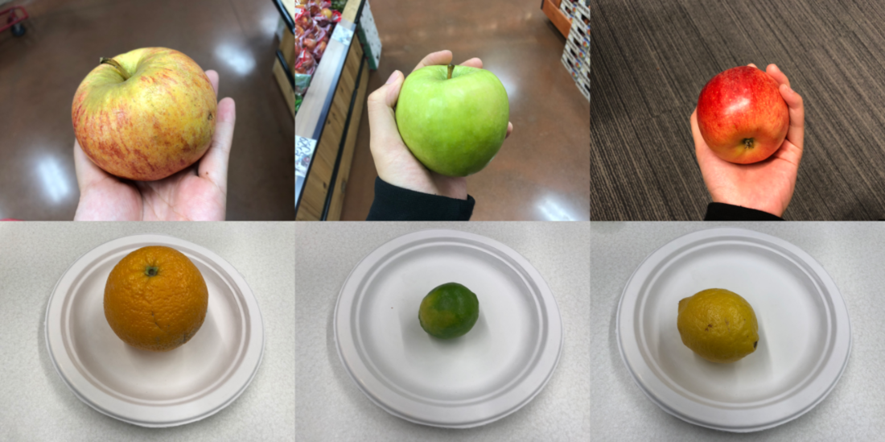
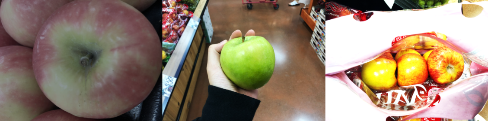
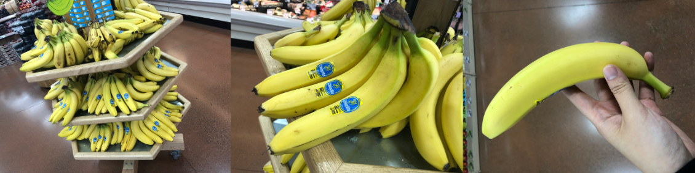
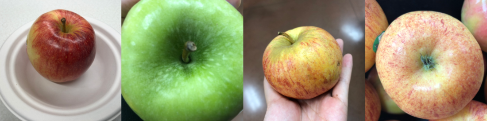
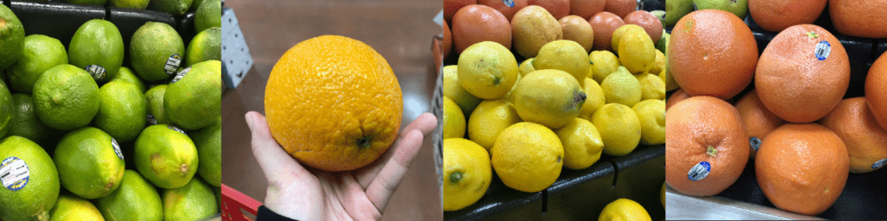
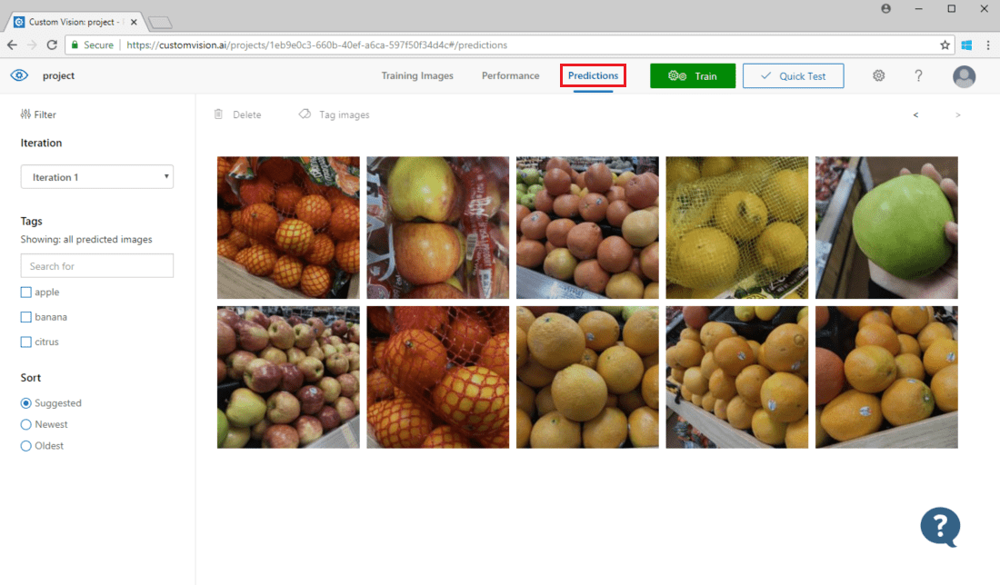
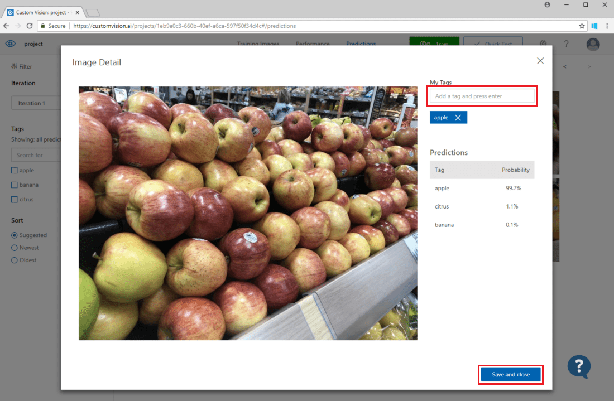

# How to improve your classifier

In this guide you will learn how to improve the quality of your Custom Vision Service classifier. The quality of your classifier depends on the amount, quality, and variety of the labeled data you provide it and how balanced the overall dataset is. A good classifier has a balanced training dataset that is representative of what will be submitted to the classifier. The process of building such a classifier is iterative; it's common to take a few rounds of training to reach expected results.

The following is a general pattern to help you build a more accurate classifier:

1. First-round training
1. Add more images and balance data; retrain
1. Add images with varying background, lighting, object size, camera angle, and style; retrain
1. Use new image(s) to test prediction
1. Modify existing training data according to prediction results

## Prevent overfitting

Sometimes, a classifier will learn to make predictions based on arbitrary characteristics that your images have in common. For example, if you are creating a classifier for apples vs. citrus, and you've used images of apples in hands and of citrus on white plates, the classifier may give undue importance to hands vs. plates, rather than apples vs. citrus.

To correct this problem, use the following guidance on training with more varied images: provide images with different angles, backgrounds, object size, groups, and other variations.

## Data quantity

The number of training images is the most important factor. We recommend using at least 50 images per label as a starting point. With fewer images, there's a higher risk of overfitting, and while your performance numbers may suggest good quality, your model may struggle with real-world data. 

## Data balance

It's also important to consider the relative quantities of your training data. For instance, using 500 images for one label and 50 images for another label makes for an imbalanced training dataset. This will cause the model to be more accurate in predicting one label than another. You're likely to see better results if you maintain at least a 1:2 ratio between the label with the fewest images and the label with the most images. For example, if the label with the most images has 500 images, the label with the least images should have at least 250 images for training.

## Data variety

Be sure to use images that are representative of what will be submitted to the classifier during normal use. Otherwise, your classifier could learn to make predictions based on arbitrary characteristics that your images have in common. For example, if you are creating a classifier for apples vs. citrus, and you've used images of apples in hands and of citrus on white plates, the classifier may give undue importance to hands vs. plates, rather than apples vs. citrus.

To correct this problem, include a variety of images to ensure that your classifier can generalize well. Below are some ways you can make your training set more diverse:

* __Background:__ Provide images of your object in front of different backgrounds. Photos in natural contexts are better than photos in front of neutral backgrounds as they provide more information for the classifier.

    

* __Lighting:__ Provide images with varied lighting (that is, taken with flash, high exposure, and so on), especially if the images used for prediction have different lighting. It is also helpful to use images with varying saturation, hue, and brightness.

    

* __Object Size:__ Provide images in which the objects vary in size and number (for example, a photo of bunches of bananas and a closeup of a single banana). Different sizing helps the classifier generalize better.

    

* __Camera Angle:__ Provide images taken with different camera angles. Alternatively, if all of your photos must be taken with fixed cameras (such as surveillance cameras), be sure to assign a different label to every regularly-occurring object to avoid overfitting&mdash;interpreting unrelated objects (such as lampposts) as the key feature.

    

* __Style:__ Provide images of different styles of the same class (for example, different varieties of the same fruit). However, if you have objects of drastically different styles (such as Mickey Mouse vs. a real-life mouse), we recommend you label them as separate classes to better represent their distinct features.

    

## Negative images

At some point in your project, you may need to add _negative samples_ to help make your classifier more accurate. Negative samples are those which do not match any of the other tags. When you upload these images, apply the special **Negative** label to them.

> [!NOTE]
> The Custom Vision Service supports some automatic negative image handling. For example, if you are building a grape vs. banana classifier and submit an image of a shoe for prediction, the classifier should score that image as close to 0% for both grape and banana.
> 
> On the other hand, in cases where the negative images are just a variation of the images used in training, it is likely that the model will classify the negative images as a labeled class due to the great similarities. For example, if you have an orange vs. grapefruit classifier, and you feed in an image of a clementine, it may score the clementine as an orange because many features of the clementine resemble those of oranges. If your negative images are of this nature, we recommend you create one or more additional tags (such as **Other**) and label the negative images with this tag during training to allow the model to better differentiate between these classes.

## Use prediction images for further training

When you use or test the image classifier by submitting images to the prediction endpoint, the Custom Vision service stores those images. You can then use them to improve the model.

1. To view images submitted to the classifier, open the [Custom Vision web page](https://customvision.ai), go to your project, and select the __Predictions__ tab. The default view shows images from the current iteration. You can use the __Iteration__ drop down menu to view images submitted during previous iterations.

    

2. Hover over an image to see the tags that were predicted by the classifier. Images are sorted so that the ones which can bring the most improvements to the classifier are listed the top. To use a different sorting method, make a selection in the __Sort__ section. 

    To add an image to your existing training data, select the image, set the correct tag(s), and click __Save and close__. The image will be removed from __Predictions__ and added to the set of training images. You can view it by selecting the __Training Images__ tab.

    

3. Then use the __Train__ button to retrain the classifier.

## Visually inspect predictions

To inspect image predictions, go to the __Training Images__ tab, select your previous training iteration in the **Iteration** drop-down menu, and check one or more tags under the **Tags** section. The view should now display a red box around each of the images for which the model failed to correctly predict the given tag.

Sometimes a visual inspection can identify patterns that you can then correct by adding more training data or modifying existing training data. For example, a classifier for apples vs. limes may incorrectly label all green apples as limes. You can then correct this problem by adding and providing training data that contains tagged images of green apples.

## Next steps

In this guide, you learned several techniques to make your custom image classification model more accurate. Next, learn how to test images programmatically by submitting them to the Prediction API.

> [!div class="nextstepaction"]
> [Use the prediction API](use-prediction-api.md)
