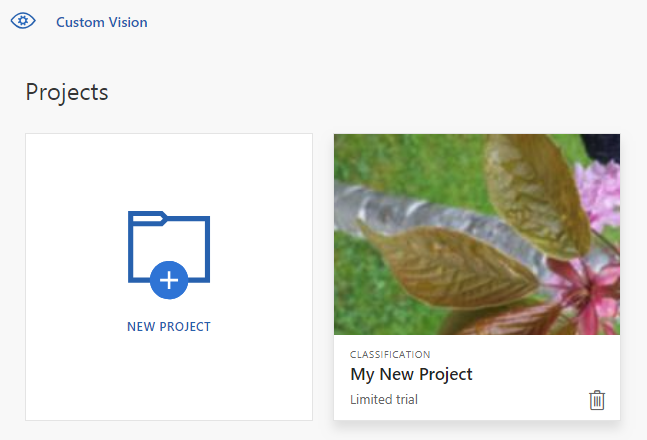

## Clean up resources

If you wish to implement your own image classification project (or try an [object detection](../csharp-tutorial-od.md) project instead), you may want to delete the tree identification project from this example. A free trial allows for two Custom Vision projects.

On the [Custom Vision website](https://customvision.ai), navigate to **Projects** and select the trash can under My New Project.

