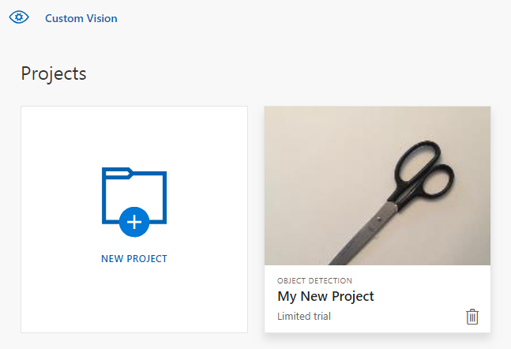

## Clean up resources

If you wish to implement your own object detection project (or try an [image classification](../csharp-tutorial.md) project instead), you may want to delete the fork/scissors detection project from this example. A free trial allows for two Custom Vision projects.

On the [Custom Vision website](https://customvision.ai), navigate to **Projects** and select the trash can under My New Project.

