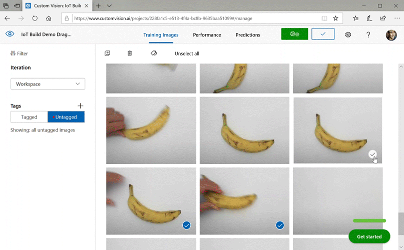

# Tutorial: Use Custom Vision with an IoT device to report visual states

This sample app illustrates how to use Custom Vision to train a device with a camera to detect visual states. You can run this detection scenario on an IoT device by using an exported ONNX model.

A visual state describes the content of an image: an empty room or a room with people, an empty driveway or a driveway with a truck, and so on. In the image below, you can see the app detect when a banana or an apple is placed in front of the camera.

This tutorial will show you how to:
> [!div class="checklist"]
> * Configure the sample app to use your own Custom Vision and IoT Hub resources.
> * Use the app to train your Custom Vision project.
> * Use the app to score new images in real time and send the results to Azure.

If you don't have an Azure subscription, create a [free account](https://azure.microsoft.com/free/) before you begin. 

## Prerequisites

* [!INCLUDE [create-resources](includes/create-resources.md)]
    > [!IMPORTANT]
    > This project needs to be a **Compact** image classification project, because we will be exporting the model to ONNX later.
* You'll also need to [create an IoT Hub resource](https://ms.portal.azure.com/#create/Microsoft.IotHub) on Azure.
* [Visual Studio 2015 or later](https://www.visualstudio.com/downloads/)
* Optionally, an IoT device running Windows 10 IoT Core version 17763 or higher. You can also run the app directly from your PC.
   * For Raspberry Pi 2 and 3, you can set up Windows 10 directly from the IoT Dashboard app. For other devices such as DrangonBoard, you'll need to flash it using the [eMMC method](https://docs.microsoft.com/windows/iot-core/tutorials/quickstarter/devicesetup#flashing-with-emmc-for-dragonboard-410c-other-qualcomm-devices). If you need help with setting up a new device, see [Setting up your device](https://docs.microsoft.com/windows/iot-core/tutorials/quickstarter/devicesetup) in the Windows IoT documentation.

## About the Visual Alerts app

The IoT Visual Alerts app runs in a continuous loop, switching between four different states as appropriate:

* **No Model**: A no-op state. The app will continually sleep for one second and check the camera.
* **Capturing Training Images**: In this state, the app captures a picture and uploads it as a training image to the target Custom Vision project. The app then sleeps for 500 ms and repeats the operation until the set target number of images are captured. Then it triggers the training of the Custom Vision model.
* **Waiting For Trained Model**: In this state, the app calls the Custom Vision API every second to check whether the target project contains a trained iteration. When it finds one, it downloads the corresponding ONNX model to a local file and switches to the **Scoring** state.
* **Scoring**: In this state, the app uses Windows ML to evaluate a single frame from the camera against the local ONNX model. The resulting image classification is displayed on the screen and sent as a message to the IoT Hub. The app then sleeps for one second before scoring a new image.

## Understand the code structure

The following files handle the main functionality of the app.

| File | Description |
|-------------|-------------|
| [MainPage.xaml](https://github.com/Azure-Samples/Cognitive-Services-Vision-Solution-Templates/blob/master/IoTVisualAlerts/MainPage.xaml) | This file defines the XAML user interface. It hosts the web camera control and contains the labels used for status updates.|
| [MainPage.xaml.cs](https://github.com/Azure-Samples/Cognitive-Services-Vision-Solution-Templates/blob/master/IoTVisualAlerts/MainPage.xaml.cs) | This code controls the behavior of the XAML UI. It contains the state machine processing code.|
| [CustomVision\CustomVisionServiceWrapper.cs](https://github.com/Azure-Samples/Cognitive-Services-Vision-Solution-Templates/blob/master/IoTVisualAlerts/CustomVision/CustomVisionServiceWrapper.cs) | This class is a wrapper that handles integration with the Custom Vision Service.|
| [CustomVision\CustomVisionONNXModel.cs](https://github.com/Azure-Samples/Cognitive-Services-Vision-Solution-Templates/blob/master/IoTVisualAlerts/CustomVision/CustomVisionONNXModel.cs) | This class is a wrapper that handles integration with Windows ML for loading the ONNX model and scoring images against it.|
| [IoTHub\IotHubWrapper.cs](https://github.com/Azure-Samples/Cognitive-Services-Vision-Solution-Templates/blob/master/IoTVisualAlerts/IoTHub/IoTHubWrapper.cs) | This class is a wrapper that handles integration with IoT Hub for uploading scoring results to Azure.|

## Set up the Visual Alerts app

Follow these steps to get the IoT Visual Alerts app running on your PC or IoT device.

1. Clone or download the [IoTVisualAlerts sample](https://github.com/Azure-Samples/Cognitive-Services-Vision-Solution-Templates/tree/master/IoTVisualAlerts) on GitHub.
1. Open the solution _IoTVisualAlerts.sln_ in Visual Studio
1. Integrate your Custom Vision project:
    1. In the _CustomVision\CustomVisionServiceWrapper.cs_ script, update the `ApiKey` variable with your training key.
    1. Then update the `Endpoint` variable with the endpoint URL associated with your key.
    1. Update the `targetCVSProjectGuid` variable with the corresponding ID of the Custom Vision project that you want to use. 
1. Set up the IoT Hub resource:
    1. In the _IoTHub\IotHubWrapper.cs_ script, update the `s_connectionString` variable with the proper connection string for your device. 
    1. On the Azure portal, load your IoT Hub instance, click on **IoT devices** under **Explorers**, select on your target device (or create one if needed), and find the connection string under **Primary Connection String**. The string will contain your IoT Hub name, device ID, and shared access key; it has the following format: `{your iot hub name}.azure-devices.net;DeviceId={your device id};SharedAccessKey={your access key}`.

## Run the app

If you're running the app on your PC, select **Local Machine** for the target device in Visual Studio, and select **x64** or **x86** for the target platform. Then press F5 to run the program. The app should start and display the live feed from the camera and a status message.

If you're deploying to a IoT device with an ARM processor, you'll need to select **ARM** as the target platform and **Remote Machine** as the target device. Provide the IP address of your device when prompted (it must be on the same network as your PC). You can get the IP Address from the Windows IoT default app once you boot the device and connect it to the network. Press F5 to run the program.

When you run the app for the first time, it won't have any knowledge of visual states. It will display a status message that no model is available. 

## Capture training images

To set up a model, you need to put the app in the **Capturing Training Images** state. Take one of the following steps:
* If you're running the app on PC, use the button on the top-right corner of the UI.
* If you're running the app on an IoT device, call the `EnterLearningMode` method on the device through the IoT Hub. You can call it through the device entry in the IoT Hub menu on the Azure portal, or with a tool such as [IoT Hub Device Explorer](https://github.com/Azure/azure-iot-sdk-csharp).
 
When the app enters the **Capturing Training Images** state, it will capture about two images every second until it has reached the target number of images. By default, the target is 30 images, but you can set this parameter by passing the desired number as an argument to the `EnterLearningMode` IoT Hub method. 

While the app is capturing images, you must expose the camera to the types of visual states that you want to detect (for example, an empty room, a room with
people, an empty desk, a desk with a toy truck, and so on).

## Train the Custom Vision model

Once the app has finished capturing images, it will upload them and then switch to the **Waiting For Trained Model** state. At this point, you need to go to the [Custom Vision portal](https://www.customvision.ai/) and build a model based on the new training images. The following animation shows an example of this process.

To repeat this process with your own scenario:

1. Sign in to the [Custom Vision portal](http://customvision.ai).
1. Find your target project, which should now have all the training images that the app uploaded.
1. For each visual state that you want to identify, select the appropriate images and manually apply the tag.
    * For example, if your goal is to distinguish between an empty room and a room with people in it, we recommend tagging five or more images with people as a new class, **People**, and tagging five or more images without people as the **Negative** tag. This will help the model differentiate between the two states.
    * As another example, if your goal is to approximate how full a shelf is, then you might use tags such as **EmptyShelf**, **PartiallyFullShelf**, and **FullShelf**.
1. When you're finished, select the **Train** button.
1. Once training is complete, the app will detect that a trained iteration is available. It will start the process of exporting the trained model to ONNX and downloading it to the device.

## Use the trained model

Once the app downloads the trained model, it will switch to the **Scoring** state and start scoring images from the camera in a continuous loop.

For each captured image, the app will display the top tag on the screen. If it doesn't recognize the visual state, it will display **No Matches**. The app also sends these messages to the IoT Hub, and if there is a class being detected, the message will include the label, the confidence score, and a property called `detectedClassAlert`, which can be used by IoT Hub clients interested in doing fast message routing based on properties.

In addition, the sample uses a [Sense HAT library](https://github.com/emmellsoft/RPi.SenseHat) to detect when it's running on a Raspberry Pi with a Sense HAT unit, so it can use it as an output display by setting all display lights to red whenever it detects a class and blank when it doesn't detect anything.

## Reuse the app

If you'd like to reset the app back to its original state, you can do so by clicking on the button on the top-right corner of the UI, or by invoking the method `DeleteCurrentModel` through the IoT Hub.

At any point, you can repeat the step of uploading training images by clicking the top-right UI button or calling the `EnterLearningMode` method again.

If you're running the app on a device and need to retrieve the IP address again (to establish a remote connection through the [Windows IoT Remote Client](https://www.microsoft.com/p/windows-iot-remote-client/9nblggh5mnxz#activetab=pivot:overviewtab), for example), you can call the `GetIpAddress` method through IoT Hub.

## Clean up resources

Delete your Custom Vision project if you no longer want to maintain it. On the [Custom Vision website](https://customvision.ai), navigate to **Projects** and select the trash can under your new project.

## Next steps

In this tutorial, you set up and ran an application that detects visual state information on an IoT device and sends the results to the IoT Hub. Next, explore the source code further or make one of the suggested modifications below.

> [!div class="nextstepaction"]
> [IoTVisualAlerts sample (GitHub)](https://github.com/Azure-Samples/Cognitive-Services-Vision-Solution-Templates/tree/master/IoTVisualAlerts)

* Add an IoT Hub method to switch the app directly to the **Waiting For Trained Model** state. This way, you can train the model with images that aren't captured by the device itself and then push the new model to the device on command.
* Follow the [Visualize real-time sensor data](https://docs.microsoft.com/azure/iot-hub/iot-hub-live-data-visualization-in-power-bi) tutorial to create a Power BI Dashboard to visualize the IoT Hub alerts sent by the sample.
* Follow the [IoT remote monitoring](https://docs.microsoft.com/azure/iot-hub/iot-hub-monitoring-notifications-with-azure-logic-apps) tutorial to create a Logic App that responds to the IoT Hub alerts when visual states are detected.
