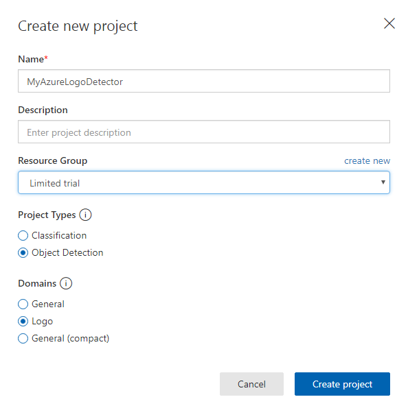
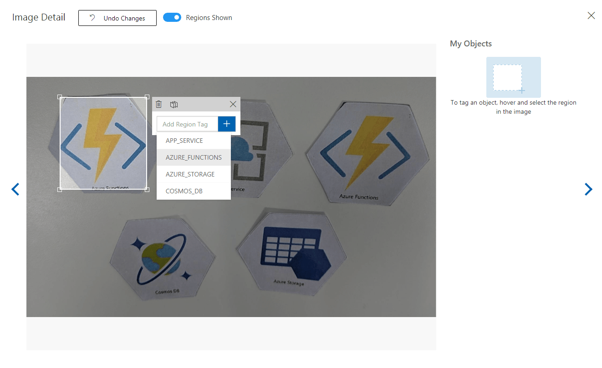
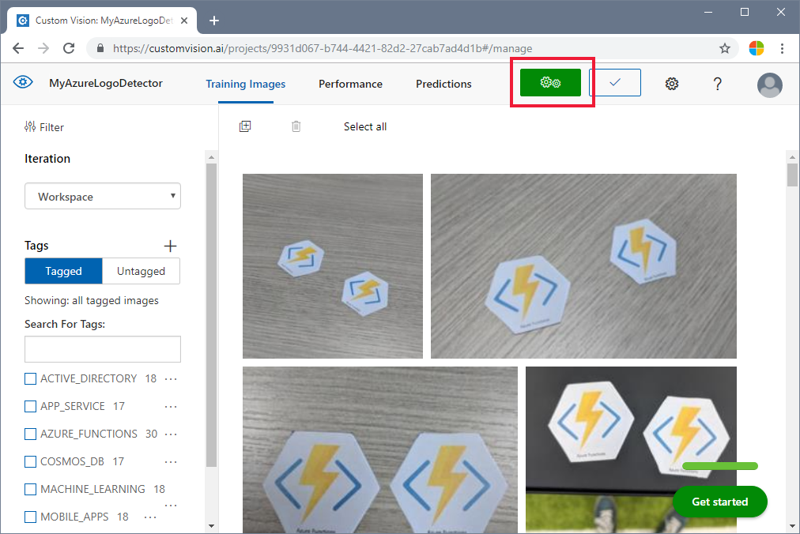
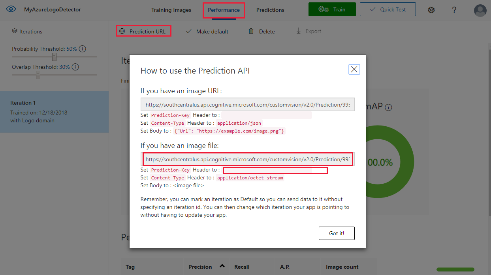
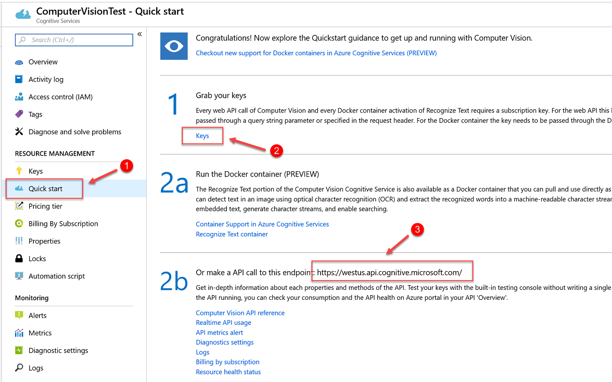
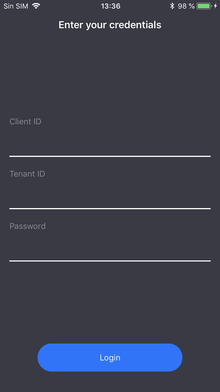
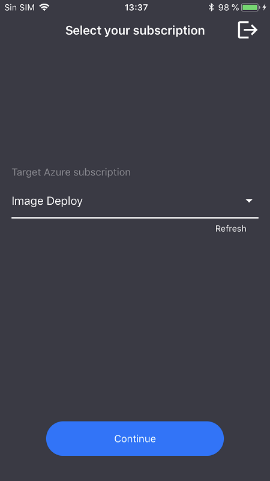
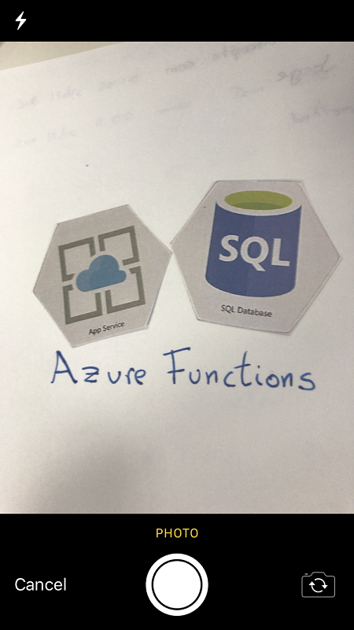
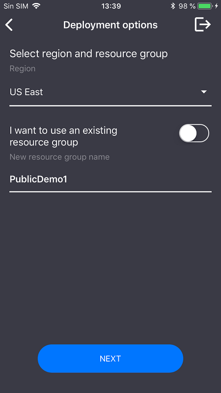

# Tutorial: Recognize Azure service logos in camera pictures

In this tutorial, you will step through a sample app that uses Azure Custom Vision as part of a larger scenario. The AI Visual Provision app, a Xamarin.Forms app for mobile platforms, analyzes camera pictures of Azure service logos and then deploys the actual services to the user's Azure account. Here you will learn how it uses Custom Vision in coordination with other components to deliver a useful end-to-end application. You may wish to run the whole app for yourself, or you can simply complete the Custom Vision part of the setup and explore how the app utilizes it.

This tutorial will show you how to:

> [!div class="checklist"]
> - Create a custom object detector to recognize Azure service logos
> - Connect your app to Azure Computer Vision and Custom Vision
> - Create an Azure service principal account to deploy Azure services from the app

If you don't have an Azure subscription, create a [free account](https://azure.microsoft.com/free/) before you begin. 

## Prerequisites

- [Visual Studio 2017](https://www.visualstudio.com/downloads/)
- Xamarin workload for Visual Studio (see [Installing Xamarin](https://docs.microsoft.com/xamarin/cross-platform/get-started/installation/windows))
- An iOS or Android emulator for Visual Studio
- [Azure command-line interface (CLI)](https://docs.microsoft.com/cli/azure/install-azure-cli-windows?view=azure-cli-latest) (optional)

## Get the source code

If you'd like to use the provided web app, clone or download the app's source code from the [AI Visual Provision](https://github.com/Microsoft/AIVisualProvision) repository on GitHub. Open the *Source/VisualProvision.sln* file in Visual Studio. Later on, you will make the necessary edits to some of the project files in order to be able to run the app.

## Create an object detector

Sign in to the [Custom Vision website](https://customvision.ai/) and create a new project. Specify an Object Detection project and use the Logo domain; this will let the service to use an algorithm optimized for logo detection. 



## Upload and tag images

Next, you will need to train the logo detection algorithm by uploading images of Azure service logos and tagging them manually. The AIVisualProvision repository includes a set of training images that you can use. On the website, select the **Add images** button in the **Training Images** tab, and then navigate to the **Documents/Images/Training_DataSet** folder of the repo. You will need to manually tag the logos in each image, so if
you are only testing out this project, you may wish to upload only a subset of the images. At minimum, you must upload 15 instances of each tag you plan to use.

Once you've uploaded the training images, select the first one on the display. This will bring up the tagging window. Draw boxes and assign tags for each logo in each image. 



The app is configured to work with specific tag strings; see the definitions in the *Source\VisualProvision\Services\Recognition\RecognitionService.cs* file:

[!code-csharp[tag definitions](~/AIVisualProvision/Source/VisualProvision/Services/Recognition/RecognitionService.cs?range=18-33)]

When you've tagged an image, navigate to the right to tag the next one. Exit out of the tagging window when you are finished.

## Train the object detector

In the left pane, set the **Tags** switch to **Tagged**, and you should see all of your images. Then click the green button at the top of the page to train the model. This will teach the algorithm to recognize the same tags in new images. It will also test the model on some of your existing images to generate accuracy scores.



## Get the prediction URL

Once your model is trained, you are ready to integrate it into your app. To do this, you'll need to get the endpoint URL (the address of your model, which the app will query) and the prediction key (to grant the app access to prediction requests). In the **Performance** tab, click the **Prediction URL** button at the top of the page.



Copy the image file URL and the `Prediction-key` value to the appropriate fields in the *Source\VisualProvision\AppSettings.cs* file:

[!code-csharp[Custom Vision fields](~/AIVisualProvision/Source/VisualProvision/AppSettings.cs?range=22-26)]

## Examine Custom Vision usage

Open the *Source/VisualProvision/Services/Recognition/CustomVisionService.cs* file to see how your Custom Vision key and endpoint URL are used in the app. The **PredictImageContentsAsync** method takes a byte stream of an image file along with a cancellation token (for asynchronous task management), calls the Custom Vision prediction API, and returns the result of the prediction. 

[!code-csharp[Custom Vision fields](~/AIVisualProvision/Source/VisualProvision/Services/Recognition/CustomVisionService.cs?range=12-28)]

This result takes the form of a **PredictionResult** instance, which itself contains a list of **Prediction** instances. A **Prediction** contains a detected tag and its bounding box location in the image.

[!code-csharp[Custom Vision fields](~/AIVisualProvision/Source/VisualProvision/Services/Recognition/Prediction.cs?range=3-12)]

If you wish to learn more about how the app handles this data, start at the **GetResourcesAsync** method, defined in the *Source/VisualProvision/Services/Recognition/RecognitionService.cs* file. 

## Add Computer Vision

The Custom Vision portion of the tutorial is complete, but if you wish to run the app, you will need to integrate the Computer Vision service as well. The app uses Computer Vision's text recognition feature to supplement the logo detection process; an Azure logo can be recognized by its appearance _or_ by the text printed near it. Unlike Custom Vision models, Computer Vision is pre-trained to perform certain operations on images or videos.

Simply subscribe to the Computer Vision service to get a key and endpoint URL. See [How to obtain subscription keys](https://docs.microsoft.com/azure/cognitive-services/computer-vision/vision-api-how-to-topics/howtosubscribe) if you need help with this step.



Then, open the *Source\VisualProvision\AppSettings.cs* file and populate the `ComputerVisionEndpoint` and `ComputerVisionKey` variables with the correct values.

[!code-csharp[Computer Vision fields](~/AIVisualProvision/Source/VisualProvision/AppSettings.cs?range=28-32)]


## Create a service principal

The app requires an Azure service principal account to deploy services to your Azure subscription. A service principal lets you delegate specific permissions to an app using role-based access control. See the [service principals guide](https://docs.microsoft.com/azure/azure-stack/user/azure-stack-create-service-principals) if you'd like to learn more.

You can create a service principal using either Azure Cloud Shell or the Azure CLI (as follows). First, log in and select the subscription you'd like to use.

```console
az login
az account list
az account set --subscription "<subscription name or subscription id>"
```

Then create your service principal (note that it may take some time to complete).

```console
az ad sp create-for-rbac --name <servicePrincipalName> --password <yourSPStrongPassword>
```

Upon successful completion, you should see the following JSON output containing the necessary credentials.

```json
{
  "clientId": "(...)",
  "clientSecret": "(...)",
  "subscriptionId": "(...)",
  "tenantId": "(...)",
  ...
}
```
Take note of the `clientId`, and `tenantId` values. Add them to the appropriate fields in the *Source\VisualProvision\AppSettings.cs* file.

[!code-csharp[Computer Vision fields](~/AIVisualProvision/Source/VisualProvision/AppSettings.cs?range=8-16)]

## Run the app

At this point, you've given the app access to:
* a trained Custom Vision model
* the Computer Vision service
* a service principal account 

Follow these steps to run the app:

1. In the Visual Studio Solution Explorer, select either the VisualProvision.Android or VisualProvision.iOS project and choose a corresponding emulator or connected mobile device from the dropdown menu in the main toolbar (note that you need a MacOS device to run an iOS emulator). Then run the app.

1. In the first screen that loads, enter your service principal client ID, tenant ID, and password. Click the **Login** button.

    > [!NOTE]
    > On some emulators, the **Login** button may not activate at this step. If this happens, stop the app, open the _Source/VisualProvision/Pages/LoginPage.xaml_ file, find the `Button` element labelled LOGIN BUTTON, and remove the line:
      ```xaml
      IsEnabled="{Binding IsValid}"
      ```
    
    > Then, run the app again.

    

1. On the next screen, select your Azure subscription from the dropdown menu (this should contain all of the subscriptions to which your service principal has access). Click the **Continue** button.

    

    At this point the app may prompt you to grant access to the devices to camera and photo storage. Accept these permissions.

1. Next, the camera on your device will activate. Take a photo of one of the Azure service logos you trained. A deployment dialogue should prompt you to select a region and resource group for the new services (as you would do if you were deploying them from the Azure portal). 

    

    

## Clean up resources 

If you've followed all of the steps of this scenario and used the app to deploy Azure services to your account, be sure to go to the [Azure portal](https://ms.portal.azure.com/) when you're finished and cancel the services you don't wish to use.

Also, if you plan to create own object detection project with Custom Vision in the future, you may wish to delete the logo detection project you created in this tutorial. A free trial for Custom Vision allows for two projects. On the [Custom Vision website](https://customvision.ai), navigate to **Projects** and select the trash can under **My New Project**.

## Next steps

In this tutorial, you set up and explored a full-featured Xamarin.Forms app that utilizes the Custom Vision service to detect logos in mobile camera images. Next, learn the best practices for building a Custom Vision model, so that when you create one for your own app you can make it powerful and accurate.

> [!div class="nextstepaction"]
> [How to improve your classifier](getting-started-improving-your-classifier.md)